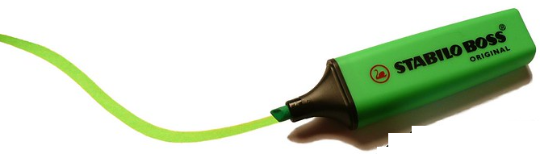
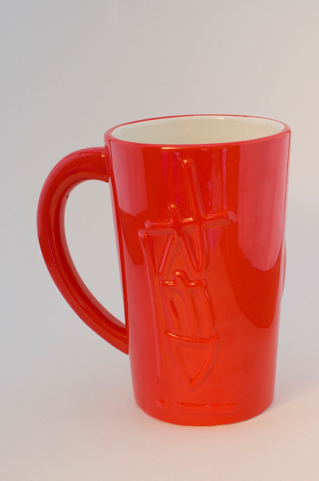
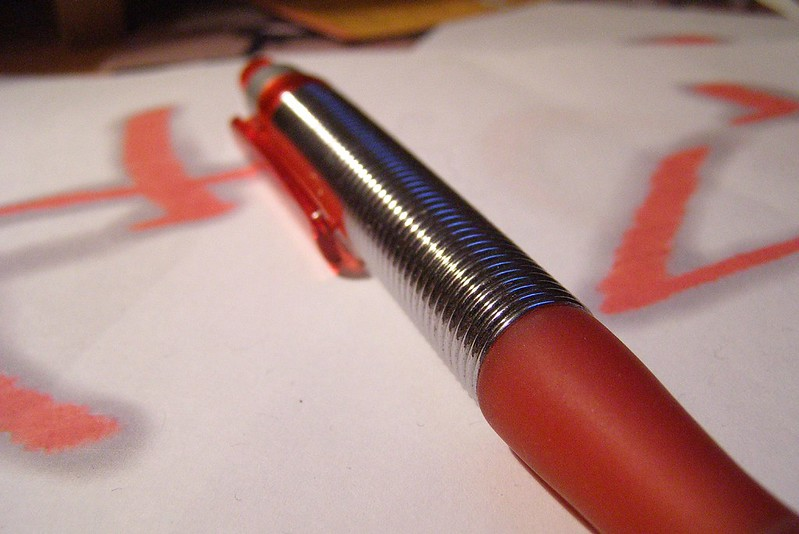
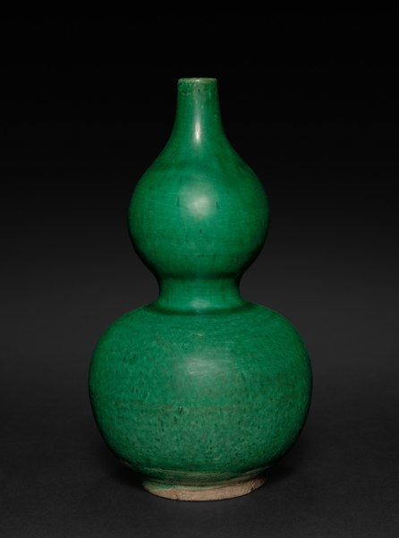

Card Exercise for Data Modeling
===================================

Here are four images:

<table>
<tr>
  <td></td>
  <td></td>
</tr>
<tr>
  <td></td>
  <td></td>
</tr>
</table>

# Task One

Use either pen and paper, or any document on your computer.

- Write a short description of these four objects. Entirely free form.  About 3 or four sentences only.

# Task Two 

- Discuss your description with a student next door
- Circle or mark nouns and adjectives.

# Task Three

- Narrow down to two kinds of adjectives. Make color one of them, but your group can chose the second. E.g., color and function.
- Pick two values for each kind of adjective. E.g., Red and Green for color.

# Task Four
- Each row of four students will be a team. Working together, do the following:
- Use four yellow post-it notes and write the name of a different item on each one (ie "Mug", "Pen")
- Use another four yellow post-it notes to write down each of the adjectives. You should have Red written on one yellow post-it, and Green on another.
- Use the green string to link the post-its to describe the items. 
    - e.g., the "Green" post-it should be linked to the "Vase" card and to the "Highlighter" card.

# Task Five
- Divide your desk for your team into three sections. These will be our three "tables".
- Using a blue post-it in the top left corner, give each table a name.
    - The first table should be called "objects"
    - The second table should be called "colors"
    - The third table should be named after your second adjective type (e.g., "functions)

- Use one blue post-it per table to create a "name" column in each table.
    - Fill this "name" column with copies of your Yellow post-it notes from your string database.
        - e.g., In the "objects" table, you have a "name" blue post-it, with yellow post-its with "Mug", "Highlighter" on each row underneath.
        - In the "colors" table, you have a "name" blue post-it, with "Red" and "Green" under it.

- Use pink post-its to create id columns.

## Image Credits

Images obtained via Creative Commons search.

- [Image One](https://www.flickr.com/photos/42931449@N07/5418401602)
- [Image Two](https://www.flickr.com/photos/35034356271@N01/358656424)
- [Image Three](https://www.flickr.com/photos/31663765@N00/2926501952)
- [Image Four](https://commons.wikimedia.org/w/index.php?curid=77116345)
