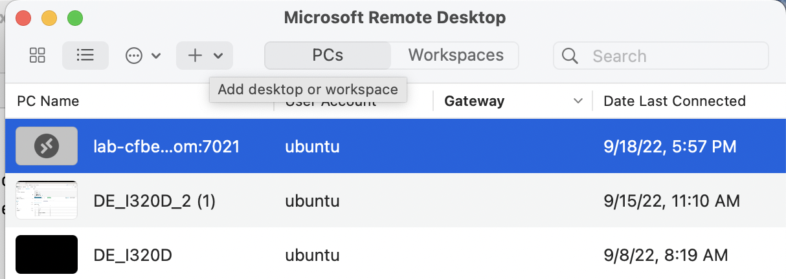
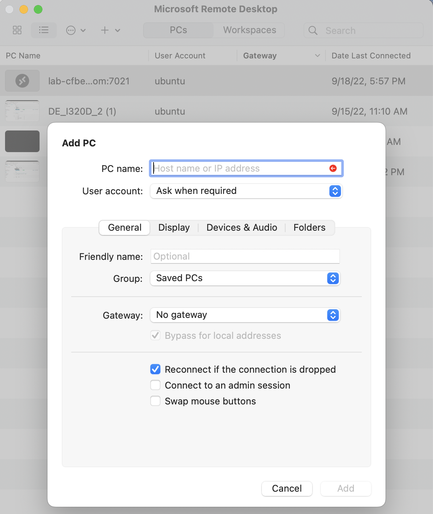
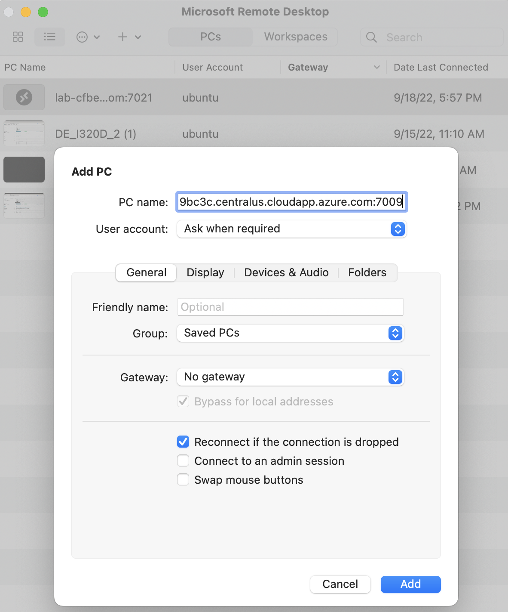
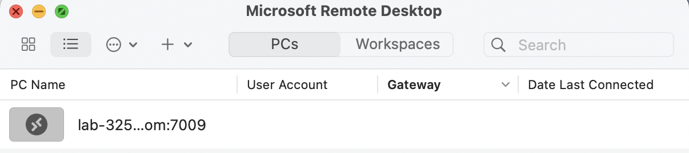
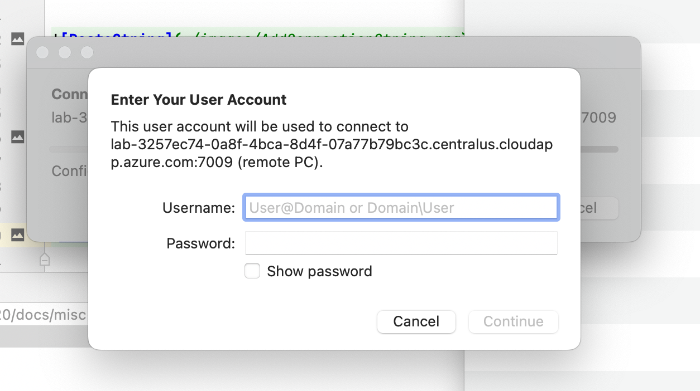

# Connect to a Spare VM

If you can't connect to the VM you registered for, you can connect to a spare VM. The spare VM must
already be running - check with one of the professors to make sure one is running.

Copy on of the three connection strings below - make sure no one else is using it already:
lab-3257ec74-0a8f-4bca-8d4f-07a77b79bc3c.centralus.cloudapp.azure.com:7009
lab-3257ec74-0a8f-4bca-8d4f-07a77b79bc3c.centralus.cloudapp.azure.com:7010
lab-3257ec74-0a8f-4bca-8d4f-07a77b79bc3c.centralus.cloudapp.azure.com:7011

Open up Microsoft Remote Desktop and click on the `+v` to the right of the `PC` button on the
menu bar. It will display `Add desktop or workspace` when you click on it.

Click `Add PC` after you click `+v'. You will see this dialog;
 

Paste in one of the connection strings into the `PC Name` field at the top:

Click the `Add` button at the bottom. A new entry will appear in your Remote Desktop window:

Click on the new entry and you can then log into the machine.

