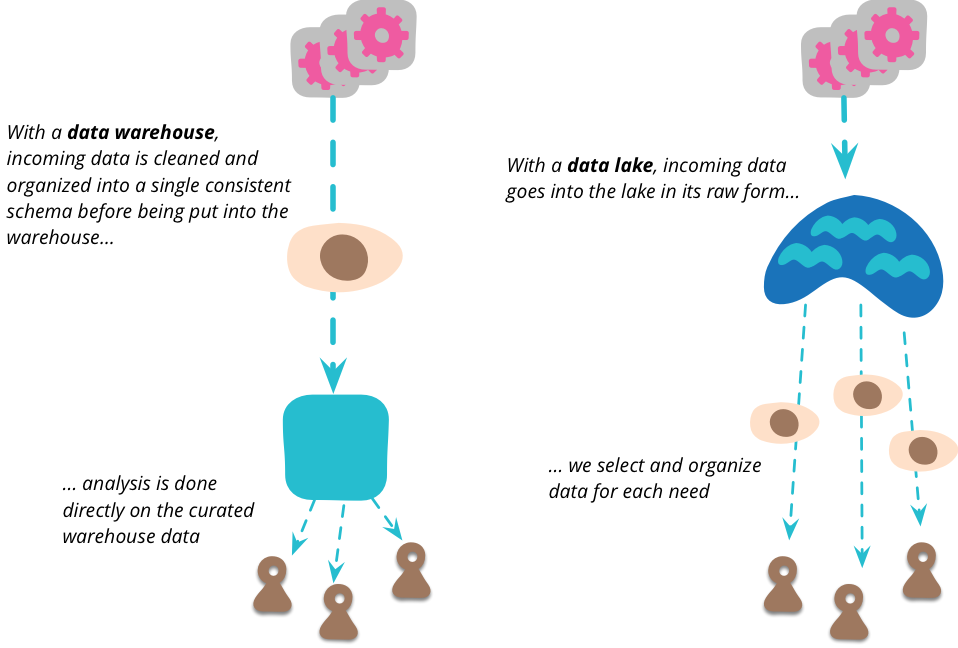
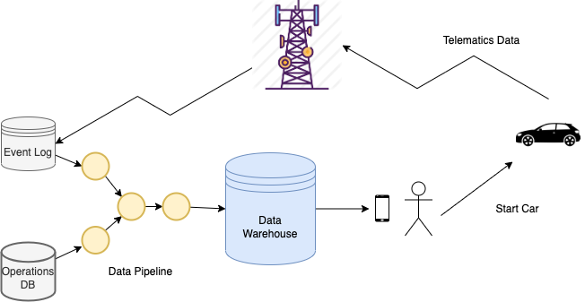
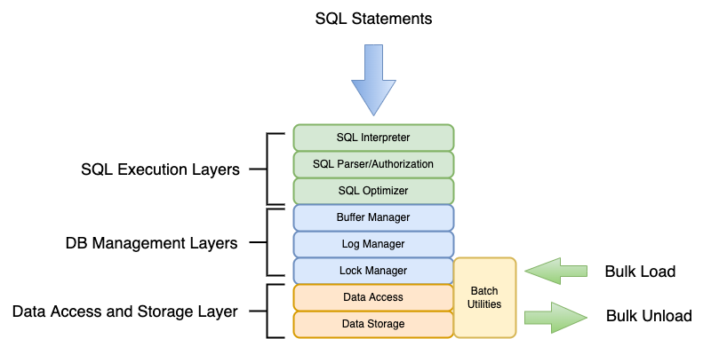

# Source Systems, Extraction, and Loading - Data Ingestion

Most organizations have their operational data in many different source systems. We want to
**E**xtract the data out of these sources, **L**oad into our analytical data warehouse, and 
**T**ransform it into data products that we can use to analyze and visualize the data.

< give example of how many source systems there are in GDI, an organization of less than 40 people >

## Data Lakes and Data Warehouses

The data extracted from source systems needs to be stored, organized and managed effectively. The 
most common approaches to this are the `Data Warehouse` and the `Data Lake`.


_credit: https://martinfowler.com/bliki/DataLake.html_

The Data Warehouse is:
* A large-scale SQL-based database management system.
* Used as a central repository for the organization's data.
* Well-structured - tables with columns holding rows of data.

The Data Lake is:
* File- or Object-based storage (HDFS, S3, Google Cloud Storage, Azure Object Storage).
* Data is kept in an original, "raw" format.
* Unstructured - can hold files or objects of all types (spreadsheets, text or binary files, documents, etc.).

In this class, we will ingest our source system data into a Postgres data warehouse and transform
it there. But it's not either/or - the data lake and data warehouse can and frequently do co-exist 
in the same organization. One company coined the term "Data Lakehouse" for a hybrid of the two. 
Frequently, raw data is extracted from source systems, stored in a data lake and then fed into a 
data warehouse.

One big difference between is how they are typically used. A data warehouse is generally fed by a
highly structured set of pipelines that do further transformations of the data in the data
warehouse. In contrast, the raw data in a data lake generally gets read into programs or pipelines
that transform the data.

In either case, the end goal is to produce useful sets of information that meet organizational needs.
We call these useful sets of information "data products".

## Data Products

Producing useful data products often means combining data from different sources to provide the
information to manage an organization. Source systems tend to focus on a specific area of the
organization and a complete picture of an organization's area of concern can only be created by
combining information from different sources together.

### An Example: Car dealerships and dead batteries

There are about 17,000 automotive dealerships across the country. All of them have vehicles parked on their lots
waiting to be sold, used as loaners, or available to be rented. One problem that these dealerships
have is that if a vehicle sits for 30 days or more, their battery will go dead. If it's a new car, the
dealership is obliged to replace the battery. For large dealerships, this can get very expensive.
And for those large dealerships, it's very difficult to keep track of the last time a vehicle was 
started (which charges the battery) or even where a specific vehicle is located.

Dealerships wanted a solution to this problem - an app that would keep track of the last time
a vehicle was turned off, record where it was located, and send out an alert when it needed to be
started to prevent the battery from dying. To do this, data from two systems needed to be combined:

* Data from the dealership's operational database which had the information about the car (make,
model, year, color, VIN, etc.)
* Data from the Telematics feed from the car, which would have an 
record of the event of when the vehicle was turned off and what its GPS coordinates were at that time.



By combining the data from these systems, a mobile app was created that runs an SQL query every day
to get that last time each vehicle was turned off. Vehicles that hadn't been started for some period
of time - let's say 20 days - would be put in a list of cars that needed to be restarted and a 
notification would be sent to the app that would alert the dealership's service personnel so that
they would know when a car needed to be restarted to charge the battery. The app could display a map 
of where the vehicle was, and what the make, model, and color of the vehicle was in order to make 
sure they had the right vehicle.

## Bringing Source Data Into Our Data Warehouse

### Extraction and Ingestion
The first step is extract the data from source systems. Today, a wide variety of tools in the 
Modern Data Stack exist to do this. Most of them use the underlying `bulk load` and `bulk unload` 
features of the source system. In a relational database, the bulk load/unload feature works by 
bypassing the higher-level features of the database in order to write large amounts of data to and
from the database as fast as possible.



Using the bulk load/unload features will improve performance by an order of magnitude or more. This
is absolutely essential when we are dealing with datasets of hundreds of millions or even billions
of records. 

In Postgres, bulk load or unload is done using the `COPY` command. The Postgres `psql` program has a 
client `\copy` command that does the same thing - we will use `\copy` in our programs.

#### Extraction
Here is an example of extracting the `tickets` table to a CSV file using `\copy`
```sql
music_festival=> \copy festival.tickets to 'festival.csv' WITH CSV HEADER;
COPY 3590408
Time: 1481.022 ms (00:01.481)
```

We now have a copy of the tickets data from our source system that we can load into our data 
warehouse. Typically, we'd either move this file to a staging area (i.e., some sort of _data lake_) 
where we gather all the data we're going to load into our data warehouse. The next step is to 
ingest it into our data warehouse.

#### Ingestion
Let's say we decided not to use the bulk loader to load this data and instead wrote a program to
write the data into the data warehouse one record at a time.

We'd have to do the following:
* Connect to the database
* Open the CSV file for reading
* Read each record in the CSV file:
  * parse the fields in the record
  * execute an SQL insert command with the values of the fields to write the record to the database

This takes a minimum of 25-30 lines of python code to do this. If we run our python program, this is
the result:  


```
ubuntu@10.0.0.8 % python ingest.py  
Inserted 3590409 rows into tickets table in 0:03:09.625822  
```

It takes a a little over 3 minutes to run. But if we use the `\copy` command in an sql script:  

```
chip@chips-air src % psql -U festival_read_write -h localhost -d music_festival -f tickets.sql  
Timing is on.  
TRUNCATE TABLE  
Time: 23.390 ms  
COPY 3590408  
Time: 17760.980 ms (00:17.761)  
```  

It takes less than 18 seconds. So we have an order-of-magnitude performance improvement (18 seconds
versus 189 seconds) and an order-of-magnitude less code (3 lines of code versus 30 lines of code) if
we use the bulk loader versus writing a program. And on today's systems that run in the cloud and
bill by resource usage, we might also pay an order-of-magnitude more in monetary cost.

## Exercise 
For a CSV file that looks like this:
```text
id,make,model,year,color,msrp
1,Audi,A-4,2022,silver,38750
2,BMW,i323,black,32499
3,Volkwagen,Jetta,green,31356
4,Subaru,Forester,white,35466
```

1. Write a CREATE TABLE statement to create a table to load this data into. It's important to get the order and data types right.
2. Write a `\copy` command to load the CSV file into the table.


