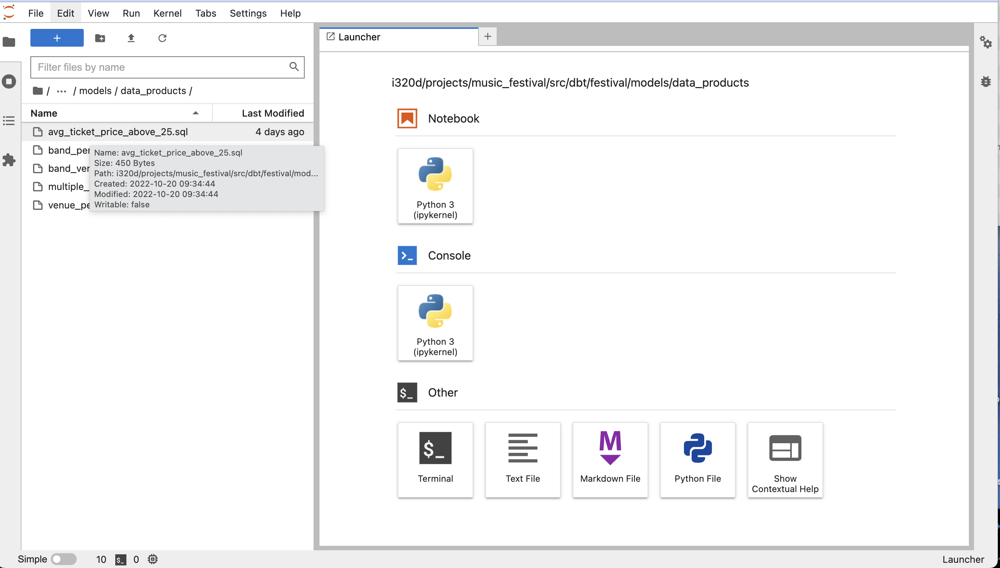
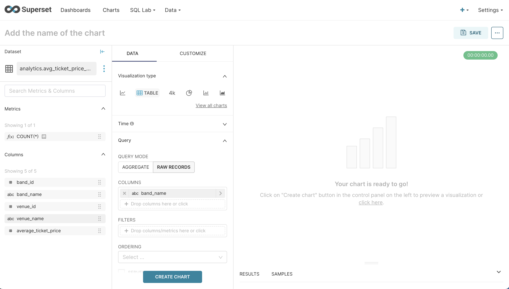
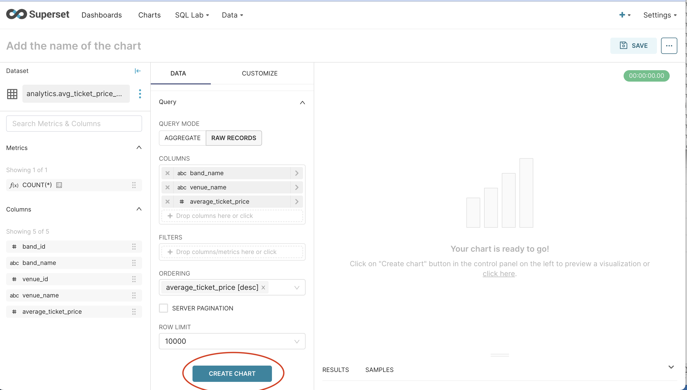
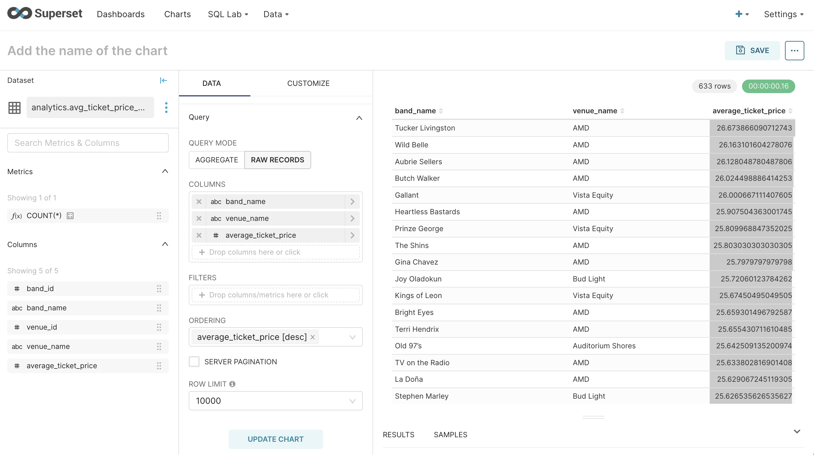

# Running dbt model files

In our last class, you were given the assignment of creating a dbt model file for a data product.
We're going to run that file in dbt so that you can see it get executed.

Open up your Jupyter notebook:


Navigate to the `data_products` directory (_projects->music_festival->src->dbt->festival->models->data_products_)

The dbt model file you created should be in that directory. In my case, the name of the file is
`avg_ticket_price_above_25.sql_ccy1234`.



Click on the Jupyter terminal icon at the bottom of the Launcher tab page. 


This will launch the Jupyter terminal in a new tab. Then use the `cd` (which stands for `change directory`)
command to move to the dbt _festival_ director (_projects->music_festival->src->dbt->festival_)


To run dbt against the model file, type in the following command and hit return:

```sh
dbt run --select avg_ticket_price_above_25_<your eid>.sql
```


You should see output that looks like this:


# Introduction to Superset
Superset is a popular open-source Business Intelligence (BI) and visualization program. We will use
Superset to create visualizations for our music festival project and for our semester projects.

* A no-code interface for building charts quickly
* A web-based SQL Editor for advanced querying (SQL Lab)
* A wide array of visualizations to showcase your data, ranging from simple bar charts to geospatial visualizations
* Out of the box support for nearly any SQL database or data engine
* A lightweight semantic layer for quickly defining custom fields and metrics

When you login to Superset (https://superset.dei320.net), you should see a webpage that looks like this.
There is a dashboard for the Music Festival project, which you can use as a reference.


Today we'll look at how to make the data from our dimensional models and data products available
in Superset and how to use that data to create a chart and a dashboard.

## Datasets

A table or data product that we see in Superset is called a _dataset_. You can add datasets through
the dataset page. You need a single dataset - one and only one - to create a chart. This is one reason why we would
need to create single-table data products from our dimensional model.

First click on the dataset menu pulldown.


Then you will see the dataset page. You can add a new dataset by clicking on the `DATASET` button
on the top right.


When you click the `DATASET` button, a dialog to add a new dataset will appear. It will have 
pull-down menus for the database, the schema, and the table name.


Let's add the data product we created in a previous class that has average ticket prices over $25.

* Select `music_festival` as the database
* Select `analytics` as the schema
* Select `avg_ticket_price_above_25_<your eid>` as the table


Then click the `ADD` button at the bottom of the dialog. This will add the table to the list of
datasets.


Once we've added the dataset, we can now create one or more charts from that dataset and place 
those charts in a dashboard.

This is what you will do for the data products that you create. Adding a data product as a dataset
makes it possible to create charts for the data in that dataset.

## Charts

### Creating a Chart
Double-click on the `avg_ticket_price_above_25_<your eid>` dataset. The `CREATE CHART` page will appear.


You'll see the name of the schema and table at the top left. Below that, you'll see a list of 
Metrics and a list of the columns in the table.

A _Metric_ is a calculated value that can be used in a chart. By default, every dataset has a 
COUNT(*) metric. You can create additional metrics, which is a topic we will discuss later.

The list of columns shows the name of the column and a little icon on the left that indicates the
data type of the column - `#` is a number, `abc` is a string, and a clock icon is a date.


The middle column of the `CREATE CHART` page is where we actually create the chart. At the top 
under `visualization type` is where we define the type of chart we want to create. You'll 
notice that it defaults to `TABLE`, which is the simplest kind of chart we can create.

Under _Query Mode_, we see we can create two types of table charts - _Aggregated_ and _Raw Records_.
Click on _Raw Records_. This will create a simple tabular (row and column) report.


Under `Columns`, click on the `+` sign - you'll see this dialog. Click on the `simple` tab.


Click the `v` in the _Columns_ dropdown to get the list of columns to add to the report.


Click on _band_name_ and then hit the `SAVE` button to add it to the list of columns that will be in 
the report. Do the same for _venue_name_ and the _average_ticket_price_. Be sure to hit `SAVE` after
you select each column. These are the columns that will appear in our report.



An alternative to clicking on the column dropdown is to drag and drop the columns from the left-
hand list of columns to the list of columns in the center. Either way, we end up with these 
columns.


Then we want to sort the data in a certain order. Go down to the _Ordering_ dropdown and click on 
it.


The list of columns in the dataset will appear, in alternating ascending (_[asc]_) and descending 
order (_[desc]_). We want to order the report from highest average ticket price to lowest, so
choose _Average_Ticket_Price [desc]" from the dropdown.


The create chart page should now look like this:


Now we're ready to create the chart. Find the `CREATE CHART` button at the bottom center of the page.



Click on the `CREATE CHART` button. The data for the chart will appear in the right-hand column on 
the page. Notice that the `CREATE CHART` button changes to `UPDATE CHART` once the chart is created.



### Formatting the Chart
Superset gives us lots of options to format charts, add features, and improve their appearance.
Most of these options can be found under the `customize` menu in the center panel of the Chart page.


The first thing we're going to do is add a search box to our report. This allows users to enter any
text that want - for example, a band name or a venue name - and return all the rows that match the
text. You can find the _Search Box_ checkbox about 1/3 of the way down the center column with 4
other checkboxes, under _Page Length_. Click the Search Box checkbox - a search box will appear
above the `_Average Ticket Price_` column in the report data in the right-hand column.


When you look at the data in the _Average Ticket Price_ column, you'll notice it extends out to
five or more decimal places. Since it's an average dollar amount, it probably would make more sense
(and be more readable if it only went to 2 decimal places. It would be even better if we formatted
it as a monetary price. Below the checkboxes is another section entitled _Customize Columns_ where
we can do just that. 

Click on _average_ticket_price_ under _Customize Columns_. You'll see a choice of ways to format
this column.


Scroll down the list of formatting choices until you find the one for a monetary value.


Select it and then click the `UPDATE CHART` button in the bottom center. You'll see 
_average_ticket_price_ change to be a monetary value.


The next thing we can do is add some conditional formatting to our average ticket price. Our 
analysts have told us that an average ticket price of $26 or more is optimal, that anything from
$25.80 is ok, and anything below that is not good. So were going to add some color formatting that
illustrates this.

Go down to where it says `CONDITIONAL FORMATTING` just above the `CREATE CHART` button.


Click on the `+` sign where it says _Add new color formatter_.


Click on the `Operator` pulldown and select `≥`. A field called `Target Value` will appear next to
it. Enter `26.00` and then hit the `APPLY` button. Notice that the values for average_ticket_price
now have a green background.


Click the '+' again. Change the `Color Scheme` value to `Yellow`. Click on `Operator` and choose `< x <`.
Enter `25.80` for the `Left Value` and `26.00` for the `Right Value`. Click on `Apply` and notice
the values in that range now turn to yellow.


Click on the `+` one more time. Change the `Color Scheme` to `Red`. Click on `Operator` and choose
`≤`. Enter `25.80` for the `Target Value` and click `Apply`. Notice the values in that range now
turn to red.


Next we need to give the chart a name. You'll notice that in the upper-left hand corner of the page
it says "Add the name of the chart". Click on that and enter the name of the chart - let's call
it "Average Ticket Price".


### Saving the Chart and Creating a New Dashboard

At this point, we're done creating the chart. Now we're going to save it and create a new dashboard
where the chart will appear. There is a `Save` button in the upper-right hand corner of the page.


Click on the `Save` button. This dialog will appear:


Using your own EID enter `<EID> Test Dashboard` in the _Add To Dashboard_ field and then click the `SAVE & GO TO DASHBOARD` 
button in the bottom row of buttons. If you get an error that it already exists check that you changed `<EID>` to be your own EID.


This will take you to the dashboard, which should look something like this:


## Exercise

Using the data product you created (which will have your EID at the end of the table name, e.g.,
`average_ticket_sales_abc1234`), do the following:

1) Add your data product as a dataset.
2) Create a chart from the dataset - append your eid to the name of your chart.
3) Save the chart and add it to a new dashboard - append your eid to the name of the dashboard.
