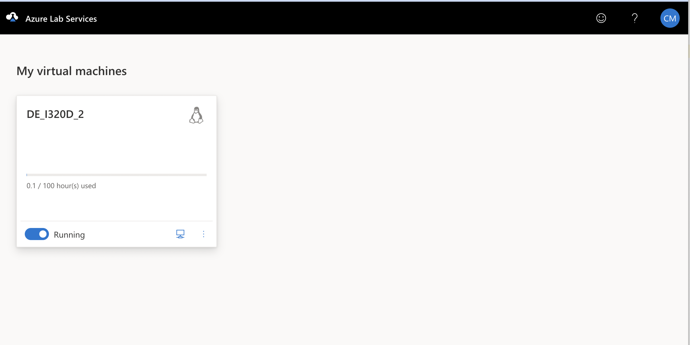

# Lab Machine Setup

## Invitation
You will get an invitation email that looks like this. Click on the `Register for Lab` button.

## Lab VM Assignment
You'll be prompted to login with your EID and password. Once you do that, you'll the VM assigned to you in the lab:

## Starting your VM
Click the button in the bottom left-hand corner of the panel showing your VM that says `Stopped`. It will change to
`Starting`. It will take a minute or two to start.

During this time, you should download and install Microsoft Remote Desktop. You can get it from the Apple Store if
you have a Mac or from the Microsoft Store if you are on Windows.

Once the button name changes to `Running`, click on the little icon on the bottom right of the panel 
that looks like a computer monitor. Then click on the menu item that says `Connect via RDP`. The first
time you do this it will prompt you for a new password.

## Setting your password
Enter your password - make sure it's memorable and that you record it somewhere, like a password manager
if you use one.

It's a good idea to click on the preview icon in the password box (it looks like an eye) to be sure you've typed the
password you want correctly.

The machine will then set your new password - this may take a minute or so.

When it's done, you'll be back to this screen

## Connecting to RDP

Click on the computer monitor icon again and select `Connect via RDP`

This will download a file to your Downloads directory called `DE_I320D.rdp`.

Start Microsoft Remote Desktop. On the top level menu, click on `Connections` and then click on 
`Import From RDP File`

A dialog box will pop up asking you to pick a file. Go to your Downloads directory and select the
`DE_I320D.rdp` file. Click the `Import` button.

The file will be imported into RDP, and you should see an entry for it in RDP:

Double-click on the entry in RDP and it will take you to a login to the lab. Use `ubuntu` as the username 
and enter your password. If your password doesn't work, enter `DEI320D_student!' as the password.

Once you login, you will see your VM Desktop

