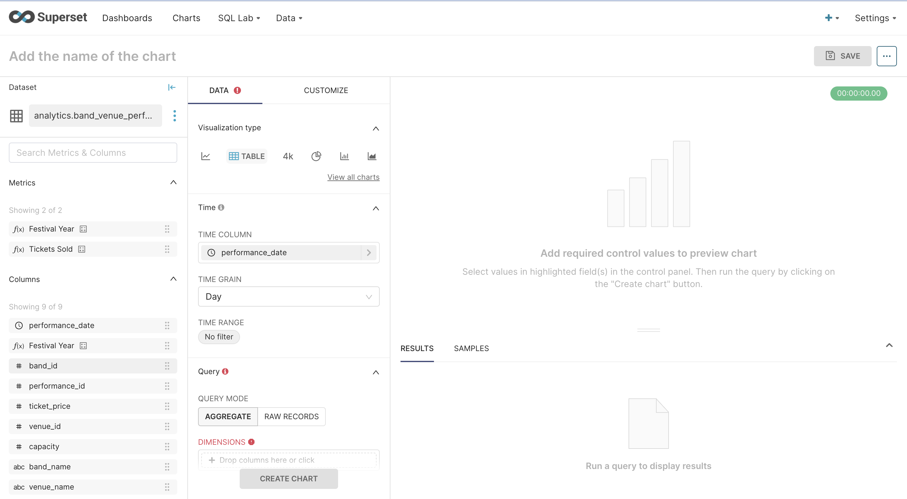
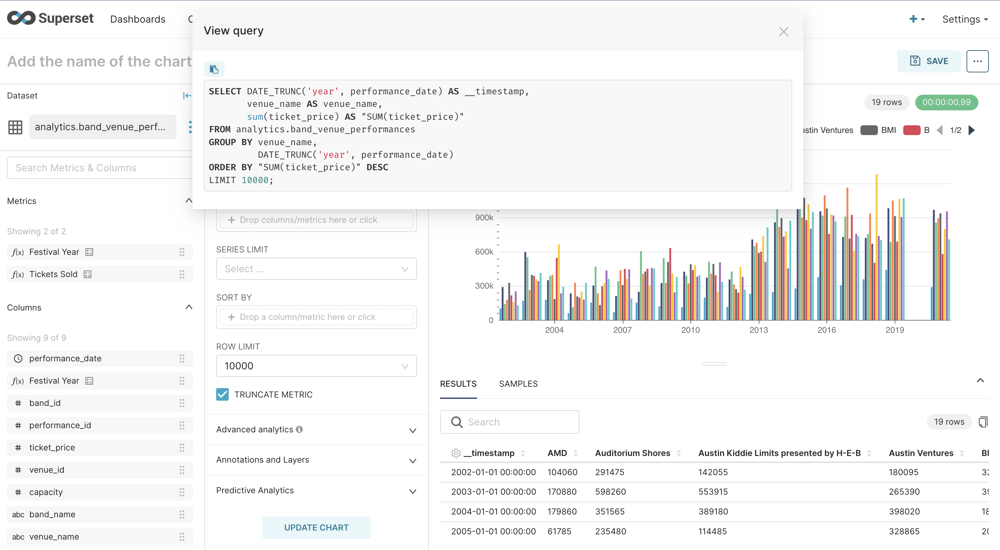
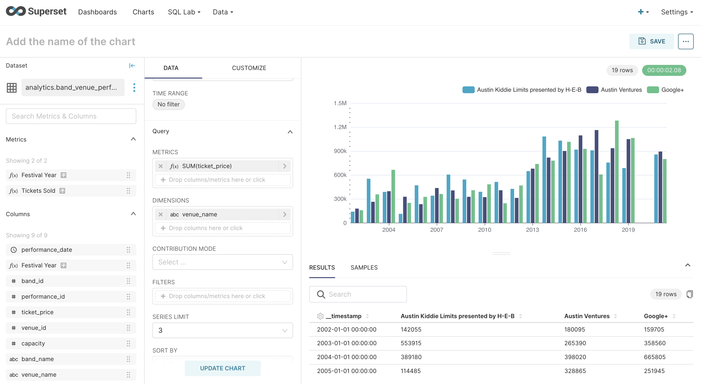
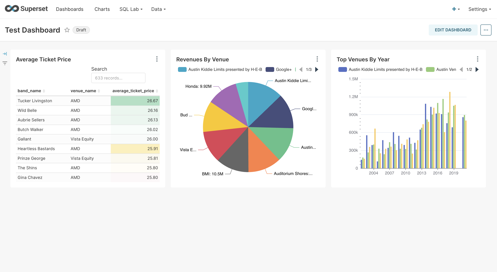

# Visualizations in Superset

In our last class, we created a simple chart and dashboard in Superset. Today we're going to create
some more advanced visualizations and add them to our dashboard.

## More on Datasets

The data products we've created so far all had aggregated data. These kinds of data products are
limited in that there's not a lot we can do with them; we can't slice and dice them in different
ways to get different perspectives on the data and we can't effectively filter on them to only 
show the data we want. In effect, they can only answer a single question - which is useful and
valuable - but limits the possibilities of what we can do 

For Superset, we want to create data products that are _reusable_ - that is, they can be used to 
create a wide variety of charts from a single dataset.

So these data products will join tables in our dimensional model but will not do aggregations of
any kind. Superset itself will do the aggregations for us when we define our charts.

Here is an example of a reusable data product.

```sql
{{ config(
    materialized = 'table',
)}}
SELECT b.band_id,
       b.band_name,
       v.venue_id,
       v.venue_name,
       p.performance_id,
       p.performance_start AS performance_date,
       c.purchase_date,
       v.capacity,
       f.ticket_price
FROM   ticket_sales_facts AS f
JOIN   bands_dimension AS b ON (b.band_id = f.band_id)
JOIN   performances_dimension AS p ON (p.performance_id = f.performance_id)
JOIN   venues_dimension AS v ON (v.venue_id = f.venue_id)
```


With this data product, we can answer all of these questions:
1. How much did we make in ticket sales? - per year, per venue, per band
2. Which venues were the most popular? - by tickets sold, by capacity filled and by revenue
3. Which bands were the most popular?
4. What was the highest, lowest, and average price of a ticket? - by band, performance, and venue
5. Are there any bands gaining in popularity over the years or losing popularity?

This data product already exists as a table in our music_festival database - it's called 
_band_venue_performances_ and it's in our analytics schema. We're going to create some more
advanced visualizations with this data.

We'll use the _band_venue_performances_ data product as our dataset. First, let's go to datasets.


There are a large number of datasets now, making this dataset hard to find.


To make it a little easier to find our dataset, use the search box - put in `band` to narrow down
the list of choices.


That makes it much easier to find our dataset.


Double-click on _band_venue_performances_ and go to the `CREATE CHART` page.

## Creating a Pie Chart



Click on the _view_all_charts_ link under _Visualization Type_


There is a list of visualization types on the left-hand side of the dialog. Scroll down it and
choose `# Popular`. This shows a page of the most popular visualization types.


We're going to create a Pie Chart, so click on the Pie Chart icon on the page. Pie charts are a 
very common visualization type. They are divided into slices to show the proportions between the 
different categories being measured.


Our Pie Chart is going to show revenues by Venue. The program manager for the Music Festival wants
to know what the top 3 venues have been overall and year-by-year for ACL. So we'll do a pie chart
for overall revenue and then a time-series bar chart for year-by-year revenue.


You can see in the center column where we specify the values for our chart, you see two new fields -
`Dimensions` and `Metrics`. `Dimensions` are _dimensional attributes_ - in our festival project, 
that would mean columns like band_name, venue_name, capacity, performance_date, etc.

`Metrics` are aggregations of measures, i.e., the facts from our dimensional model. In the case of
our festival project, this would be ticket_sales that we will aggregate in various ways.

If this sounding a lot like how we use dimensional attributes and facts in SQL GROUP BY queries, 
that's because that's exactly what they are being used. Superset generates SQL under the covers
when a chart is rendered, and it will generate a GROUP BY query for this chart. So let's specify
the dimensions and the metric.

We're going to use venue_name as our dimensional attribute.


Our metric is going to be revenues - how do we calculate revenues?

We'll select _ticket_price_ as our metric column.


Then we'll select `SUM` as our aggregate function for our metric.


After defining our dimension and our metric, we're ready to create our initial chart. Click the
`CREATE CHART` button. This will create the initial version of our pie chart.


By default, the chart displays the dimension name but not the values. Let's customize the chart to
display thre revenue values as well. First, we choose the _Customize_ menu.


Update the category label to include the revenue amount and click the `UPDATE CHART` button.


Just to make the venues and revenues a little easier to read, we'll add a label line.


At this point, the chart is complete - we'll name it, save it, and add it to our test dashboard.


## Creating a Time-Series Bar Chart

Now we'll look at creating a time-series bar chart. Time series refers to a series of data values 
over time. A `time-series` visualization shows a metric value over defined time periods. In our 
chart, our time period will be a year.

Go back to datasets, find the _band_venue_performances_ dataset, and double-click on it to create
the new chart. Then select _View All Charts_, click on _# Popular_, and choose 
_Time Series Bar Chart v2_.


The first field in the center panel is the `TIME COLUMN`. You'll note that it is automatically 
populated with the _performance_date_ field. This is because Superset will automatically 
recognize a column with a date/time values and use it to populate this field.

Immediately below that is the `TIME GRAIN` field. This is not the same as the grain of our 
dimensional models - instead, it is the granularity of our time series - you can see in the 
pulldown that the grain can go anywhere from a second to a year. In this case we want to get
revenues by venue for each year.


Now we create the metric column for the bar chart - again, it's a SUM of ticket_price


Then choose the _venue_name_ as the dimension.


Let's also

We're ready to create the initial version of the chart. Click on `CREATE CHART`.


Note that there is a value for each venue for each year (except 2020 when there was no festival).

Now let's take a look at the SQL that Superset generates. Look for the three dots to the right of
the `SAVE` button at the top right-hand corner and click on them. You'll see a menu with 4 choices,
the third of which is _View query_. Click on _View query_.


A _View Query_ dialog box will appear containing the SQL statement generated by Superset. Generated
SQL isn't always as readable as the SQL we write ourselves. 



We're going to now modify the chart to only show the top 3 venues for each year. Go to `Series Limit`
field under the Data column. Click on it and enter `3` in that field. 


Click 'UPDATE CHART'. Notice how the chart changes to only show the top three venues for each year.



Superset allows additional formatting options. In this instance, If we don't like the colors of the 
bars in the chart, we can choose a choose a different color scheme. Click on the `Customize` menu,
find the color scheme field, click on the field, and choose a color scheme.


Click `SAVE` and add it to the Test Dashboard.


The bar chart now appears on the dashboard



## Exercise

Create a pie chart that show the top 10 bands by revenue using the `analytics.band_performances` 
dataset. Customize it to show both the band name and revenue. Save it and add it to your test dashboard.

## Semester Project

For your semester project, you have been divided into teams of 4 people. You have been given a set of 
requirements for your project and data for your project in the form of CSV files. The requirements 
are a description of the data and organizational context along with a series of questions that 
we want the data to answer.

A project has been set up for your team in your VM and it gives you a framework to build your 
project. In your project, the members of your team will do the following:

* Load the CSV files into staging tables. 
  * Create a database design for the staging tables.
    * Concrete data, conceptual ER, physical ER, sample tables (screenshots are sufficient)      
  * Write the SQL scripts to create the tables and run those scripts.
  * Write `\copy` commands into the appropriate file to load the data

* Create a Dimensional Model (Star Schema)
  * Determine the grain of your data and identify the fact or facts in your data
  * Determine the dimensions
  * Create a database design for your star schema.
    * Concrete data, conceptual ER, physical ER, sample tables (screenshots are sufficient) 
  * Write dbt model files to create and load the data into your star schema

* Create Data Product(s)
  * Determine what data product(s) you need to fulfill the requirements
  * Write dbt model files to create and load the data into your data product(s)

* Create Visualizations in Superset
  * These visualizations should fulfill the requirements you were given for the project.

You will submit a report as a Jupyter file exported as HTML, using screenshots and markdown cells to present each section.  You will include short pieces of narrative text to describe the work that you have done. The report will document the completed project files on the server (which we will also inspect).

After the project is submitted the professors will meet with each student to interview them about the project.  We expect you to understand every step of the project during that interview; it will not be acceptable to say "I didn't do that part of the project".  In other words, everyone must understand the entire project rather than splitting up into pieces.


