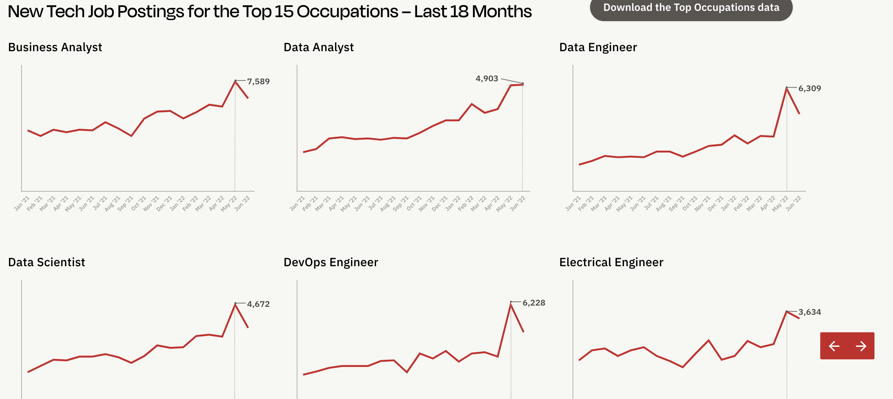

# Data Engineering Wrap-Up

## The Big Picture

#### We started out the semester defining what data engineering is, what data engineers do, and what career prospects are for data engineers.

Why is data engineering important? Because data has become a critical business and organizational
asset - companies as diverse as Amazon, Tik Tok, any major sports team, Netflix, or Google derive
significant competitive advantage from leveraging their data using data engineering and data
science.

### Data Engineers Build Data Pipelines

#### You learned the fundamental steps in building a data pipeline:
* Ingestion (Staging tables)
* Transformation (Dimensional models aka Star Schemas)
* Publication (Data Products)

#### Production-level data engineering adds a whole set of tools to help build, run, and monitor data pipelines:
* ETL tools - automate extracting data out of source systems into staging areas
* Orchestration tools - to organize, schedule, and run pipelines.
* Data Catalogs, Lineage, and Observability - to document and track the data

#### Kinds of Data Engineering Roles
As data engineering continues to become more and more important, it will become more specialized 
and offer more and different kinds of opportunities.
* Data Engineer as infrastructure engineer (data engineering + devOps = dataOps)
* Data Engineer as software engineer (“data intensive” systems)
* Data Engineer as data scientist
* Data Engineer as analytics engineer
* Data Engineer as knowledge engineer

### Interviewing

Interviewing tips:
* Interviewing is its own skill - like any skill, it takes practice.
* Do your research on the company you're interviewing.
* If you know what skills they're looking for, study them.
* If there's a job you really want, try to do one or more interviews with other companies first.
* Act positive, friendly, and confident, but be yourself.
* Don't pretend you know what you don't know.
* If you're asked a question that you don't know the answer to, ask what the answer is.
* You can ask them questions, too - it's a two-way street.
* Learn to handle rejection - treat it as a learning opportunity.
