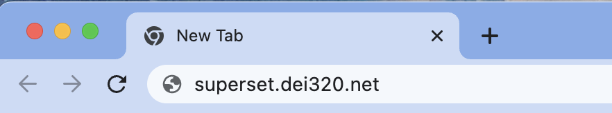
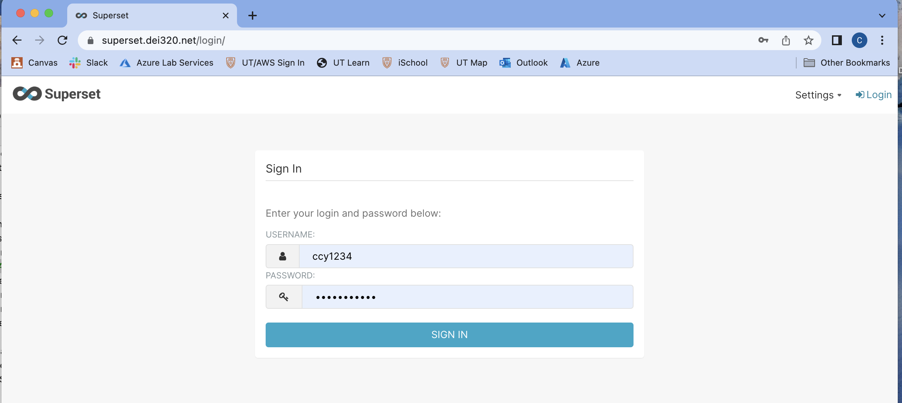
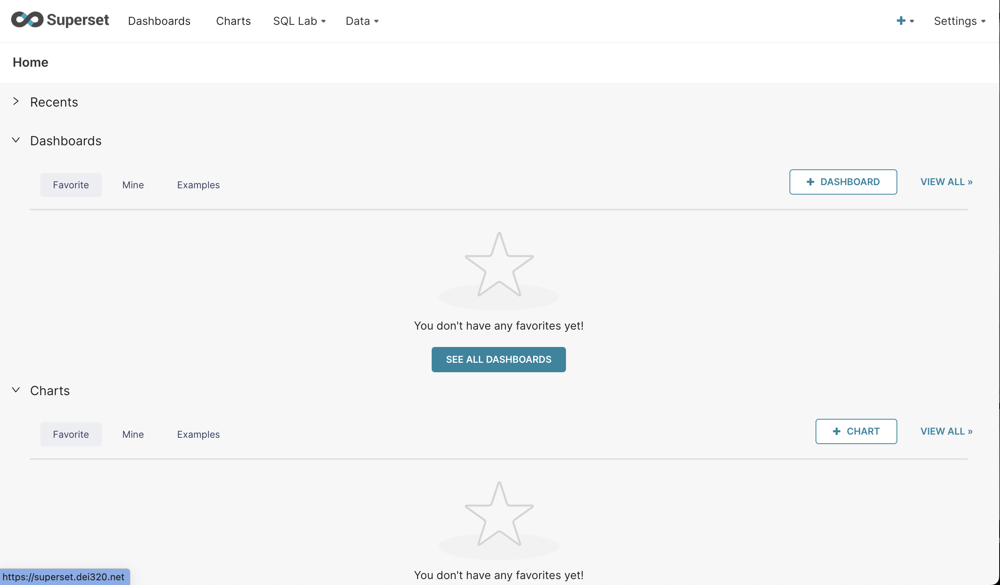
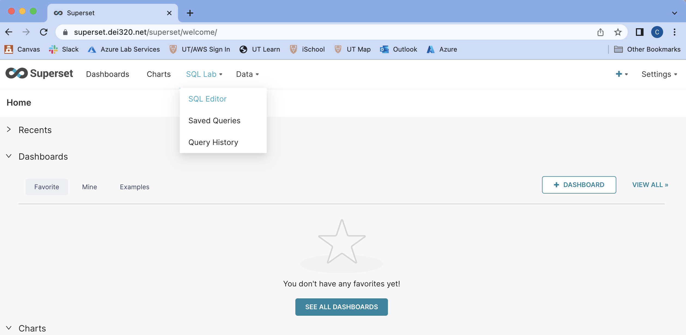
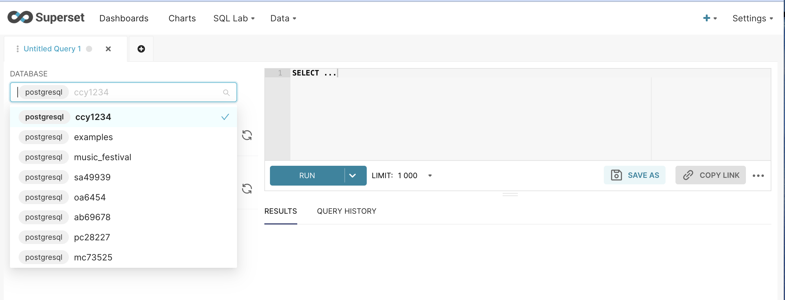
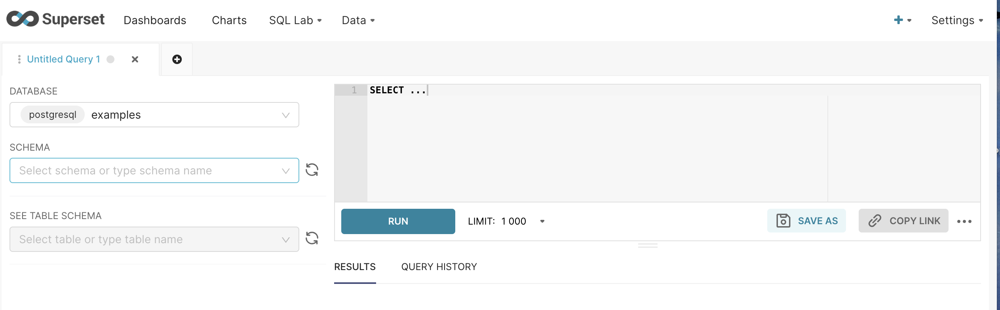
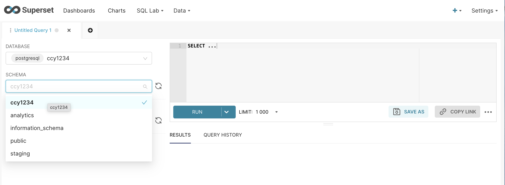
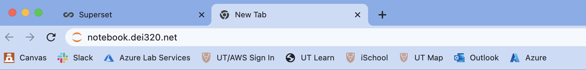
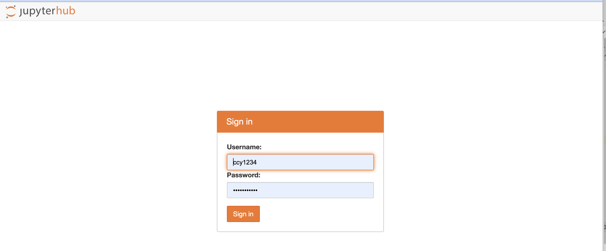
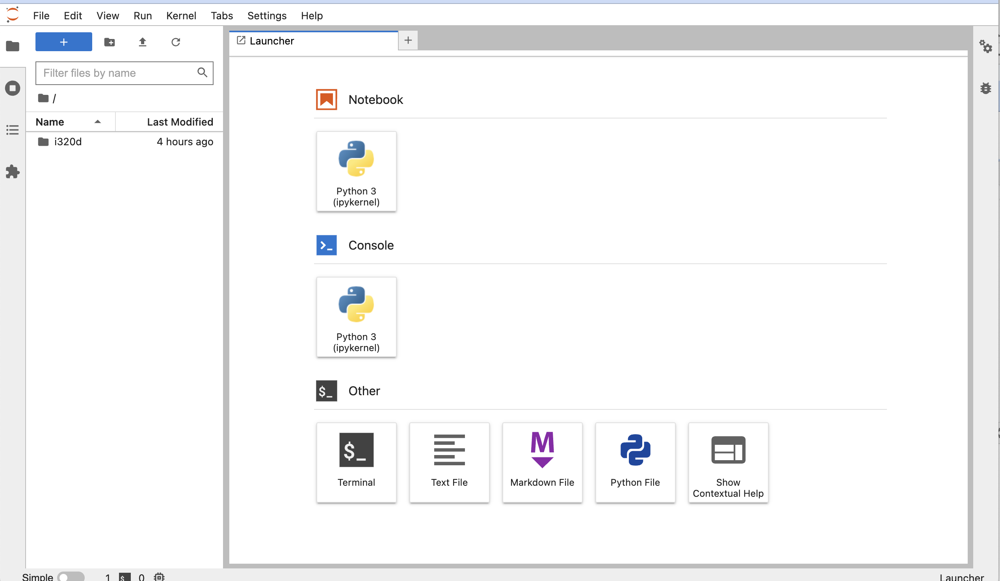

# Accessing Your AWS VM Environment

We have a single large AWS VM that everyone will have their own separate environment on. Superset
and Jupyter are installed as your primary software tools.

* Your login will be your EID (e.g., `abc987`)
* Your password will be your EID followed by 4 random alphanumeric characters (e.g., `abc987df4g`)
* The login and password should have been provided to you in an email.

## Login to Superset

Enter the URL for Superset in your browser: `superset.dei320.net`

You will see a login screen - enter your EID and your password. Save your EID and password to your
browser's password manager (or other password manager) if you can, so you don't have to enter it
every time.

You'll see an empty dashboard screen the first time you log in - this is fine.

Select `SQL Lab` from the Menu and then `SQL Editor` from the pulldown.

Set your database and schema in the SQL Lab Editor - your database and schema name is your EID.
You'll see this screen - click on the database dropdown.

Pick your database from the dropdown.

Repeat this to choose your schema, which is also your EID

The next time you login, your database and schema should be set.

## Login to Jupyter
Now login to Jupyter. Enter the URL for Jupyter in your browser: `notebook.dei320.net`

You will see this login screen. Your login is your EID and your password is your EID plus 4 random
characters.

You will see this screen after logging in.

