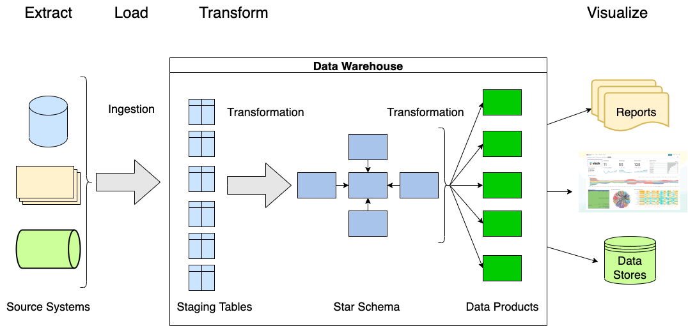
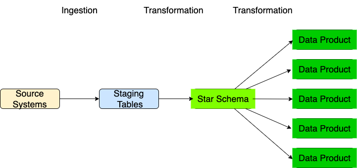
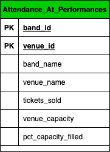

# Data Products

Data Products are what get produced at the end of the data transformation pipeline. The creation of 
data products is usually _customer-driven_ - we build them in response to specific customer and 
organizational needs. Data products are the primary things that we _publish_ out of our data 
warehouse. They are what will provide the data that goes into reports, into visualizations,
and into other systems in an organization.



The dimensional models (star schemas) that we build are data products, too. But we can classify them
as our **primary** data product. A dimensional model also serves as a _data product factory_ - that 
is, we can use our dimensional models to create derived data products to fulfill customer and 
organizational requirements.



## What Are Data Products?

Data Products are tables in our data warehouse that are:
* **Derived** from star schemas.
* Intended to fulfill certain specific needs of our customers.
* Often transient; that is, they may only be for a specific project or inquiry.

One of the most important goals in building data products is to make our data easier to understand,
simpler, and faster to query - the exact same goals we had in building dimensional models - but now
taken a step further.

One big conceptual difference between dimensional models and derived data products is that derived
data products are _ad-hoc_ - that is, there is no model or process for creating them. They are 
created in response to some need - a request from a data scientist or analyst, a requirement from a 
requirements document in a project plan, or some other triggering event.

This can lead to problems. If the lifecycle of data products is not carefully managed, a bewildering
array of data products may get created to the point that the organization loses track of them. 
Having too many different data products, especially if they are poorly tracked and documented, can
be so confusing that it might be worse than not having the data products customers need. 

Example: Facebook's (Meta's) issues with finding all their customer data.

### An Example Data Product

Calculating how full each venue gets for each performance requires a more complicated SQL
statement than we've seen before:

```sql
CREATE TABLE analytics.attendance_at_performances AS
WITH performance_attendees AS (
    SELECT performance_id, COUNT(ticket_id) AS tickets_sold
    FROM   ticket_sales_facts AS tsf
    GROUP  BY performance_id
)
SELECT b.band_id,
       b.band_name,
       v.venue_id,
       v.venue_name,
       pa.tickets_sold,
       v.capacity AS venue_capacity,
       pa.tickets_sold/(v.capacity*1.0) AS pct_seats_filled
FROM   ticket_sales_facts AS tsf
JOIN   bands_dimension AS b ON (b.band_id = tsf.band_id)
JOIN   venues_dimension AS v ON (v.venue_id = tsf.venue_id)
JOIN   performance_attendees AS pa ON (pa.performance_id = tsf.performance_id)
```

This question requires using an advanced SQL construct that you haven't learned yet. Many analysts
and engineers haven't learned it either. So instead of expecting or hoping analysts and other engineers 
can write this complicated SQL  - and have to do it again and again every time they want to get
this data - we turn this query into a data product that can be reused.

Note that this is an example of how our star schema is a data model factory - the data product is
derived from the star schema.

As an aside, every SELECT statement produces a result set that is the equivalent of a table, so we
can use the result of an SQL statement to create a table. [Give brief explanation of theory of
relations and how an operation on a relation always produces another relation]

That SQL statement creates this table:



Which I can now query as follows:

```sql
SELECT *
FROM   analytics.attendance_at_performances
WHERE  ...
```

This achieves our goals for data products:

* Easier to understand - the data product has a single clear purpose: What was the ratio of attendance at each performance to the capacity of the venue?
* Simpler - Just query the single data product to get the data you need.
* Faster - Faster to query because the joins have been _pre-computed_.

### Why Create Data Products?

1. Simpler access to data
    Instead of writing SQL that joins multiple tables, we can execute a simpler query against a data product.
2. Performance
    Instead of executing the same complex query over and over again, we execute the query once and store the results in the data product. This saves both time and money.
3. Tool constraints (one dataset at a time)
    Superset, for example, can only work on a single dataset at a time. So we build data products for tools like Superset to consume.

#### Why not just create data products directly from the source data in a data lake?

This is a good question and in fact some organizations have taken this approach. The reasoning is
that different teams in an organization can be more flexible and more productive if they can go 
directly to the source data and create exactly what they and their customers need. In other words,
instead of processing data in a data pipeline that gets stored in a centralized data warehouse, 
individual programs or processes create new products. I think that this is a mistake for most 
organizations, for the following reasons:

1. The difficulty of coordinating both the processes and data products created by decentralized projects and teams.
2. Dimensional models provide a well-known, structured way to organize analytical data and to build data products.
3. Star schemas also provide a well-structured way to do ad-hoc queries, as opposed to searching across raw data sources.
4. Combining data from different sources is only done once in a data pipeline but may be repeated many times in a data lake approach.

In truth, most organizations take a kind of hybrid approach - the primary source of analytic data
is from a centralized data warehouse, but data scientists and analysts have the ability to use the
raw data in the data lake for some specialized needs that the data warehouse can't fulfill.


### Exercise - Create a Data Product

Using the star schema tables in the music_festival database, create a data product that can be used
to answer the following questions:

Which performances had an average ticket price over $25 - we want to know the band, the venue,
the number of tickets sold, and the total ticket sales revenue as well as the average ticket price.

So the first step is to create a `SELECT` query that answers this question.

The SQL statement can begin with a _DROP TABLE IF EXISTS_, follwed by a _CREATE TABLE...AS_, like so:

```sql
DROP TABLE IF EXISTS analytics.<your_table_name_your_EID>;
CREATE TABLE IF NOT EXISTS analytics.<your_table_name_your_EID> AS
SELECT ...
;
```
Fill in the table name with what you think is a good descriptive name for this data product. Good
names are important (and not always easy)!

**Important**: The name of the table needs to be followed by your EID - this is because we're all 
creating this table in the same database schema, so each table has to have a unique name. For
example I could call the table `avg_ticket_price_youngcc4` (but use a more descriptive name than that).

Then fill in the SELECT statement with a query that will fulfill the requirements above.

Question: Why do we want the DROP TABLE in this exercise?
