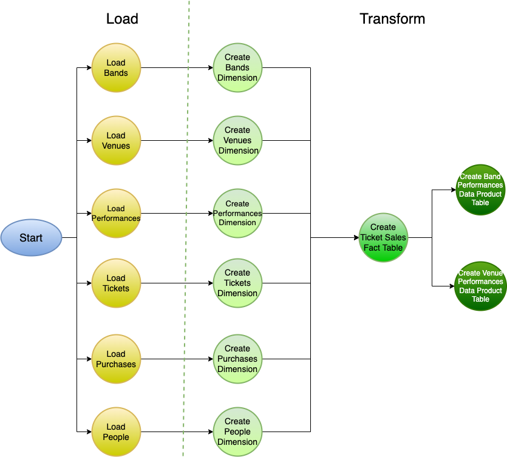
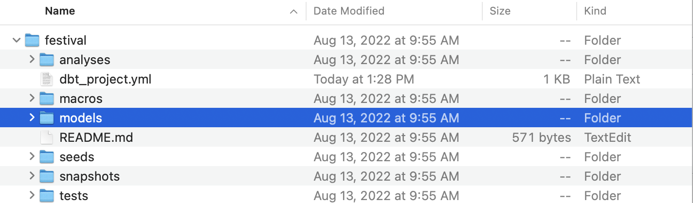
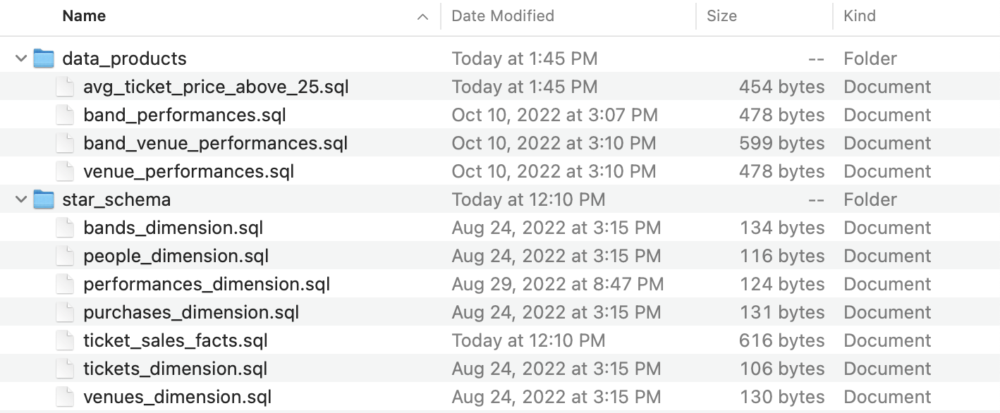

# Data Transformations Using DBT

dbt (which stands for **d**ata **b**uild **t**ool) is a very popular open-source tool that is widely used by
data engineers and analysts to transform data in data pipelines. It works by turning the results of
SELECT statements into tables in the data warehouse.

In our previous class, we created a data product by turning a SELECT statement against the 
dimensional model in the Music Festival database:

```sql
DROP TABLE IF EXISTS analytics.avg_ticket_price_above_25;  
CREATE TABLE IF NOT EXISTS analytics.avg_ticket_price_above_25 AS  
    SELECT b.band_id,  
           b.band_name,  
           v.venue_id,  
           v.venue_name,  
           AVG(t.ticket_price) AS average_ticket_price  
    FROM   ticket_sales_facts AS t  
    JOIN   bands_dimension AS b ON (t.band_id = b.band_id)  
    JOIN   venues_dimension AS v ON (t.venue_id = v.venue_id)  
    GROUP BY b.band_id, b.band_name, v.venue_id, v.band_name  
    HAVING AVG(t.ticket_price) >= 25 
```

## Data Pipelines and DAGs
We've also talked previously about data pipelines and directed acyclic graphs (DAGs). A data pipeline
is the set of tasks or processes that transforms the data from its source(s) into the dimensional 
model and data products.

We represent the data pipeline as a directed acyclic graph (DAG) so that we can understand the 
order of the tasks in the data pipeline and their dependencies on each other. There are tools that
allow you to define a DAG in code and that orchestrate the execution of the tasks in the DAG, but 
they are beyond the scope of this class.

Here is the dag for the Music Festival project:



Everything to the left of the dotted green line is a task that loads data from a CSV into a table. 
We used the python `\copy` command to load CSV files into tables, for example:

```sql
\copy festival.bands FROM './data/bands.csv' WITH CSV HEADER
```

To the right of the dotted green line are tasks that transform from one or more source tables into 
a new table. 
* The first set of transformations transforms our staging tables into dimension tables 
in our dimensional model. 
* The second set of transformations transforms the dimensional tables into the ticket_sales_facts table.
* The third set of transformations transforms the dimensional model into data products.

### Transformations using dbt

We will use dbt as the tool to do these transformations. dbt does two very useful things for us:

1) It automatically drops and creates tables for us.
2) It allows us to declare dependencies between tables so we can control the flow of execution in a DAG.

So if use dbt, this:
```sql
DROP TABLE IF EXISTS analytics.avg_ticket_price_above_25;  
CREATE TABLE IF NOT EXISTS analytics.avg_ticket_price_above_25 AS  
    SELECT b.band_id,  
           b.band_name,  
           v.venue_id,  
           v.venue_name,  
           AVG(t.ticket_price) AS average_ticket_price  
    FROM   ticket_sales_facts AS t  
    JOIN   bands_dimension AS b ON (t.band_id = b.band_id)  
    JOIN   venues_dimension AS v ON (t.venue_id = v.venue_id)  
    GROUP BY b.band_id, b.band_name, v.venue_id, v.band_name  
    HAVING AVG(t.ticket_price) >= 25  
```

becomes a file called `avg_ticket_price_above_25.sql` with this content:
``` 
{{ 
   config(  
     materialized="table"  
   ) 
}}  
SELECT b.band_id,  
       b.band_name,  
       v.venue_id,  
       v.venue_name,  
       AVG(t.ticket_price) AS average_ticket_price  
FROM   ticket_sales_facts AS t  
JOIN   bands_dimension AS b ON (t.band_id = b.band_id)  
JOIN   venues_dimension AS v ON (t.venue_id = v.venue_id)  
GROUP BY b.band_id, b.band_name, v.venue_id, v.band_name  
HAVING AVG(t.ticket_price) >= 25;  
```

Note that we have the same exact SELECT statement in the dbt file. But there are some important
differences:
1. The name of the file (`avg_ticket_price_above_25.sql`) is the name of the table we want to create.
2. The DROP TABLE and CREATE TABLE statements get replaced with this:
```
{{  
   config(  
     materialized="table"  
   )  
}} 
```
This configuration directive tells dbt to materialize (i.e., _create_) the SELECT statement as a 
table. If the table already exists, it will drop it before attempting to create it. In other words,
dbt is replacing this part of our original SQL code to create the data product:

```sql
DROP TABLE IF EXISTS analytics.avg_ticket_price_above_25;  
CREATE TABLE IF NOT EXISTS analytics.avg_ticket_price_above_25 AS  
```

The second thing dbt does is enforce dependencies between transformations. For example, we can
change the SQL in our dbt file as follows:
```
SELECT b.band_id,  
       b.band_name,  
       v.venue_id,  
       v.venue_name,  
       AVG(t.ticket_price) AS average_ticket_price  
FROM   {{ ref('ticket_sales_facts') }} AS t  
JOIN   {{ ref('bands_dimension') }} AS b ON (t.band_id = b.band_id)  
JOIN   {{ ref('venues_dimension') }} AS v ON (t.venue_id = v.venue_id)  
GROUP BY b.band_id, b.band_name, v.venue_id, v.band_name  
HAVING AVG(t.ticket_price) >= 25
```

Let's take a closer look at what changed here:

> FROM   {{ ref('ticket_sales_facts') }} AS t  
JOIN   {{ ref('bands_dimension') }} AS b ON (t.band_id = b.band_id)  
JOIN   {{ ref('venues_dimension') }} AS v ON (t.venue_id = v.venue_id)

The **{{ ref('ticket_sales_facts') }}** is a directive to the dbt engine that this SQL statement
cannot be executed until a table named _ticket_sales_facts_ has been dropped and created in a 
previous step in our DAG. Only when it and the bands_dimension and venues_dimension tables have 
been created can this table be created. Put another way, this is enforcing this part of our DAG:


One important note: **there can be one and only one SQL statement in a dbt SQL file. It must be
a SELECT** and it will create a table with the same name as the file (without the `.sql` extension).

## How dbt Works
dbt is a stand-alone program that is already installed for each of you in your VM environment. It
works by creating a project in which you write SQL files for your transformations. 

I created a dbt project for our music festival database with this command:

> dbt init festival

When this command is run, it will create a directory tree like this one for our music festival project:



You will not have to do this - for your projects, this will all be set up for you. The one thing you
need to care about here is the highlighted `models` directory. This directory contains the SQL files
that do the actual transforms:



Under the `models` directory we have 2 sub-directories - `star_schema` and `data_products`.  Notice 
that there is a file for each table in our dimensional model in the `star_schema` directory. You
can also see that we have several files in our `data_products` directory including the 
`avg_ticket_price_above_25.sql` file that we've been discussing. 

For your semester project, you will have a dbt project set up for you. It will have a `models` 
directory that contains the `star_schema` and `data_products` sub-directories. You will have to 
write the SQL files that create your star schema in the `star_schema` directory and the
SQL files that create your data products in the `data_products` directory.

## Running DBT

We can execute the SQL files in the `models` directory by running this command from the festival
project directory:

> dbt run 

It will produce output that looks like this:
```text
dbt run  
22:04:42  Running with dbt=1.2.0  
22:04:42  Found 11 models, 0 tests, 0 snapshots, 0 analyses, 256 macros, 0 operations, 0 seed files, 0 sources, 0 exposures, 0 metrics  
22:04:42   
22:04:42  Concurrency: 1 threads (target='dev')  
22:04:42    
22:04:42  1 of 11 START table model analytics.bands_dimension ............................ [RUN]  
22:04:42  1 of 11 OK created table model analytics.bands_dimension ....................... [SELECT 1417 in 0.09s]  
22:04:42  2 of 11 START table model analytics.people_dimension ........................... [RUN]  
22:04:42  2 of 11 OK created table model analytics.people_dimension ...................... [SELECT 143616 in 0.34s]  
22:04:42  3 of 11 START table model analytics.performances_dimension ..................... [RUN]  
22:04:42  3 of 11 OK created table model analytics.performances_dimension ................ [SELECT 2402 in 0.03s]  
22:04:42  4 of 11 START table model analytics.purchases_dimension ........................ [RUN]  
22:04:46  4 of 11 OK created table model analytics.purchases_dimension ................... [SELECT 2147150 in 3.94s]  
22:04:46  5 of 11 START table model analytics.tickets_dimension .......................... [RUN]  
22:04:53  5 of 11 OK created table model analytics.tickets_dimension ..................... [SELECT 3590408 in 7.25s]  
22:04:53  6 of 11 START table model analytics.venues_dimension ........................... [RUN]  
22:04:53  6 of 11 OK created table model analytics.venues_dimension ...................... [SELECT 9 in 0.02s]  
22:04:53  7 of 11 START table model analytics.ticket_sales_facts ......................... [RUN]  
22:05:03  7 of 11 OK created table model analytics.ticket_sales_facts .................... [SELECT 3590408 in 10.03s]  
22:05:03  8 of 11 START table model analytics.avg_ticket_price_above_25 .................. [RUN]  
22:05:05  8 of 11 OK created table model analytics.avg_ticket_price_above_25 ............. [SELECT 633 in 1.03s]  
22:05:05  9 of 11 START table model analytics.band_performances .......................... [RUN]  
22:05:20  9 of 11 OK created table model analytics.band_performances ..................... [SELECT 3590408 in 15.60s]  
22:05:20  10 of 11 START table model analytics.band_venue_performances ................... [RUN]  
22:05:38  10 of 11 OK created table model analytics.band_venue_performances .............. [SELECT 3590408 in 17.53s]  
22:05:38  11 of 11 START table model analytics.venue_performances ........................ [RUN]  
22:05:52  11 of 11 OK created table model analytics.venue_performances ................... [SELECT 3590408 in 13.87s]  
22:05:52   
22:05:52  Finished running 11 table models in 0 hours 1 minutes and 9.88 seconds (69.88s).  
22:05:52   
22:05:52  Completed successfully  
22:05:52    
22:05:52  Done. PASS=11 WARN=0 ERROR=0 SKIP=0 TOTAL=11  
```


