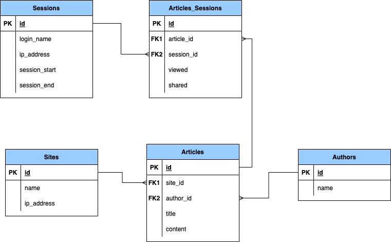

In our last class, we looked at how to transform operational data models into dimensional models or 
star schemas. We did this by:

First, getting requirements from our customer in the form of a set of questions that could be
answered by querying our data;

Second, by determining the grain or granularity of our data and picking out the atomic facts.

Remember that **facts** are _measures_ - each row in a fact table is a measurement of something.
We generally want our facts to be _numeric_ and _additive_ so that we can sum them, count them,
average them, and perform other kinds of mathematical functions on them. Facts should be indivisible
and unique. Each row in the fact table usually represents a **transaction** or an **event**. So the 
grain of a table is usually the lowest-level transaction in the system.

Remember that **dimensions** are composed of descriptive attributes that provide _context_. These
descriptive attributes allow us to label, search, filter, group, and order the data in various ways. 
We use dimensional attributes in SELECT, WHERE, GROUP BY, and ORDER BY clauses in our SQL 
statements.

Once we understand the requirements, and have identified atomic facts and the granularity of our 
data, we transform the operational model into a dimensional model following this 4-step process:

1. Remove the foreign keys from each table. These tables will become the dimension tables.
2. Rename any columns in the dimension tables whose names are ambiguous or duplicates. For example, change `name` in the bands table to `band_name`.
3. Add all the primary keys to the fact table - rename them with the name of the table, e.g., `id` in the bands table becomes `band_id`.
4. Add the fact column to the fact table.

Exercise:

We will break into teams of 3 and each team will do a transformation of this operational model:

But first we need to understand the data and the model. Below is a concrete diagram that shows 
several example records for this data model. Then we transform it into a couple of concrete 
records and then into an abstract record. 

We can then transform it into a conceptual model for a star schema.

Here are the questions our customers are asking:

1. What articles have the most pageviews?
2. What is the most shared article?
3. What authors have the most shares?
4. What sites have the most pageviews?
5. What is the average length of a session?

Now, do the following:

1) Pick out the atomic facts and determine the grain or granularity of the fact table.
2) Draw a transformational diagram
3) Draw the star schema diagram

