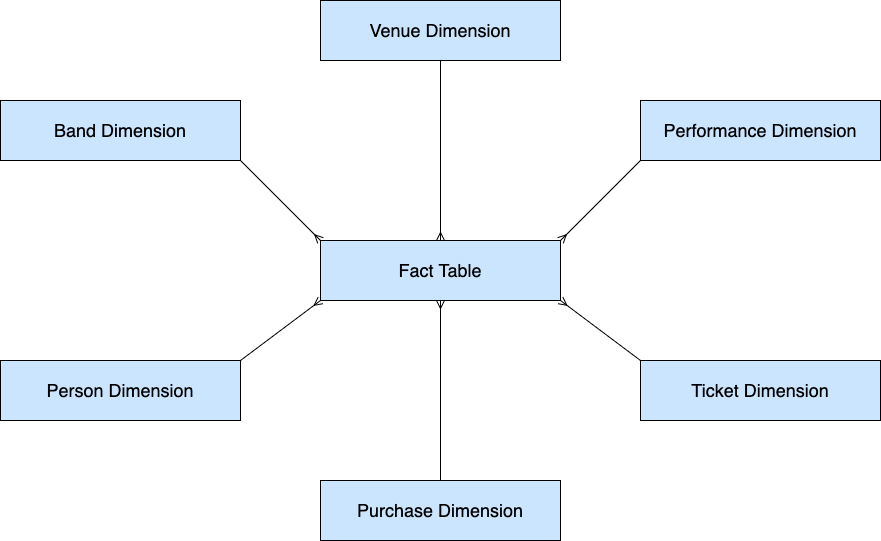

# Dimensional Models AKA "Star Schemas"

Today we're going to talk about dimensional modeling. Dimensional modeling is a technique for 
modeling large-scale analytical data to make it easier to understand, easier to query, and faster 
to query.

### Why Do We Need A Different Data Model?
We build (or at least, we should build) normalized data models for our operational
systems - what we've been calling E-R data models - because that is the right model for applications 
that have many small transactions. But normalized data models are inefficient and hard to understand 
when doing more complex kinds of analytics. Analytical queries against operational databases will 
join many tables and use more sophisticated features of SQL to get the answers to the questions we 
want to ask.

### Concrete Example
Let's consider a concrete example of our Music Festival Data. 

What is that data model about?  
_Bands_ give _Performances_ at _Venues_ to _People_ who made _Purchases_ of _Tickets_. 

We can give a concrete representation of that in this diagram:

As the number of relationships grows, this diagram gets more and more complex. Another way to 
express this is to visualize each concrete example as a record:

We can then break out our entities from our abstract representation of a record:

### A Dimensional Data Model (Conceptual)
Dimensional models structure the data to make it much easier to build complex analytical queries.
It does this by organizing the model around two kinds of tables:
* **Fact** tables 
* **Dimension** tables

A single fact table will have many dimension tables associated with it. We create diagrams where a
Fact table is surrounded on all sides by dimension tables like points of star - so we term these 
models _Star Schemas_.

Both the operational data model and the dimensional data model express this - they are equivalent
in that they contain the exact same information. But they are structured differently to best suit
their particular use cases.

### What are Fact and Dimension Tables?
**Facts** are _measures_ - each row in a fact table is a measurement of something.

We prefer facts to be numeric and _additive_ - that is, we can perform aggregate functions on them
like COUNT, SUM, AVG, MIN, MAX, etc.

**Dimensions** provide _context_ for different kinds of measurement. They describe what we are 
measuring.

Dimensions consist of descriptive attributes - usually (but not always) text strings or date/times - 
that allow us to label, search, filter, group, and order the data in various ways. In other words, 
we will use dimensional attributes in SELECT, WHERE, GROUP BY, and ORDER BY clauses in our SQL 
statements.

Generally, each row or fact in a fact table represents a **transaction** or an **event** that is measurable
in some way. We want our facts to be _atomic_ - that is, they should be unique and indivisable. The
reason for this is that we want to be able to slice and dice our data in every possible way in order
to thoroughly and effectively analyze it.

What is an atomic fact in our Music Festival data model?

### Creating Our Dimensional Model

So let's convert our operational data model for the music_festival database to a dimensional model.

The first step is to understand what our customers want - remember, we're always doing this for
some organization or entity. In our case, it's the organizers of the music festival. The want us
to analyze the data to answer questions like the following questions:

1. How much did we make in ticket sales? - per year, per venue, per band
2. Which venues were the most popular? - by tickets sold, by capacity filled and by revenue
3. Which bands were the most popular?
4. What was the highest, lowest, and average price of a ticket? - by band, performance, and venue
5. When did people buy tickets for a performance? When the show was announced, or just before the performance?
6. Are there any bands gaining in popularity over the years or losing popularity?

If our dimensional model makes it relatively easy to answer these questions, then we know our model
is more or less correct.

The next step is to take the tables in our festival schema and turn them into dimensions.

1. Remove the foreign keys from each table - the foreign keys will go into the fact table. These will be the dimension tables.
2. Rename any columns whose names are ambiguous or duplicates.
3. Identify the candidate facts in the tables.
4. Build the fact table by adding all the foreign keys and the column(s) that are the facts.

So we end up with this dimensional model:

Exercise:
Using the dimensional model, write out queries to answer some of the questions we posed above:

