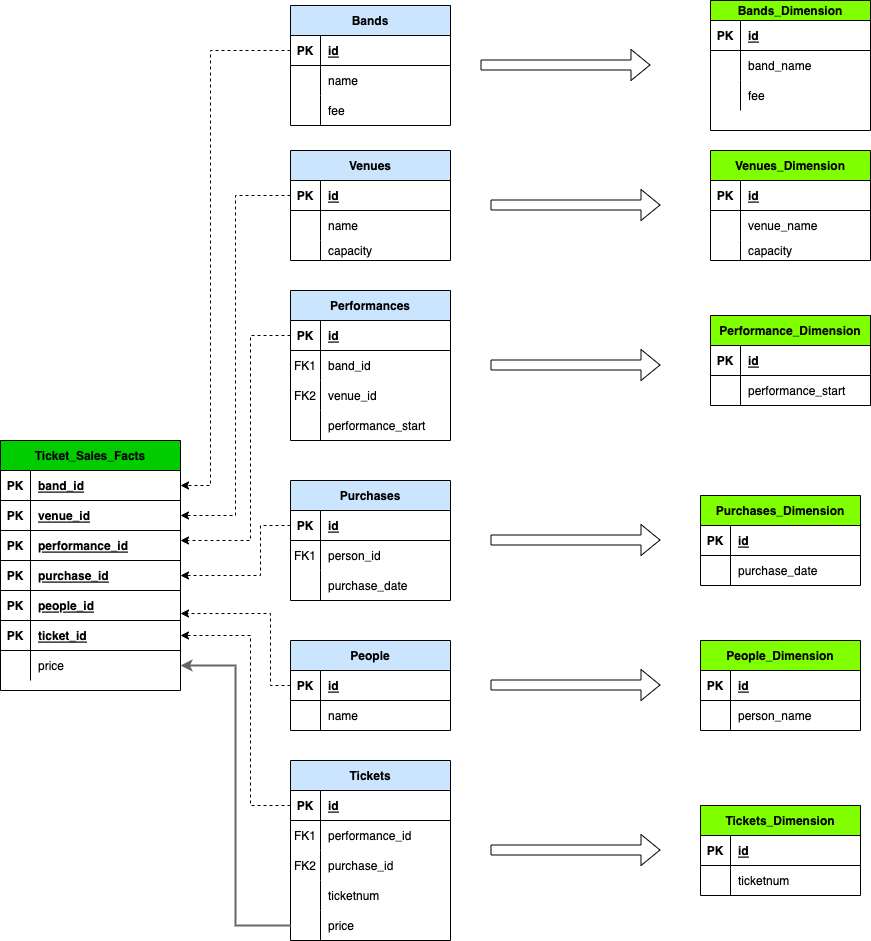

# Dimensional Models AKA "Star Schemas"

Today we're going to talk about dimensional modeling. Dimensional modeling is a technique for 
modeling large-scale analytical data to make it simpler, easier to understand, and faster to query.

### Why Do We Need A Different Data Model?
We build (or at least, we should build) normalized data models for our operational
systems - what we've been calling E-R data models - because that is the right model for applications 
that have many small transactions. But normalized data models are inefficient and hard to understand 
when doing more complex kinds of analytics. Analytical queries against operational databases will 
join many tables and will need to use more sophisticated features of SQL to get the answers to the  
questions we want to ask.

### Operational Data Model
In our last assignment, we created a physical E-R model of our operational database:

What is this data model about?  
_Bands_ give _Performances_ at _Venues_ to _People_ who made _Purchases_ of _Tickets_

OR -

_People_ make _Purchases_ of _Tickets_ to see _Performances_ of _Bands_ at _Venues_


### Concrete Example
We can give a concrete representation of that in this diagram:


As the number of relationships grows, this diagram gets more and more complex. Another way to 
express this is to visualize each concrete example as a record:


We can then break out our entities from our abstract representation of a record:


### A Dimensional Data Model (Conceptual)
Dimensional models structure the data to make it much easier to build complex analytical queries.
It does this by organizing the model around two kinds of tables:
* **Fact** tables 
* **Dimension** tables

A single fact table will have many dimension tables associated with it. We create diagrams where a
Fact table is surrounded on all sides by dimension tables like points of star - so we term these 
models _Star Schemas_.


Both the operational data model and the dimensional data model express this - they are equivalent
in that they contain the exact same information. But they are structured differently to best suit
their particular use cases.

### What are Fact and Dimension Tables?
**Facts** are _measures_ - each row in a fact table is a measurement of something.

We prefer facts to be numeric and _additive_ - that is, we can perform aggregate functions on them
like COUNT, SUM, AVG, MIN, MAX, etc.

**Dimensions** provide _context_ for different kinds of measurement. They describe what we are 
measuring.

Dimensions consist of descriptive attributes - usually (but not always) text strings or date/times - 
that allow us to label, search, filter, group, and order the data in various ways. In other words, 
we will use dimensional attributes in SELECT, WHERE, GROUP BY, and ORDER BY clauses in our SQL 
statements.

Generally, each row or fact in a fact table represents a **transaction** or an **event** that is measurable
in some way. We want our facts to be _atomic_ or _granular_ - that is, they should be as unique and 
indivisible as possible. The reason for this is that we want to be able to slice and dice our data 
in every possible way in order to thoroughly and effectively analyze it.

### Who Is Our Customer for the Dimensional Model?

The operational database is used in real time - people add bands who will play at a future festival,
reserve venues for performances, determine ticket prices for those performances, and sell tickets.
All that information goes into the operational database as it happens. Over the years, a historical
record of that data gets built up. 

At some point, the organizers of the festival want to analyze the data to help them make decisions
about future festivals. There are a set of questions they would like to have answered because they're
thinking of putting on an all-star festival of the most popular bands at the most popular venues.

Those questions are our starting point in building the model. We'll know we have the right model
if we can answer these questions and others like them effectively and efficiently.

1. How much did we make in ticket sales? - per year, per venue, per band
2. Which venues were the most popular? - by tickets sold, by capacity filled and by revenue
3. Which bands were the most popular?
4. What was the highest, lowest, and average price of a ticket? - by band, performance, and venue
5. When did people buy tickets for a performance? When the show was announced, or just before the performance?
6. Are there any bands gaining in popularity over the years or losing popularity?

Given that set of questions, and the knowledge that we want to organize the data into a 
dimensional model that will help us answer those questions, we need to decide on the facts and
dimensions. The first, most essential question is this:

What is an atomic fact in our Music Festival data model?


Remember that facts are numeric and additive - what column in our data model would we want to
sum up, count, average, or do math on to help us answer the questions above?

### Creating Our Dimensional Model

So let's convert our operational data model for the music_festival database to a dimensional model.

The next step is to take the tables in our festival schema and turn them into dimensions.

1. Remove the foreign keys from each table. These tables will become the dimension tables.
2. Rename any columns in the dimension tables whose names are ambiguous or duplicates. For example, change `name` in the bands table to `band_name`.
3. Add all the primary keys to the fact table - rename them with the name of the table, e.g., `id` in the bands table becomes `band_id`.
4. Add the fact column to the fact table.



So we end up with this dimensional model:


### Why Is This Better?

We stated earlier that the dimensional model was simpler, easier to understand, and faster to 
query. Here is an example:

_Find the top 10 performances by ticket sales revenue in the history of the festival_:

A query against our operational database in the festival schema that answers this question looks
like this:

```sql
SELECT b.name AS band_name,
       v.name AS venue_name,
       COUNT(*) AS tickets_sold,
       SUM(t.price) AS ticket_sales
FROM   bands AS b
JOIN   performances AS p ON (b.id = p.band_id)
JOIN   venues AS v ON (v.id = p.venue_id)
JOIN   tickets AS t ON (t.performance_id = p.id)
GROUP BY b.name, v.name
ORDER BY ticket_sales DESC
LIMIT 10;
```

It takes about 2.7-3 seconds to run

Here is the same query using the dimensional model:

```sql
SELECT band_name,
       venue_name,
       COUNT(*) AS tickets_sold,
       SUM(ticket_price) AS ticket_sales
FROM   ticket_sales_facts AS f 
JOIN   bands_dimension AS b ON (b.band_id = f.band_id)
JOIN   venues_dimension AS v ON (v.venue_id = f.venue_id)
GROUP BY band_name, venue_name
ORDER BY ticket_sales DESC
LIMIT 10;
```

It took about 20 milliseconds to run.

Note that:
* It's simpler - 2 joins instead of 3.
* It's easier to understand - no aliasing of column names, joins are easier to understand because everything joins to the fact table.
* It's much faster - simpler for the optimizer to figure out the fastest access paths to the data.

Exercise:
Using the dimensional model, write out queries to answer some of the questions we posed above:

1. How much did we make in ticket sales? - per venue, per band, per year
2. Which venues were the most popular? - by number of tickets sold, by revenue (ticket sales), and by capacity filled
3. Which bands were the most popular? - by number of tickets sold, by revenue (ticket sales)
4. What was the highest, lowest, and average price of a ticket? - by band, performance, and venue
5. When did more people buy tickets for a performance? When the show was announced, or just before the performance?
6. Are there any bands gaining in popularity over the years or losing popularity?

#### Answers to question 1:
- Ticket Sales per Venue:
```sql
SELECT venue_name, 
       SUM(t.ticket_price) AS ticket_sales
FROM   ticket_sales_facts AS t 
JOIN   venues_dimension AS v ON (v.venue_id = t.venue_id)
GROUP BY venue_name
ORDER BY ticket_sales DESC
```

- Ticket Sales per Band:
```sql
SELECT band_name, 
       SUM(ticket_price) AS ticket_sales
FROM   ticket_sales_facts AS t 
JOIN   bands_dimension AS v ON (v.band_id = t.band_id)
GROUP BY band_name
ORDER BY ticket_sales DESC
```

- Ticket Sales per Year
```sql
SELECT EXTRACT(YEAR from performance_start) AS year, 
       SUM(ticket_price) AS ticket_sales
FROM   ticket_sales_facts AS t 
JOIN   performances_dimension AS p ON (p.performance_id = t.performance_id)
GROUP BY EXTRACT(YEAR from performance_start)
ORDER BY tickets_sold DESC
```


