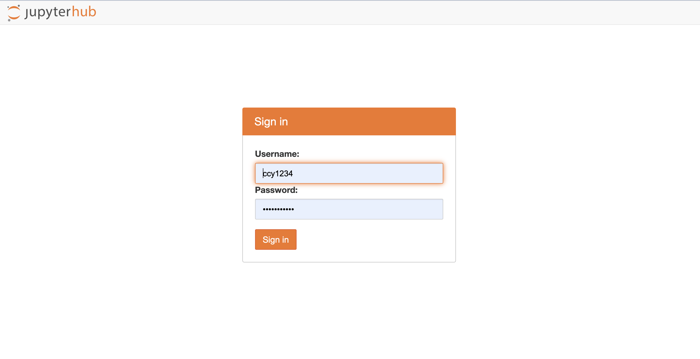
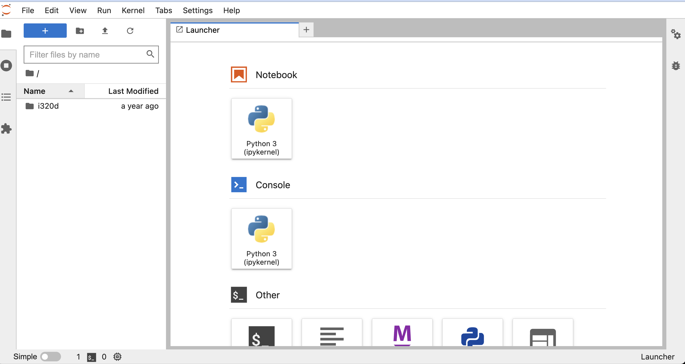
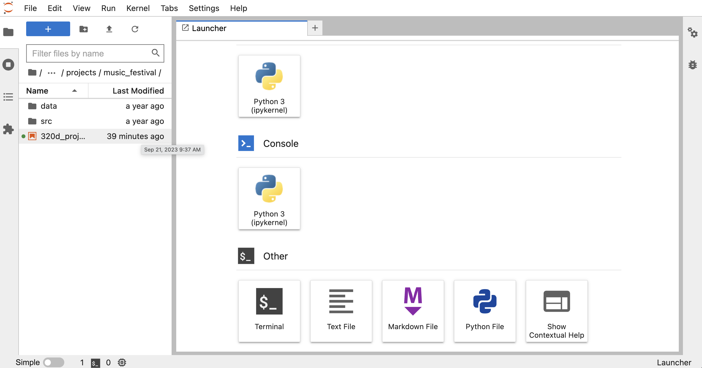
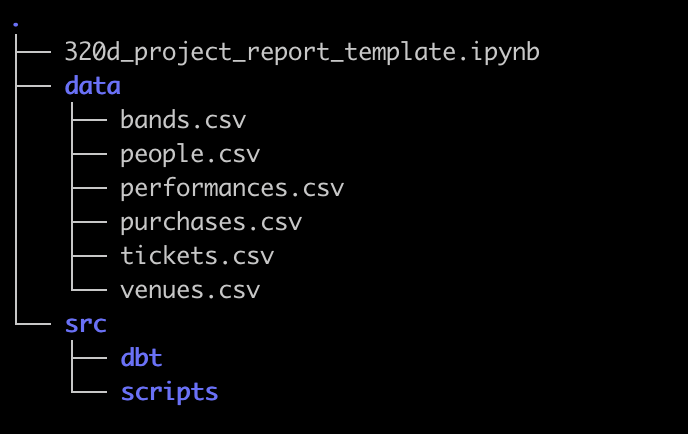
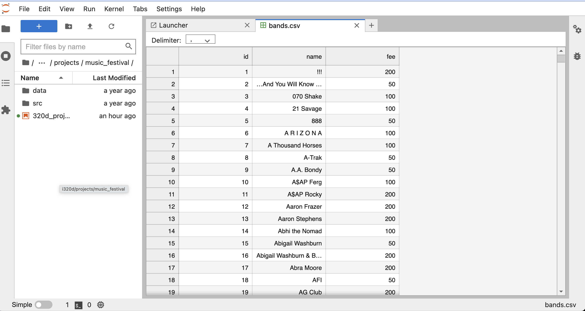
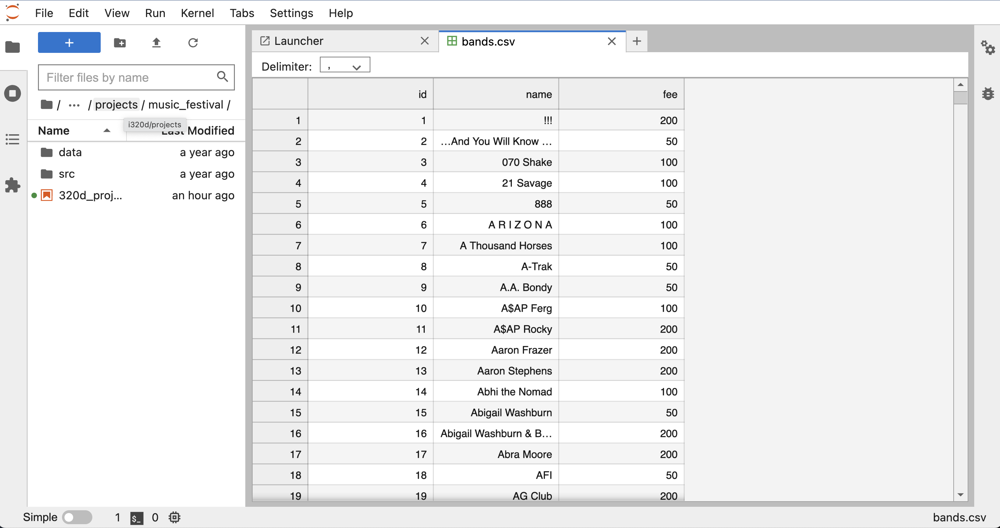
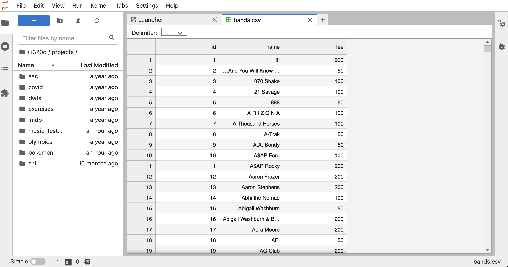

# File Systems

Wikipedia defines a file system this way:
> In computing, a file system or filesystem (often abbreviated to fs) is a method and data 
> structure that the operating system uses to control how data is stored and retrieved.
> Without a file system, data placed in a storage medium would be one large body of data with no 
> way to tell where one piece of data stopped and the next began, or where any piece of data was 
> located when it was time to retrieve it. By separating the data into pieces and giving each 
> piece a name, the data are easily isolated and identified. Taking its name from the way a 
> paper-based data management system is named, each group of data is called a "file". The structure 
> and logic rules used to manage the groups of data and their names is called a "file system."

## Navigating in Jupyter
The file system on our shared VM is presented to you through a Jupyter notebook. In your browser,
open up `https://notebook.dei320.net` and login with your EID and password:

Once you login, you should see this:

The `i320d` ia folder or `directory` in the file system. The way you navigate around the file 
system in Jupyter is to double-click on directory names. Double-click on `i320d`, then on `projects`,
then on `music_festival`. You should see something like this:

Directories can contain files and other directories in a `hierarchical` structure. Here is the
structure of the music_festival directory:

Go ahead on double-click on the `data` directory. Then double-click on any of the files. You should
see something like this:

 

You can navigate backwards by clicking on the file path above the list of files and directories.
Double-click on `projects`:

You see that it takes you back to the `projects` directory.

## File paths

The hierarchical structure of file systems can be represented by a `file path`. There are two kinds
of file paths:
* **Absolute** - a complete file path starting at the `root` of a file system.
* **Relative** - a file path starting from a known directory in the file system.

The directories and files in a file path are separated by slashes - a forward slash (`/`) in Linux
and Mac OS X, a backwards slash (\) in Windows.

This is an example of an absolute path to the music_festival directory:

> /home/ccy1234/notebooks/i320d/projects/music_festival

The leading `/` is what is known as the `root` directory. It is the base of the file system - all
other directories and files live in the root directory. All absolute paths start with the root
directory.

This is an example of a relative path to the music_festival directory, where the starting point is
the `notebooks` directory - this is what you're seeing in your Jupyter notebook.

> i320d/projects/music_festival

We often represent relative file paths like this:

> ./i320d/projects/music_festival

The `.` means the current directory you are in. `..` also has a special meaning - it means the 
directory **above** the one you're currently in. So

> ./i320d/projects/music_festival/..

is the same thing as:

> ./i320d/projects
