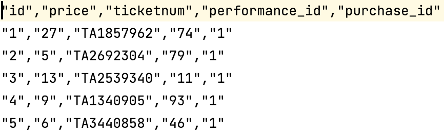
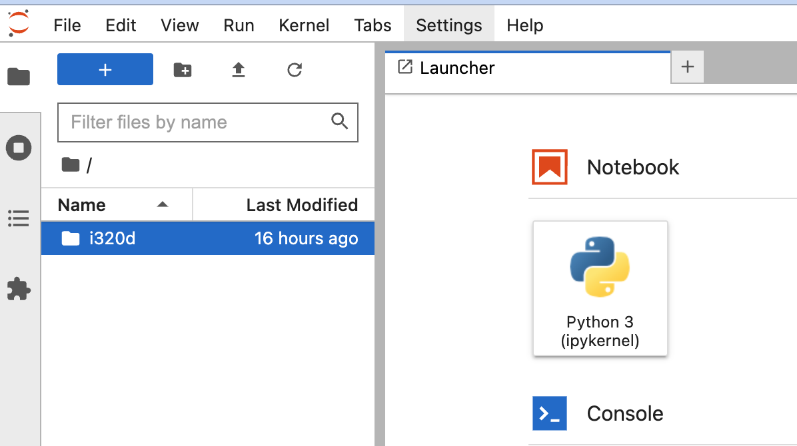
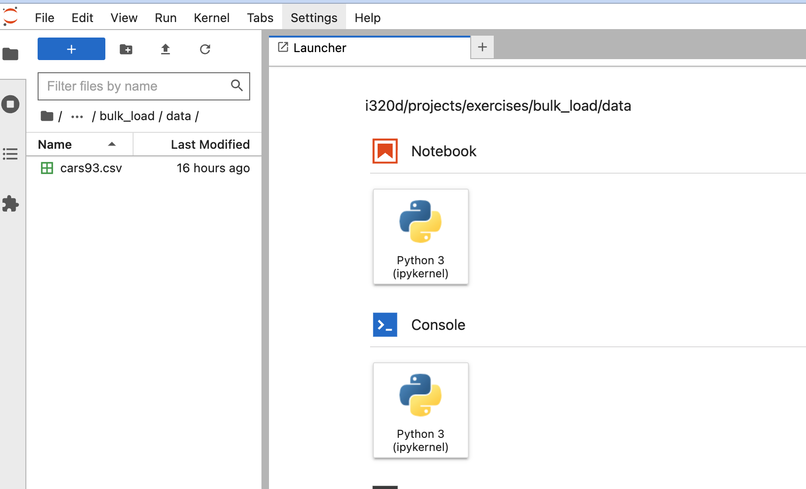
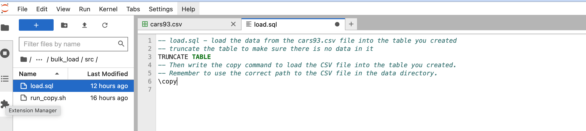
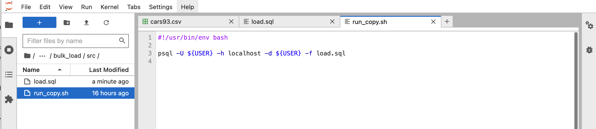
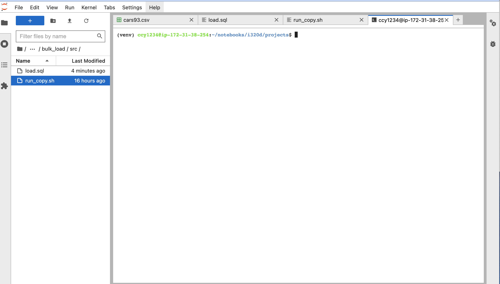
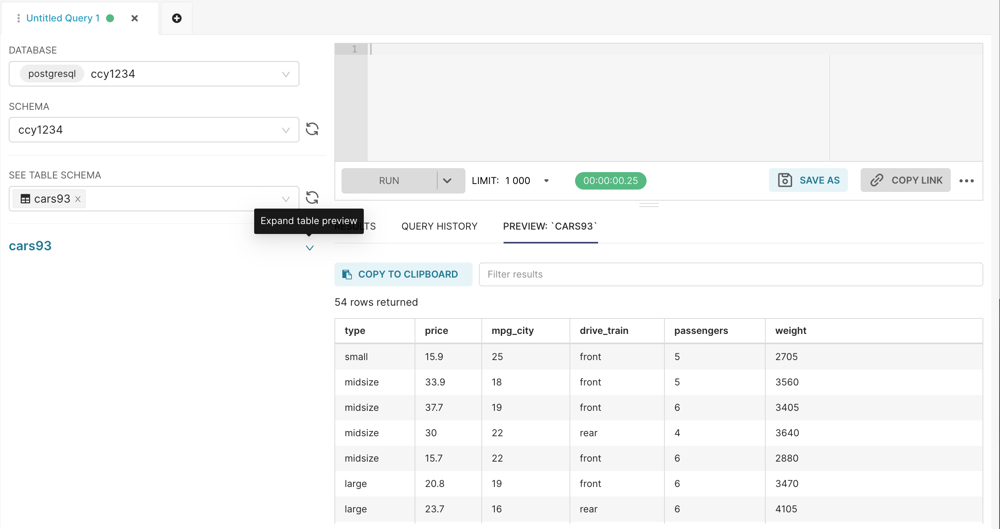

# Ingestion Using Bulk Loading

We typically need to load millions or even billions of records into our analytical systems. To do
this efficiently we need tools that can load data with very high throughput. these tools are called
bulk loaders. The bulk loader in Postgres is the `COPY` command. 

## The COPY command

### Bulk loading of data in Postgres

This is the basic syntax of the copy command:
```
\copy [table name] FROM [path to data file] WITH [OPTIONS]     Bulk loading of data
\copy [table name] TO [path to data file] WITH [OPTIONS]       Bulk unloading of data
```

In our previous class, we used `\copy` to load the tickets table in our music festival database:

```text
\copy tickets FROM ../data/tickets.csv WITH CSV HEADER
```

Let's break this down:
* We specify a table to load the data into - `tickets`
* We specify a path to the data file - `../data/tickets.csv`
* We specify options to load the data - the data file is a `CSV` with a `HEADER` row

The following conditions are necessary to make this work:
* The CSV file must have the same number of columns as the table and in the same order.
* The data types of the data must be compatible between the data file and the table.
* The values in each row must be separated by a comma, optionally enclosed in double quotes.
* Each row must end in a newline.



The structure of the table has to match the structure of the data file:

```sql
CREATE TABLE IF NOT EXISTS festival.tickets (
    id INTEGER PRIMARY KEY,
    price INTEGER,
    ticketnum TEXT,
    performance_id INTEGER,
    purchase_id INTEGER  
);
```

## Exercise - Create a table and ingest it using \copy

### Login to Jupyter and Superset
Open your Jupyter notebook (https://notebook.dei320.net) and log in - your server may take a minute to start.


Click on `i320d` in the file manager on the left-hand side.



Click on `projects`, then `exercises`, then `bulk load`, then `data`. You will see a file called
`cars93.csv`. Double-click on it to open it.



Now open Superset (https://superset.dei320.net) and log in.


### Create a table
Open the SQL Lab Editor:


Click on the DATABASE drop-down and pick your database (your database name is your EID). Do the 
same for the SCHEMA drop-down.


Now write a CREATE TABLE statement that will be the table you load the data from the CSV into. It
needs to have the same structure as the CSV file.


Run your CREATE TABLE command - you should see a message that no rows were returned. Then click the
refresh icon next to the SEE TABLE SCHEMA dropdown.


Then click the SEE TABLE SCHEMA dropdown - you should see the table you created. Click the table
name and you should see this:


We're now ready to load the data.

### Loading the Data

Go back to your Jupyter notebook. Click on `Bulk Load` in your file manager and then click on `src`.


You should see two files. These are the files we will use to load the data.


Open the `load.sql` file:



You're going to fill in the commands in this file to load the CSV file. Write a copy command that
will do this.

When you're done, open the `run_copy.sh` file. You do not need to modify this. All it does is run
the `load.sql` script.



To do that, click on the tab to open the Launcher and click on `Terminal` at the bottom left of the
screen. 


This will launch a terminal



`cd` to the `src` directory:


You can now run the `run_copy.sh` script:


You should see this result:

Run it three times, then go back to Superset:


Click on `Preview: [table name]`


It should have 54 rows in the table (not 162!)




