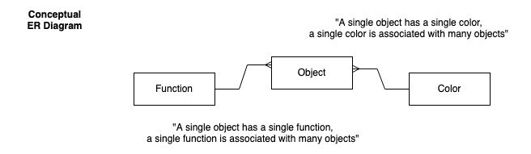

Data Modeling
===================================

In this module we learn two approaches to modeling data: 

1. Normalized entity relationship (ER) modeling 
2. Star schema modeling

Normalized ER models are common in transactional (source) systems (such as those that run a website). 
Star schemas are common in data warehouses and are optimized for analysis.  

In our data pipeline the data we extract from source systems will often be in a normalized ER schema 
and we will transform to a star schema. 

Modeling means understanding the sort of things we have in our dataset and the relationships between 
them. You will find that this is closely related to the SQL queries we have been doing, but data 
modeling is more abstract and useful regardless of the specific technologies one handles data with.

## Start with concrete instances

When we are data modeling we will always start by writing down some concrete examples of the 
phenomena that we want to model, just as we began the exercise in the first class with real objects 
in front of us. I call this a "free-form description" of your data. For example, when we had the 
objects on the table in front of the class, you might have written something like:

> On the table are four things, a red pen, a red mug, a green highlighter, and a green vase. You can 
> write with the pen and the highlighter. The vase might hold some flowers, while the mug might hold 
> some coffee.

If you were modeling Olympic swimming events you might write:

> Katie Ledeky swam for the US team at the 2016 Olympics. She swam a number of different events, 
> the 200m, 400m and the 800m freestyle and she won all three in record time. She was joined on the 
> podium by .... She didn't swim any backstroke events.

So, by "free form description" I mean just jotting down some examples in free text that you are g
oing to use as concrete examples for your modeling.

Two kinds of relationships
===================

Think of the exercise we did with the cards in the first class, where we described our four objects 
with two attributes: color ("red"/"green") and function ("holds"/writes"). Each of the individual 
objects had a single color and function ("The red mug holds"). Conversely each color or function 
could have many objects; we could have many green objects or many objects that write. Thus we can 
say that there is a "one-to-many" relationship between color and objects. There is a separate 
one-to-many relationship between function and color.

On the other hand, we could easily imagine a situation where each object was described with more 
than one color ("The highlighter is green and black"), so that the relationship was two-way: a 
single color could have many objects, but each object could have many colors. In that situation we 
might say that we had a "many-to-many" relationship between objects and colors. 

First we will do examples with only one-to-many, then we will introduce many-to-many.

# The four parts of our database designs

The following picture shows a data model for Object, Function, and Color that uses four elements:

1. Concrete examples of data (in words and and informal lines/string sketch)
1. A diagram with boxes and lines ("Conceptual ER diagram")
2. A diagram that includes foreign_keys ("Physical ER diagram")
3. A sketch of relational tables with examples ("Table Sketch")

Three things to note at this point:

1. In this course whenever I speak of a "Database design" I mean all four of these elements. It is easy to forget one of them (usually the table sketches or the sample data in them.)
2. Each part has to be consistent with each other; they are different ways of showing the same thing. This means that each functions as a check against the others.
3. The database design is a communicative document; our goal is to communicate with other people. It is good to have little notes around the diagrams and tables.

Let's review piece by piece.

## Conceptual ER diagram

In the conceptual ER diagram:

The boxes with the Capitalized words represent the types of things in the data model (called 
"entities"), and the lines represent the relationships between them. Thus Object, Color, and F
unction are all entities that have relationships to each other. The symbols at the ends of the lines 
show the kind of relationship. At this point there are two symbols to know:

1. A straight line to a box represents "one"
2. The "crows foot" three part represents "many"

To read the lines between the entities, you always begin with "A single [entity]..." Following this, 
you use words that describe the relationship (e.g. "has a" or "is a color of") and then the numbers, 
which go at the far end of the line. 

With those elements we can read the line from Object to Color in both directions.

From left to right: “A single object has a single color” and, going right to left: "A single color 
can be the color of many objects."

Reading the line from Object to Function, we would say "A single object performs a single function" 
and "A single function can be the function of many objects." 

# Physical ER diagram

When we have the pattern of a line with a simple straight line at one end, and the crows-foot at the 
other end, then we know that we have a "one to many" relationship. 

We realize the one-to-many relationship physically in the database using the primary key `id` and 
the foreign key `table_id`, such as `color_id` and `function_id`. In the SQL portion we used this to 
show how to `JOIN` tables.

In a one-to-many relationship, the **foreign key goes into the table at the crows foot end**. You 
can think of the crows foot as spreading out to point to the multiple connected rows in that table.  
The foreign key column is always named after the table at the other end of the line (the single line 
end). 

- Note that our boxes now represent tables. Since our class convention means that we use plurals for tables, we now snake_case and pluralize the box names. 
- We list the columns vertically (just like in a CREATE TABLE statement), together with their datatype. 
- We can then connect the line to the part of the box that points to the keys. While this is convenient, it is not always possible to get them to line up (or sometimes the relationship involves multiple columns working together as keys), so if you encounter ER diagrams in the wild the lines may connect just to the overall entity box and not point to specific columns.
- A first column is added to show which columns are part of the primary key (PK) and any foreign keys (FK1 and FK2). This column is called "key participation".

You can create these diagrams using a wide variety of drawing programs.  Here I am using 
[draw.io](http://draw.io) and using the "Download" option to save the file locally. 
[You can access the source file here](images/object_function_color.drawio).

## Table sketch

We sketch the tables to show how the concrete examples are realized in the tables.  This is a step 
further than the physical ER diagram.

In both the physical ER diagram and in the table sketches our intent is to show the reader how we've 
modeled things. Thus they don't need to include every non-key column in the table; we can elide 
extra columns with an underlined ellipsis: _..._

## A note on CamelCase vs snake_case and Singular vs Plural

Each workplace, or team, will likely have very specific expectations about drawing models.  In our 
course for conceptual ER diagrams, we will use the singular and Capitalize Entities (and to cope 
with multiword entities we use [CamelCase](https://en.wikipedia.org/wiki/Camel_case), because these 
represent the abstract concept of a thing (the Concept of a Color, the Concept of a Function), but 
attributes (aka columns) will follow our conventions from SQL ([snake_case](https://en.wikipedia.org/wiki/Snake_case), 
with foreign key columns in the singular, that is `color_id` rather than `colors_id`.  For physical 
ER diagrams we use the exact table name from the database (and so the entity would be snake_case and 
plural).

Note that there are varying opinions on capitalization and pluralization ... in the long run you 
figure out what people and teams use.  In this course, though, we will use the conventions above 
and deduct points for not following them.

# Modeling Exercise (in-class)

In Zoom working groups you will be assigned one of the relationships below. Each should be modeled 
with just two entities (two boxes) and one relationship between them (one line).

You should (using paper and pens):

1. Brainstorm some concrete instances. Feel free to start with sentences or jotted notes, but you **must** have some real world examples to begin your modeling.
2. Begin to develop your conceptual ER diagram. 
3. Develop your physical ER diagram.
4. Sketch tables and insert your concrete example data from step 1. (check that you are correctly using lowercase and underscores).

Examples (all one-to-many and only two boxes and one line.)

1. Players on football teams (at one time, assume no changes)
2. Families and their Pets.
3. Presidents and their terms in office
4. Species and their genus (e.g., Felis Catus and Felis silvestris)
5. State/Province and their Country
6. Cities and states (use some cities with the same name in different states)
7. Bands and their albums
8. Authors and books
