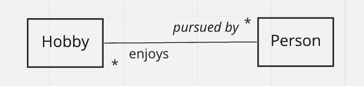

Modeling many-to-many relationships
=================================================================

The second of our two relationship types is used when entities have a "many to many" relationship. In our running example, if our objects can be multi-colored (have more than one color), then we move from a "one to many" to a "many to many".  A cup could be both red and green (perhaps striped?), while red could still be the color of many different objects.

Another good example of a many to many relationship is a tagging system, such as Book and Genre. A genre like "mystery" or "horror" clearly includes many different books, and each book can be from more than one genre (although many will have only one.)  Another good example are people and their hobbies: many people like to paint, and some of those people also like to dance.

One way of recognizing the many-to-many relationship is to draw out some concrete examples and use lines to join up those that are associated with each other.  Here we work with some hobbies and people that enjoy them.

If you see objects on _both_ sides with multiple lines coming from them, then you know that you have a many-to-many. Above, for instance, "paint" and "running" each point to two people. On the other side, "Sarah" and "Kyle" each point to two hobbies. Because both the hobbies side and the people side both have data points that send out multiple lines, we have a many-to-many relationship.

When we draw our ER diagram we get a crows-foot on both ends of the line:

We can read this as "A single Hobby could be pursued by many People" and, reversing direction, "A single Person could enjoy many Hobbies" 

Previously we saw that the pattern of `1 ------- *` or `* ------ 1` meant we had a one-to-many relationship, but in this new example, though, the pattern of the line endings is `* ------- *` which means that we have a many-to-many relationship.

# From relational vocab to table sketch.

Representing a many-to-many relationship in tables still uses primary keys and foreign keys. But it isn't enough to put a foreign key in one table. If we just put `hobby_id` into the `people` table, then that would limit each person to having only 1 hobby. Similarly if we just put `person_id` into the hobbies table, each hobby could only be enjoyed by 1 person. And it's no help having foreign keys in both tables (we are avoiding any structure with a list in a cell, because it massively complicates querying).

We solve this problem by introducing a new table that sits between the two tables for the entities: we call it a _Simple Association Table_ and we show it between the two tables for the entity. (Informally these tables are often called "join tables" or sometimes "intermediate" tables).

Each entry in the entity tables has only one row and those tables don't have foreign keys for this relationship.  **The table in the middle, though, has both foreign keys**. In fact it only has both foreign keys. Simple Association Tables are special because they don't have an `id` column of their own, they only have foreign key columns. As before we name a foreign key column with the name of the table it refers to, making it singular, and adding `_id`. Thus the foreign key referring to the `hobbies` table is `hobby_id` and the foreign key referring to the `people` table is `person_id`.

Now we can have a row for each of the lines that we drew above (five lines, five rows). Each `hobby_id` can show up on multiple rows, and each `person_id` can show up on multiple rows.  You might be wondering, though, why we can double rows in here but not in the entity tables and how we can get away with not having an `id` column. The answer is that the _combination_ of the foreign keys is unique: we can only have one row linking a specific hobby and a specific person. This we call a _composite primary key_. We show that by underlining both of the foreign keys (rather than just `id` which is underlined in regular tables).

# Naming conventions for has_and_belongs_to_many

The simple association table is named in lowercase but with a name made up by joining the two tables names **in alphabetical order**. We always work to show it sitting between the entity tables that it joins. Thus we `hobbies_people` (and not `people_hobbies` because `h` comes before `p` in the alphabet.) We use the pluralized form because the table names are pluralized.

Note that the simple association table **does not show up in the conceptual ER diagram**, but it does show up in the physical ER diagram and in the table sketches. So there can be more tables than there are boxes in the ER diagram.

# Modeling Exercise (in-class)

Form five groups and you will be assigned one of the relationships below. Each should be modeled with just two entities (two boxes) and one relationship between them (one line). Hint: they are all many-to-many with a simple association table :)

You should:

1. Brainstorm some concrete instances. Feel free to start with sentences or jotted notes, but you must have some real world examples to begin your modeling. Draw the "crossing lines diagram" as at the top of this page.
2. Begin to develop your ER diagram. Work hard to find great illustrative names for your relationship (the labels on the lines). 
3. Write out the relational vocabulary (check that you are getting the CamelCasing correct)
4. Sketch the entity tables and insert your concrete example data from step 1. (check that you are correctly using lowercase and underscores).
5. Sketch the simple association table and add the foreign keys.

Examples (all `habtm` and only two boxes and one line.)

1. Books and genres  
_e.g., The Lord of the Rings is a Fantasy book, but The Hobbit is Young-Adult as is The Hunger Games._
2. Photos and tags
_e.g., Photo21 was tagged "cute" "adorable" and "dog". Photo23 was tagged "dog" and "large"._
3. Shows that actors have been in (over their career)
_e.g., Hugh Laurie acted in both House, M.D. and Blackadder. Blackadder also starred Rowan Atkinson and Stephen Fry_
4. Buses and routes they can be used on.  
_e.g., Route 37 was served by three physical buses this morning: 5PC*L23, U89*S32, and U28*628 (The specific vehicles identified by license plates)._
5. Races and competitors (no results)
_e.g., Shuyen, Sarah, and Swati all competed in the half-marathon. Only Swati competed in the 10,000m._

Don't forget to brainstorm some more concrete instances and include them as sample data in your table sketches!
