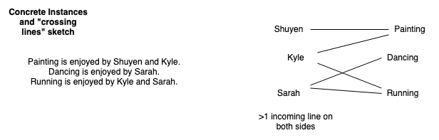
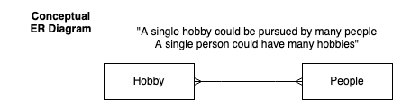
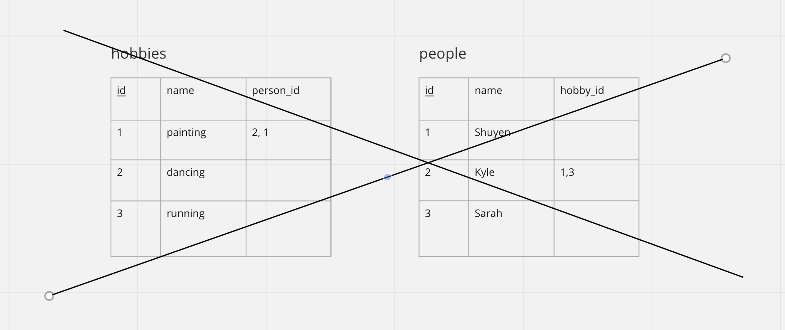
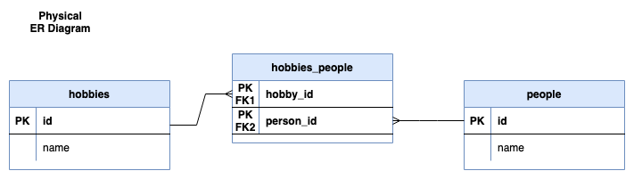
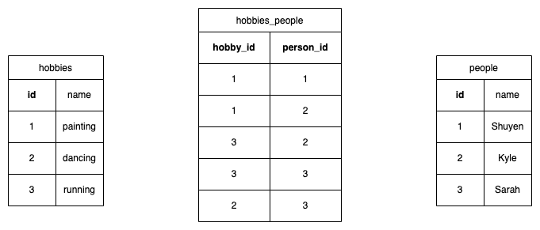
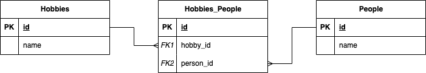

# Many-to-many relationships

Modeling many-to-many relationships
=================================================================

The second of our two relationship types is used when entities have a "many to many" relationship. 
A good example of a many-to-many relationship is a tagging system, such as Book and Genre. A genre 
like "mystery" or "horror" clearly includes many different books, but it is equally true that each 
book can be from more than one genre (although many will have only one.)  Another good example are 
people and their hobbies: many people like to paint, and some of those people also like to dance.

One way of recognizing the many-to-many relationship is to draw out some concrete examples and use 
lines to join up those that are associated with each other.  Here we work with some hobbies and 
people that enjoy them.

If you see objects on _both_ sides with multiple lines coming **from them**, then you know that you 
have a many-to-many. Above, for instance, "paint" and "running" each point to two people. On the 
other side, "Sarah" and "Kyle" each point to two hobbies. Because both the hobbies side and the 
people side both have data points that send out multiple lines, we have a many-to-many relationship.

When we draw our conceptual ER diagram we get a crows-foot on both ends of the line:

We can read this as "A single Hobby could be pursued by many People" and, reversing direction, "A 
single Person could enjoy many Hobbies" We have a crows foot on both ends of the line, which means 
that we have a many-to-many relationship.

## Locating foreign keys for many-to-many

Representing a many-to-many relationship in tables still uses primary keys and foreign keys. But it 
isn't enough to put a foreign key in one table. If we just put `hobby_id` into the `people` table, 
then that would limit each person to having only 1 hobby. Similarly if we just put `person_id` into 
the hobbies table, each hobby could only be enjoyed by 1 person. And it's no help having foreign 
keys in both tables (we are avoiding any structure with a list in a cell, because it massively 
complicates querying).

We solve this problem by having adding a third table.  Then we have the two entity tables (one for 
hobbies and one for people), as well as one that sits between them. The physical ER diagram shows 
this middle table:

We call this third table an _Association Table_. Informally these tables are often called 
"join tables" or sometimes "intermediate" tables (but this can be confused with the result of a 
JOIN, so I prefer "association table").

Note that now we show this 3rd table in the physical ER diagram, notice that we don't have crowsfeet 
at both ends now, now we have two one-to-many lines with the crowsfeet at the middle table.

The table sketch looks like:

Each entry in the entity tables has only one row and those tables don't have foreign keys for this 
relationship.  **The table in the middle, though, has both foreign keys**. In fact it *only* has 
both foreign keys. Simple Association Tables are special because they don't have an `id` column of 
their own, they only have foreign key columns. As before we name a foreign key column with the name 
of the table it refers to, making it singular, and adding `_id`. Thus the foreign key referring to 
the `hobbies` table is `hobby_id` and the foreign key referring to the `people` table is `person_id`.

Now we can have a row for each of the lines that we drew above (five lines, five rows). Each 
`hobby_id` can show up on multiple rows, and each `person_id` can show up on multiple rows.  You 
might be wondering, though, why we can double rows in here but not in the entity tables and how we 
can get away with not having an `id` column. The answer is that the _combination_ of the foreign 
keys is unique: we can only have one row linking a specific hobby and a specific person. This we 
call a _composite primary key_. We show that by underlining/bolding both of the foreign keys 
(rather than just `id` which is underlined in regular tables); we show this in the physical ER 
diagram by having `PK` next to both columns.

However, I generally prefer to add an id column to every table in a production database. The reason 
for this is the it makes it much easier to evolve the structure of the database over time. Entities
and relationships in the database tend to change and evolve over time - usually by adding new tables
and new columns - and maintaining the relationships between those tables is simpler if the linking
primary and foreign keys are a single id column. So ultimately I prefer a many-to-many table 
structure that looks like this:

## Naming conventions for simple association tables

The simple association table is named in lowercase but with a name made up by joining the two 
tables' names **in alphabetical order**. We always work to show it sitting between the entity tables 
that it joins. Thus we `hobbies_people` (and not `people_hobbies` because `h` comes before `p` in 
the alphabet.) We use the pluralized form because the table names are pluralized.

Note that the simple association table **does not show up in the conceptual ER diagram**, but it 
does show up in the physical ER diagram and in the table sketches. So there can be more tables than 
there are boxes in the Conceptual diagram.

# Modeling Exercise (in-class)

Form eight groups and you will be assigned one of the relationships below. Each should be modeled 
with just two entities (two boxes) and one relationship between them (one line). Hint: they are all 
many-to-many with a simple association table :)

You should:

1. Brainstorm some concrete instances. You can start with full sentences or jotted notes, but you must have some real world examples to begin your modeling. Draw the "crossing lines diagram" as at the top of this page.
2. Begin to develop your conceptual ER diagram. Remember to read your diagram using the "A single" structure.
3. Develop your physical ER diagram; you will add the simple association table at this point.
4. Sketch the entity tables and insert your concrete example data from step 1. (check that you are correctly using snake_case).
5. Sketch the simple association table and add the foreign keys.

Exercises (all many-to-many with 2 entities, but 3 tables)

1. Books and genres  
_e.g., The Lord of the Rings is a Fantasy book, but The Hobbit is Young-Adult as is The Hunger Games._
2. Photos and tags
_e.g., Photo21 was tagged "cute" "adorable" and "dog". Photo23 was tagged "dog" and "large"._
3. Shows that actors have been in (over their career)
_e.g., Hugh Laurie acted in both House, M.D. and Blackadder. Blackadder also starred Rowan Atkinson and Stephen Fry_
4. Individual buses which are used on bus routes.  
_e.g., Route 37 was served by three individual buses this morning: 5PC*L23, U89*S32, and U28*628 (The specific vehicles identified by license plates)._  5PC*L23 was used on Route 4 in the afternoon.
5. Races and competitors (no results)
_e.g., Shuyen, Sarah, and Swati all competed in the half-marathon. Only Swati competed in the 10,000m._
6. Classes and Students
_e.g., Carmen, Raghu, and Paolo are taking both organic chemistry and philosophy. Raghu is also taking calculus._
7. Customers and Products
_e.g., Rudy and Tomika have Dell Laptops. Tomika and Omar have iMacs. All 3 have PlayStations._
8. Musicians and Instruments
_e.g., Wayne has a saxophone and a piano, Lydia has a piano and a guitar, Isao has a guitar and a saxophone._

Don't forget to brainstorm some more concrete instances and include them as sample data in your table sketches!
