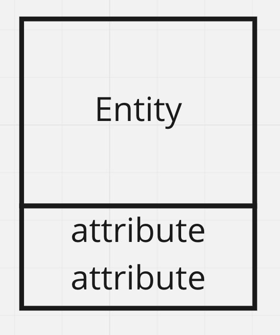
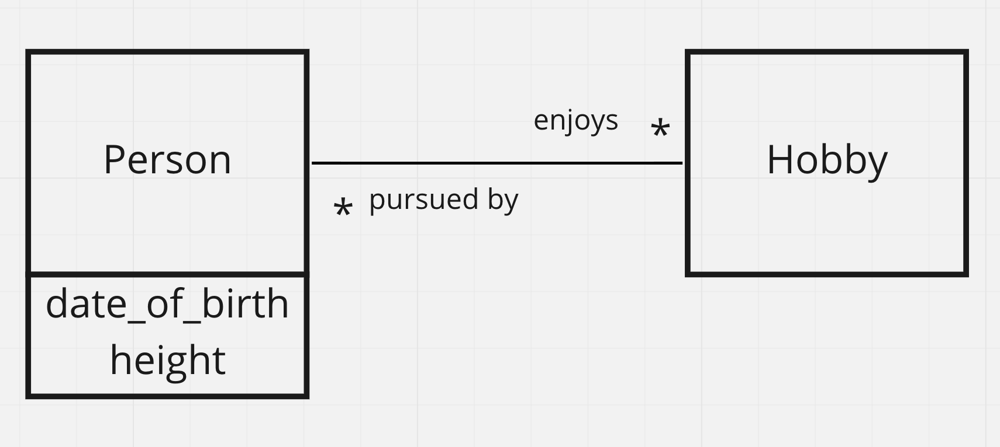
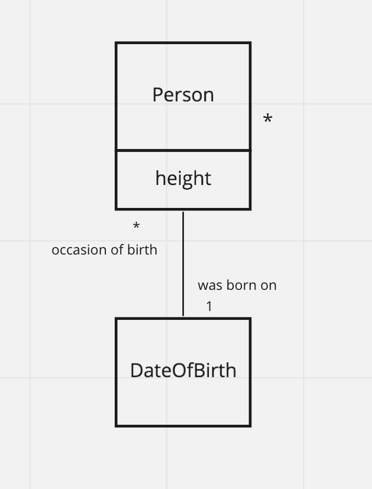
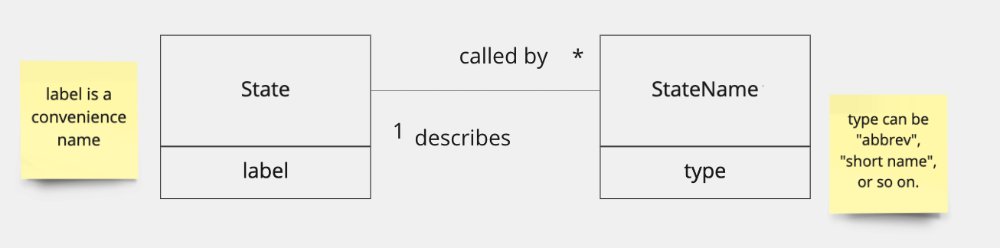
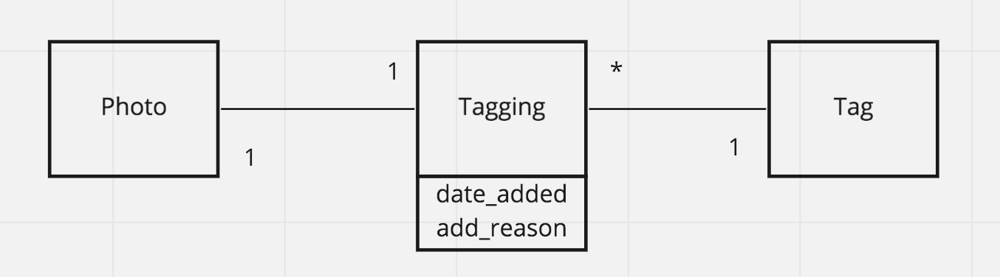

# Attributes

So far we have focused on modeling relationships. In addition there are frequently additional pieces of data that we want to store. 

For example, we might want to record a person's date of birth, or the weight of a book. These are not about the relationship between objects in the database, they are characteristics of the things in the database.  We call these "attributes" when modeling, and they end up as additional columns in our tables.

For example, we might add a `date_of_birth` column to the `people` table.  Or a `weight` column to the `books` table.

In drawing our ER diagrams we represent these attributes in this way, adding to our Entity boxes:



Attributes don't affect other aspects of the ER diagram.  Here I show our `Person habtm Hobby` example, but adding a `date_of_birth` attribute to the Person entity.



We do not, though, need to have all our columns from our table as attributes in our ER diagram. The rule is that we only include attributes to communicate how we decided to model something.  For example we have always had a `name` column, but we haven't included that as an attribute, because it is clear that things have names.  

We also never include attributes for columns like `id` or various `foreign_id` columns.  Those are already represented in the numbers and lines between entities, and they are just specific conventions about representing these relationships in tables. They don't belong in the logical data modeling world of the ER diagram.

Note also that while our columns in our table sketch move horizontally (they are next to each other) the attribute list is vertical, one attribute per line.

Try to minimize which attributes are included in your ER diagrams.  Use them to communicate—to call out your modeling decisions, not to exhaustively represent all columns/characteristics.  Remember that database designs communicate (and since they are usually drawn on a whiteboard you really want to save space).

# Choosing between an entity and an attribute

Knowing when something needs to be an entity and an attribute is part of your data modeling expertise. The answer is not always obvious and your sense will develop over time.

For example, it is entirely possible to model a date of birth as an entity:



We would then say 

```
DateOfBirth has_many Person
Person belongs_to DateOfBirth
```

but then we would have introduced a whole new table `dates_of_birth` with it's own `id` column, and a `name` column which would include the actual date `2015-02-22`.  

That's a very long winded way of specifying a piece of information!

So there are times when it just makes more sense to model something as an attribute than as its own entity.  As a rule of thumb: 

> If a table ends up with only an id and name column, consider using the name as an attribute

And take it from me: it is very rare that you want to model Year as its own entity. It just doesn't accomplish much to create a `years` table with its own made up `id` which then map to the name of the year which has a value `2002` ... it is better to just use columns with `2002` directly as the data value.

# When an attribute should become an entity

Conversely, if you find that there are lots of columns that seem to "go together" they may be better expressed as an entity.  One common time we see this is when columns have similar names, especially prefixes or suffixes.  For example, think of the different ways we refer to states, sometimes using "Texas" sometimes "TX" or even sometimes "State of Texas".  Similarly, South Korea is known as "South Korea," but also "Korea, South" as well as "The Republic of Korea" and "ROK".

Some of these are different kinds of names, so we might start off adding columns:

```
countries
id, name,          abbrev,   name_formal
-----------------------------
32, United States, US,       United States of America
38, South Korea,   ROK,      Republic of Korea
```

But when we do that we are starting to encode pieces of data in the column names.  Those pieces of data are the types of names (e.g., "formal", "abbreviation", and so on).  Rather than doing that this would be better modeled as `State has_many StateNames` where we can have the kind of name as values in a `type` column.



## Modeling events

A similar situation arises when we want to record things that help us trace how data came to be in the database.  For example, if we are modeling Photos and Tags, even if we only allow a single tag, we might want to record who added it and when.  So we might start with just the tag

```
id, name,   image_path, tag
-----------------------------
32, photo1, photo1.jpg, happy
```

but then want to know when the tag was added, or maybe a free text reason that the tag was added.

```
id, name,   image_path, tag,   tag_added_date, tag_add_reason
-----------------------------
32, photo1, photo1.jpg, happy,  2011-02-21,    Told to by Diane

```

In that case we would be better modeling the `tag_` columns as their own entity, `Tag` with an entity that models the event in which that Tag was added to the photo and a reason. Something like:



We will develop this idea of modeling events more when we discuss the `has_many through` relationship.

# Is there a has_one relationship?

A common question is whether, given the `has_many` and `has_and_belongs_to_many` relationships, there is a `has_one` relationship?

We've seen the patterns 

```
* ... 1 (or 1 ... *)
``` 
which maps to `has_many/belongs_to`

and 

```
* ... *
```

which maps to `habtm`.

Clearly, another logical possibility is

```
1 ... 1
``` 

These are not impossible or neccessarily wrong (indeed I show one in the ER just above when we added the `Tagging` entity even though each `Photo` could only have a single `Tag`). However, when you see them you should ask yourself:

> Might this 1 .... 1 relationship be better modeled as an attribute?

We might see these in situations like a `User` having a `User Account`. Each user has one and only one user account, and each user account is for just one user ... so we could take the columns from one and add them to the other (for example adding `user_account_name` as an attribute of `user`).

In the real world, though, we don't always have full control like that, so if we are using an ER diagram to document data that others control, we very well may have to leave those tables as separate.

Or, just as with `Tagging` above, we may decide that we have other reasons to keep the `1 ... 1` in place (in that case we left it to group similar columns together).

You will develop a clearer sense of this over time, especially as we learn to write queries.