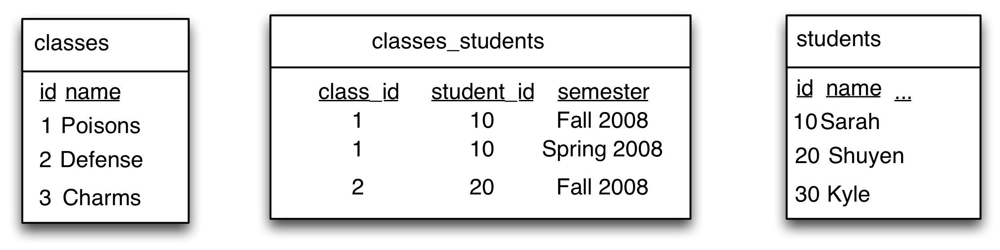
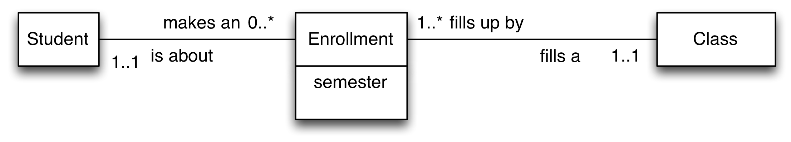
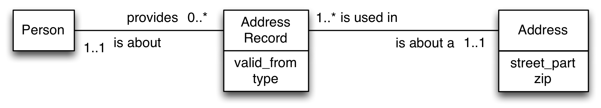
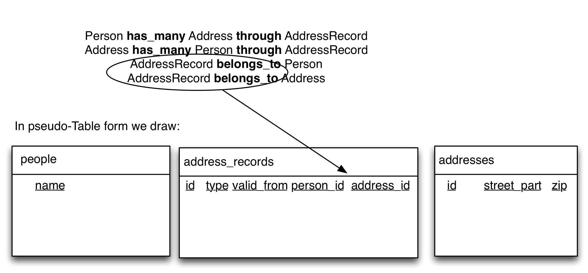

Modeling Relationships as Entities (has_many through)
=================================================================

Often when we are dealing with many to many relationships we want to go further than simple associations. For example if we were modeling people and their hobbies, we might want to know when the person started having their hobby.  Or if we were modeling the colors that objects were painted, we might want to know when to know when the colors were changed. If we were modeling sporting events we might want to store results (who won, came second, or their race times) as well as who competed.

To continue our example of Class and Student, we might want to store an additional attribute of the connection between a single student and a single class, such as semester in which the student enrolled in that class. In mysql tables we could do this:



This takes our Simple Association table `classes_students` and adds a column to it `semester`.  Now we can represent that Sarah took Poisons twice, once in Fall 2008 and once in Spring 2008. So far so good. However our primary key for this table is the combination of `class_id` and `student_id`. Can you see that we have repeated that combination? The first row and the second row have the same primary key (`class_id: 1` and `student_id: 10`). We can't do that (the database server will reject the second row).

To make our simple association table work with extra attributes we would have to add the extra attribute to our composite primary key as well, making the combination of all three columns the unique thing about the row.

There are two problems with this. First, the key becomes unwieldy as it gets longer. Second, you may have an extra attribute that is not unique. For example, imagine a class code like "Independent Study" that could be taken twice in the same semester by the same student. Now even the three columns (`class_id`, `student_id`, and `semester`) in combination aren't sufficient to make the row unique. In this example we could try to find something further that made the classes unique (perhaps they have a different instructor?). However then we have to manage keys of length 4. Moreover it may be that we simply don't have data to distinguish between the two relationships, no matter how many attributes we try to add.

So when we have additional attributes about a relationship, rather than extending our composite primary key, we handle this by turning the relationship into its own Entity, with its own entity name and the extra data as an attribute of that entity. As we turn our modeling into mysql tables, this means that we have a new `id` column. To continue the Student-Class example, we would add the `id` column to our growing middle table and make it, rather than the combination of `class_id`, `student_id`, and `semester` the primary key.


As far as mysql is concerned that is fine and you will definitely see databases that are set up like this (and you very well might see composite keys of length 3 or even 4). The real world of databases can be a messy place.

For our database design conventions, though, that is a problem because we still have our relationship table named `classes_students` which indicates a simple association table. More importantly, although more abstractly, by adding an `id` column we have promoted the table to an Entity. Yet if we left our modeling as `Student habtm Class` we wouldn't know to expect the `id` column on that table (or the additional attribute of `semester`). Chaos!

Thus, to keep everything consistent, we reflect the changes in our tables in our modeling by turning the relationship into an Entity:



Now we can say:

> "A single student makes between 0 and many enrollments"  

> "A single enrollment is about a single student"  

> "A single enrollment adds to a single class"  

> "A single class fills up by between 1 and many enrollments"  

To link all this together in our relational vocab we say (and the relational vocab. for has_many through is four lines):

```
Student has_many Class through Enrollment
Class has_many Student through Enrollment
Enrollment belongs_to Student
Enrollment belongs_to Class
```

Notice that `Enrollment` is to the left of `belongs_to`?  Just as with `has_many` this indicates that the foreign keys are in the `enrollments` table, which is nice and consistent with `has_many`.

Finally, modeling a many to many relationship as a separate Entity allows us to more easily use the relationship entity `id` as a foreign key for additional modeling. That doesn't come up often but when it does it is crucial, because you really don't want to use a composite primary key as a foreign key (you have to have all three of the columns in the other table.)

Now we turn to another example, relevant to modeling our Book Store.

## People and Addresses of different kinds.

In the figure below we model a very common situation of the relationship between People and Address. People often have more than a single address: for example they have a "shipping" address (where to send the package) and a "billing" address (where your credit card bill is sent). Sometimes, of course, those are actually the same place. And of course more than one person may use a single address as their address (if they live together, for example). So the relationship between Person and Address is many-to-many, but if we use `has_and_belongs_to_many` then we just end up with a `people_addresses` table with only two columns (as shown in the example above for Class and Student.)

We are going to model the new entity that joins People and their Addresses as a seperate entity, just as we did with `Enrollment` above. We'll call this new entity `AddressRecord` (using the CamelCase rules to join the two words.)  Sometimes there is a natural name for the relationship, such as a `Enrollment` for students and classes or `Result` for the relationship between a `Competitor` and an `Event`, and I recommend using that when it's available. But sometimes we have to make one up. Adding `Record` to one of the entities is one useful way, thus, `AddressRecord`.



In the diagram above we show the relationship between `Person` and `Address` going through `AddressRecord`. We also include the attributes of the relationship (here they are `valid_from`, a date showing when an address is valid, and `type`, for "mailing", "billing" or other address types).

As we read the diagram, we can mention all three entities in one sentence. We can read this diagram as saying (left to right):

> A single person provides between 0 and many AddressRecords, each of which is about a single Address.

And back right to left:

> A single Address could be used in between 0 and many AddressRecords, each of which is about a single Person.

Note the way I say "each of which" in the middle as I move toward the outside box. An alternative way of reading this would be to start in the middle and read to each side.

> A single AddressRecord brings together a single Person and a single Address.

When we translate that into our more formal Relational Vocabulary we have to say four lines:

```
Person has_many Address through AddressRecord
Address has_many Person through AddressRecord
AddressRecord belongs_to Person
AddressRecord belongs_to Address
```

Just as with a straight `has_many` the foreign keys go into the table for the entity to the left of `belongs_to`, giving us:



Note that we get the foreign keys in the middle table, just as we would with using `has_and_belongs_to_many`. However the AddressRecord now has its own primary key and it has columns which are about the relationship between the person and address referred to by those foreign keys.  Note also that the table is called `address_records` (the plural of AddressRecord) which follows from the entity being `AddressRecord` rather than deriving from `Address` and `Person` as we considered earlier. Note that you can distinguish this from a simple association table between some `Address` and some `Record` table which would be called `addresses_records` (pluralizing both).  

We can recognize candidates for `has_many through` by the pattern of maximum cardinalities (ignore minimums) `1` and `*` just as we did for `has_many / belongs_to` and `habtm`.

```
has_many / belongs_to            * -------- 1  

habtm                            * -------- *

has_many through           1 ------- *  * -------- 1
```
The pattern for `has_many through` has a `*` for maximum on both sides of the middle box and `1` on the outside on both sides.

Note that not every group of `1 ------- *  * -------- 1` needs to be described with a `has_many through`. You can equally describe these with two separate `has_many/belongs_to` and the column structure ends up the same.  We use `has_many through` when the Entity in the middle exists to describe the relationship between the two entities, and sometimes that can be ambiguous. I won't grade "missed" `has_many through` as incorrect.

# Modeling Exercise (in-class)

Form groups of four and you will be assigned one of the relationships below. Each should be modeled with three entities (two boxes) with the center entity being the relationship between the outside ones. Hint: they are all `has_many through` :)

You should:

1. Brainstorm some concrete instances. Feel free to start with sentences or jotted notes, but you must have some real world examples to begin your modeling. For each I have provided one example, you should add more.
2. Begin to develop your diagram. Work hard to find great illustrative names for your relationship (the labels on the lines).  Don't sweat the minimum numbers too much, it's the maximum numbers that matter.
3. Write out the relational vocabulary (check that you are getting the CamelCasing correct)
4. Sketch tables and insert your concrete example data from step 1. (check that you are correctly using lowercase and underscores).

Examples (all `has_many through` and they will have three boxes and two lines.)

1. Citizenship (Naturalization and Birth)  
e.g., _James has two citizenships, one for the United Kingdom which he obtained by birth, and one for Australia where he was naturalized in 1997._

2. Recipes and Ingredients  
e.g., _My recipe for omelette includes 3 eggs and 15ml of milk. milk is also an ingredient in a hot chocolate, which uses 3 teaspoons of sugar and one cup of milk._

3. Degrees awarded by universities to students.  
e.g., _Shuyen graduated from Peking University with a BA in finance in 2000. She graduated with her MSIS from University of Texas at Austin in 2012._

4. Magazine Subscriptions  
e.g., _Roundrock library subscribed to "The Economist" magazine from 1972 through 2014. Kyle library subscribed to "The Economist" in 1985 and still has a subscription; they also subscribe to "The Atlantic Monthly" which they began in 2003._

5. Sporting Event, Competitors, Results.  
Use the results in the screenshot as an example. You can ignore country or include it as an attribute of the competitor.  Hint: the Event is "800m Freestyle Women". See more results here: [Rio 2016 Swimming Results](https://www.olympic.org/rio-2016/swimming)


Don't forget to brainstorm some additional concrete instances, write them down, and include them as sample data in your table sketches!

# Further reading for modeling: Modeling and Normalization

A good place for further worked examples is the book [Learning MySQL](http://www.utxa.eblib.com/patron/FullRecord.aspx?p=540862) which is available in full online through the UT Austin library. It uses diagrams that differ a bit from those we've used, though.

Another great source is Churcher, C. (2012). Beginning Database Design: From Novice to Professional (2nd ed. edition). Apress. This is available through UT Library but not online; I think it is [available through the Internet Archive library](https://archive.org/details/beginningdatabas0000chur/page/n257/mode/2up).  This book uses diagrams very similar to those we've used.

If you are curious for further reading on data modeling for relational database you can start with this [Wikipedia page on "Normalization" which shows a worked example](https://en.wikipedia.org/wiki/Database_normalization#Example_of_a_step_by_step_normalization).

Another important source for data modeling, especially for those thinking Data Engineering in industry, is Kimball, R. (2013). The Data Warehouse Toolkit: The Definitive Guide to Dimensional Modeling, 3rd Edition (3rd Edition). Wiley.  I believe this is available online [though the UT library](https://search.lib.utexas.edu/discovery/openurl?institution=01UTAU_INST&vid=01UTAU_INST:SEARCH&rft_val_fmt=info:ofi%2Ffmt:kev:mtx:book&rft_id=urn:isbn:978-1-118-53080-1&rft.place=Indianapolis,%20IN&rft.language=English&rfr_id=info:sid%2Fzotero.org:2&ctx_ver=Z39.88-2004&rft.isbn=978-1-118-53080-1&rft.btitle=The%20Data%20Warehouse%20Toolkit:%20The%20Definitive%20Guide%20to%20Dimensional%20Modeling,%203rd%20Edition&rft.genre=book&rft.aufirst=Ralph&rft.aulast=Kimball&url_ver=Z39.88-2004&rft.date=2013-06-21&rft.publisher=Wiley&rft.tpages=600&rft.au=Ralph%20Kimball&rft.edition=3rd%20Edition). Note that this implements a different set of conventions and concentrates on things like "fact tables" and "star schemas".
