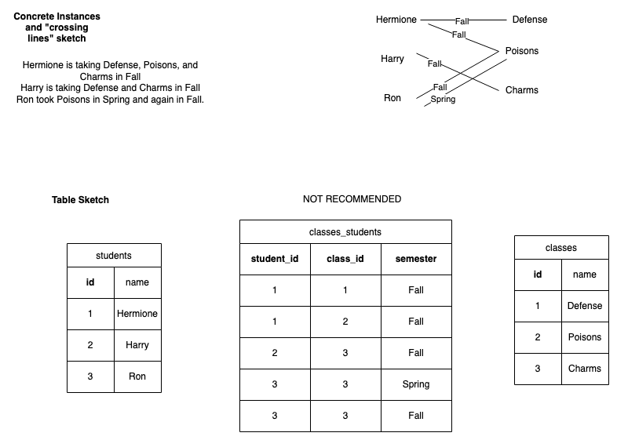
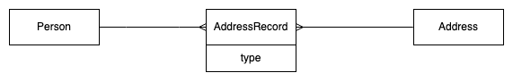

Modeling Relationships as Entities ("many-to-many with attributes")
=================================================================

Often when we are dealing with many to many relationships we want to go further than simple associations. For example if we were modeling people and their hobbies, we might want to know when the person started having their hobby. If we were modeling sporting events we might want to store results (who won, came second, or their race times) as well as who competed.

We can use an example of Class and Student, we might want to store an additional attribute of the connection between a single student and a single class, such as semester in which the student enrolled in that class. In tables we *could* do this:

But this is not recommended. This takes a Simple Association table `classes_students` and adds a column to it `semester`.  Now we can represent that Sarah took Poisons twice, once in Fall 2008 and once in Spring 2008. So far so good. However our primary key for this table is the combination of `class_id` and `student_id`. Can you see that we have repeated that combination? The last two rows would have the same primary key (`class_id: 3` and `student_id: 3`). We can't do that (the database server will reject the second row).

To make our simple association table work with extra attributes we would have to add the extra attribute to our composite primary key as well, making the combination of all three columns the unique thing about the row.

There are two problems with this. First, the key becomes unwieldy as it gets longer. Second, you may have an extra attribute that is not unique. For example, imagine a class code like "Independent Study" that could be taken twice in the same semester by the same student. Now even the three columns (`class_id`, `student_id`, and `semester`) in combination aren't sufficient to make the row unique. In this example we could try to find something further that made the classes unique (perhaps they have a different instructor? Perhaps not.). However then we have to manage keys of length 4. Moreover it may be that we simply don't have data to distinguish between the two relationships, no matter how many attributes we try to add.

As far as the database is concerned that is fine and you will definitely see databases that are set up like this (and you very well might see composite keys of length 3 or even 4). The real world of databases can be a messy place.

## Promote the association table to be an Entity

So when we have additional attributes about a relationship, rather than extending our composite primary key, we handle this by turning the relationship into its own Entity, with its own entity name and the extra data as an attribute of that entity. 

As we turn our modeling into tables, this means that we have a new `id` column. To continue the Student-Class example, we would add the `id` column to our growing middle table and make it, rather than the combination of `class_id`, `student_id`, and `semester` the primary key.  We can call this Entity "Enrollment".

Now we can say:

> "A single student could make many enrollments"  

> "A single enrollment is about a single student"  

> "A single student could have many enrollments, each about a single class"

It is possible to include attributes in the conceptual ER diagram; here we include `semester` as a key attribute of the enrollment.

When we translate to the physical ER diagram, just as before the foreign keys are in the 'middle' table, at the crowsfoot end of the lines.

<!--
Finally, modeling a many to many relationship as a separate Entity allows us to more easily use the relationship entity `id` as a foreign key for additional modeling. That doesn't come up often but when it does it is crucial, because you really don't want to use a composite primary key as a foreign key (you have to have all three of the columns in the other table.)
-->

## Naming the middle entity

Sometimes the middle entity doesn't have a natural name, such as Enrollment. In that case using "Record" is useful. For example People have many Addresses, such as "billing" and "mailing". We can record that with a middle entity "AddressRecord" with an attribute of "type".

<!--
Now we turn to another example, relevant to modeling a Book Store.

## People and Addresses of different kinds.

In the figure below we model a very common situation of the relationship between People and Address. People often have more than a single address: for example they have a "shipping" address (where to send the package) and a "billing" address (where your credit card bill is sent). Sometimes, of course, those are actually the same place. And of course more than one person may use a single address as their address (if they live together, for example). So the relationship between Person and Address is many-to-many, but also has an attribute (address type).

We are going to model the new entity that joins People and their Addresses as a seperate entity, just as we did with `Enrollment` above. We'll call this new entity `AddressRecord` (using the CamelCase rules to join the two words.)  Sometimes there is a natural name for the relationship, such as a `Enrollment` for students and classes or `Result` for the relationship between a `Competitor` and an `Event`, and I recommend using that when it's available. But sometimes we have to make one up. Adding `Record` to one of the entities is one useful way, thus, `AddressRecord`.

In the diagram above we show the relationship between `Person` and `Address` going through `AddressRecord`. We also include the attributes of the relationship (here they are `valid_from`, a date showing when an address is valid, and `type`, for "mailing", "billing" or other address types).

As we read the diagram, we can mention all three entities in one sentence. We can read this diagram as saying (left to right):

> A single person can provide many AddressRecords, each of which is about a single Address.

And back right to left:

> A single Address could be used in many AddressRecords, each of which is about a single Person.

Note the way I say "each of which" in the middle as I move toward the outside box. An alternative way of reading this would be to start in the middle and read to each side.

> A single AddressRecord brings together a single Person and a single Address.

As before the foreign keys go into the table with the crowsfoot, giving us this Physical ER diagram:

When we name this table the AddressRecord now has its own primary key and it has columns which are about the relationship between the person and address referred to by those foreign keys.  Note also that the table is called `address_records` (the plural of AddressRecord) which follows from the entity being `AddressRecord`. Note that you can distinguish this from a simple association table between some `Address` and some `Record` table which would be called `addresses_records` (pluralizing both).  

-->

# Modeling Exercise (in-class)

Form groups of four and you will be assigned one of the relationships below. Each should be modeled with three entities with the center entity being the relationship between the outside ones. Hint: they are all many-to-many with attributes :)

You should:

1. Brainstorm some concrete instances. Feel free to start with sentences or jotted notes, but you **must** have some real world examples to begin your modeling.
2. Begin to develop your conceptual ER diagram. Check use are using CamelCase and singular.
3. Develop your physical ER diagram. Check snake_case, tables plural, columns singular.
4. Sketch tables and insert your concrete example data from step 1. 

Examples (all will have three boxes and two lines.)

1. Citizenship (Naturalization and Birth)  
e.g., _James has two citizenships, one for the United Kingdom which he obtained by birth, and one for Australia where he was naturalized in 1997._

2. Recipes and Ingredients  
e.g., _My recipe for omelette includes 3 eggs and 15ml of milk. milk is also an ingredient in a hot chocolate, which uses 3 teaspoons of sugar and one cup of milk._

3. Degrees awarded by universities to students.  
e.g., _Shuyen graduated from Peking University with a BA in finance in 2000. She graduated with her MSIS from University of Texas at Austin in 2012._

4. Magazine Subscriptions  
e.g., _Roundrock library subscribed to "The Economist" magazine from 1972 through 2014. Kyle library subscribed to "The Economist" in 1985 and still has a subscription; they also subscribe to "The Atlantic Monthly" which they began in 2003._

5. Sporting Event, Competitors, Results.  
Use the results in the screenshot as an example. You can ignore country or include it as an attribute of the competitor.  Hint: the Event is "800m Freestyle Women". See more results here: [Rio 2016 Swimming Results](https://www.olympic.org/rio-2016/swimming)

Don't forget to brainstorm some additional concrete instances, write them down, and include them as sample data in your table sketches!

<!--

# Further reading for modeling: Modeling and Normalization

A good place for further worked examples is the book [Learning MySQL](http://www.utxa.eblib.com/patron/FullRecord.aspx?p=540862) which is available in full online through the UT Austin library. It uses diagrams that differ a bit from those we've used, though.

Another great source is Churcher, C. (2012). Beginning Database Design: From Novice to Professional (2nd ed. edition). Apress. This is available through UT Library but not online; I think it is [available through the Internet Archive library](https://archive.org/details/beginningdatabas0000chur/page/n257/mode/2up).  This book uses diagrams very similar to those we've used.

If you are curious for further reading on data modeling for relational database you can start with this [Wikipedia page on "Normalization" which shows a worked example](https://en.wikipedia.org/wiki/Database_normalization#Example_of_a_step_by_step_normalization).

Another important source for data modeling, especially for those thinking Data Engineering in industry, is Kimball, R. (2013). The Data Warehouse Toolkit: The Definitive Guide to Dimensional Modeling, 3rd Edition (3rd Edition). Wiley.  I believe this is available online [though the UT library](https://search.lib.utexas.edu/discovery/openurl?institution=01UTAU_INST&vid=01UTAU_INST:SEARCH&rft_val_fmt=info:ofi%2Ffmt:kev:mtx:book&rft_id=urn:isbn:978-1-118-53080-1&rft.place=Indianapolis,%20IN&rft.language=English&rfr_id=info:sid%2Fzotero.org:2&ctx_ver=Z39.88-2004&rft.isbn=978-1-118-53080-1&rft.btitle=The%20Data%20Warehouse%20Toolkit:%20The%20Definitive%20Guide%20to%20Dimensional%20Modeling,%203rd%20Edition&rft.genre=book&rft.aufirst=Ralph&rft.aulast=Kimball&url_ver=Z39.88-2004&rft.date=2013-06-21&rft.publisher=Wiley&rft.tpages=600&rft.au=Ralph%20Kimball&rft.edition=3rd%20Edition). Note that this implements a different set of conventions and concentrates on things like "fact tables" and "star schemas".

-->