# Data Engineering Pipeline Overview

This week we will gain an overview of the data engineering pipelines that we are going to build.

In the presentation today we begin with our task, and first show the final outcome, then we circle back to the start, and discuss the data and the pipeline steps and tools we use.

This presentation is to give you a high-level overview and a map to the semester; we will go over each of these steps in detail in individual classes.  We don't expect you to understand the details, we just hope you are intrigued and excited to learn more.

## Scenario: ACL all stars analyst task

Our scenario is that that Austin City Limits music festival wants to create an ACL all stars event, inviting back bands that have been highly successful over the 20-year history of the ACL fest.

The festival wants to identify the most successful venues through the history of the festival, then identify the most successful bands for each of those venues.

What does success mean?  For the festival, the most successful venues and bands are those whose performances tend to sell most tickets. <!-- In addition, as potential all-stars, bands should have played at least three festivals over the years. -->

The festival would like to see a visualization of these data, to help assess whether there are clear "must invite" standout bands, or whether there are groups of bands that have been about equally successful, such that any of them could be invited.

## Visualizations

1. Ticket sales over all time

2. Tickets sales per venue over all time
    - visually identify the top venues, a group of three.

3. Per those 3 venues, average ticket sales per performance by each band over all time.
    - visually identify group of top performers
    - maybe limit visualization to top 8 bands per venue

## The Pipeline

The source data needs to be processed through a pipeline to produce these visualizations. 
This will involve the following steps:
* Creating tables for ingesting source data.  
* Validating ingested data.  
* Transforming data from staging tables into a star schema.  
* Creating data products for visualizations.  
* Creating visualizations of the data to answer the questions above.

A conceptual visualization of this process might look like this:

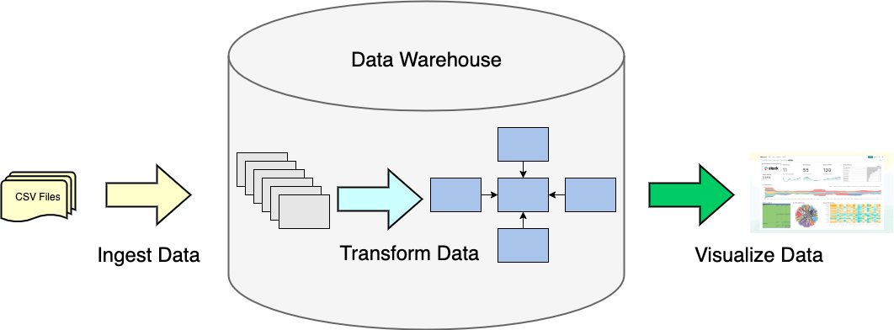

A pipeline like this follows a pattern known as "ELT", which stands for ***E***xtract ***L***oad ***T***ransform.
* First we ***E***xtract the data from the source system.
* Then we ***L***oad the data into our Data Warehouse or Data Lake.
* Once it's loaded into our Data Warehouse/Lake, we ***T***ransform it into star schemas and data products.

Earlier systems used a different approach, known as "ETL" - ***E***xtract ***T***ransform ***L***oad.
The difference was that the transformation of data was done by programs that ran outside of where 
the data would be stored, and then was loaded into the Data Warehouse. We've moved away from this
approach because it was complex, labor- and code-intensive, and failed to leverage the resources
and power of modern data warehouses which have been designed to ingest and transform very large 
amounts of data efficiently.

This conceptual pipeline will be implemented as a series of tasks to be executed. Some of those 
tasks are dependent on other tasks; in other words they cannot run until the tasks ton which they depend 
have run successfully. We can visualize this series of tasks as a "DAG" (for ***D***irected ***A***cyclic ***G***raph).  

Directed - Only goes in one direction  
Acyclic - Never loops back  
Graph - Can be visualized as a connected set of nodes and edges  

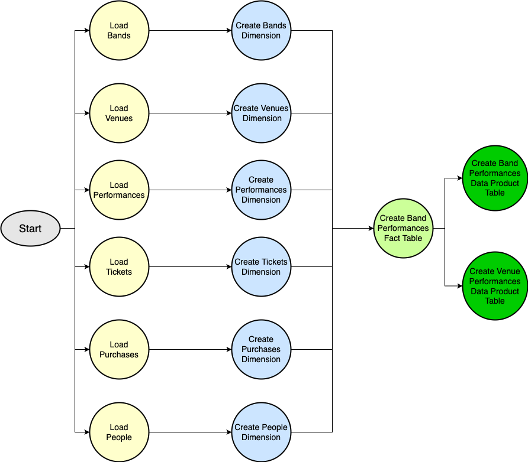

### Ingestion

The festival has its data in a transactional or operational database, organized in a structure that 
makes sense for the system that sells tickets.  This system is being used currently to sell tickets 
to the 2022 ACL fest, so it is crucial that we do not bog the ticket sales server down.

We first need to extract the data from the transactional system, then we need to understand the 
structure of that database.  

Data from different years of the festival are all in a single database and have a consistent organization; in many real-world cases the underlying systems would have changed over decades, so we would we ingesting data from different systems and our transformations would make them consistent.

We have a set of CSV files that were exported from the source system database. They are shown here
in a Jupyter notebook. You can see the CSV files on the left and the tickets.csv file opened up in a 
panel on the right.  

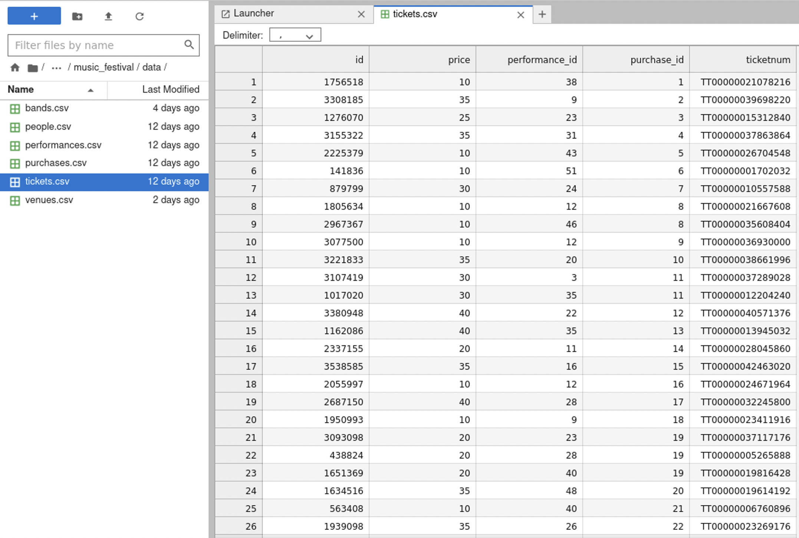

As the first step in the process, we're going to replicate the tables in the source system by
importing the data into copies of those tables. The source tables and their relationships are 
shown in the following Entity-Relationship Diagram (ERD or ER-Diagram for short).

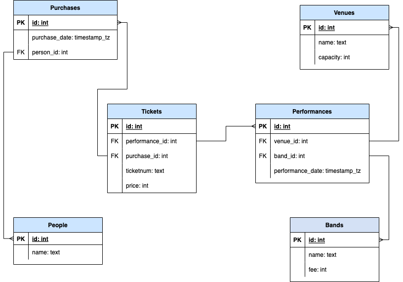

I find it can be useful to explain the structure of the database in a few simple sentences - for example:  

`People` make `Purchases` of `Tickets` to see `Bands` give `Performances` at `Venues`  - or -
`Bands` give `Performances` at `Venues` to `People` who made `Purchases` of `Tickets`.

We can use the ER diagram as a guide to creating the copies of the source tables in our system. 
Here's an example of a table to hold the data about tickets. Note that the columns of the table 
correspond to the column names in the CSV file.

```
CREATE TABLE IF NOT EXISTS festival.tickets (
    id             SERIAL   PRIMARY KEY,
    price          INTEGER,
    ticketnum      TEXT,
    performance_id INTEGER,
    purchase_id    INTEGER
);
```
The initial set of steps in the DAG ("Load Bands", "Load Venues", etc.) uses the Postgres bulk data loader to
insert the contents of the CSV files into the copies of the source tables.

```sql
-- Load CSV file into Tickets table
\copy festival.tickets FROM '../../data/tickets.csv' WITH HEADER CSV;  
```

Most databases have some method for doing high-speed loading of bulk data into the database. In the
case of Postgres, bulk loading is done using the `copy` command. Normally, we add data to the database
using the _INSERT_ command. However, inserting each new row one at a time when we have millions of
rows to insert can be very slow. Bulk loaders overcome this be reading many records at a time into
the database, bypassing some of the extra checking that is done when executing SQL commands, and
even loading multiple chunks of data in parallel.

TODO: Show comparison of times between bulk load and row-by-row inserts
    
### Cleaning and Validation

Our data in this project should be very clean, but we need to validate the data. One possible issue
is the we have "orphan" records. For example, every ticket should belong to a performance. We can 
write an SQL query to find any tickets that don't belong to performances.
```sql
SELECT COUNT(*) AS orphan_tickets
FROM   festival.tickets AS t 
WHERE  NOT EXISTS (SELECT 1
                   FROM   festival.performances AS p 
                   WHERE  p.id = t.performance_id)
```

A result of zero is good validation in the case.
 
Another validation we can test is whether our ticket sales give us the same number of performances 
as a count on the performances table:

```sql
SELECT COUNT(DISTINCT t.performance_id) AS ticket_performances,
       COUNT(DISTINCT p.id) AS total_performances
FROM   festival.tickets AS t 
JOIN   festival.performances AS p ON (p.id = t.performance_id )
```

### Transformation

To build a usable data product for our analysis (and future analyses that might be needed) we will do two steps of transformation.  

1. Transform to Star Schema
2. Transform to data products

First, we transform this entity database schema into a star schema.

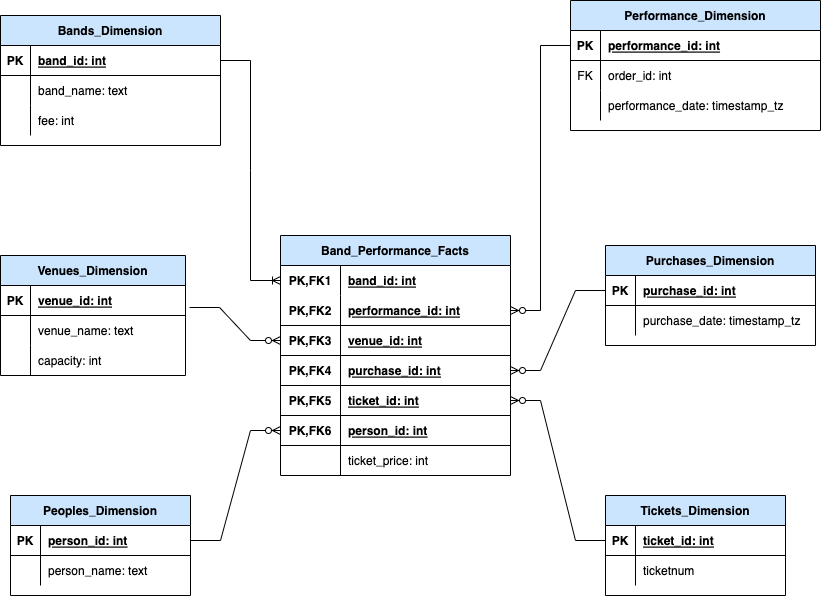

The `DBT` tool implements the creation of the star schema and the data products using SQL `SELECT` 
queries stored in files that DBT calls *models*. 

This screenshot shows the DBT model file that creates the central `Fact` table in our star schema.

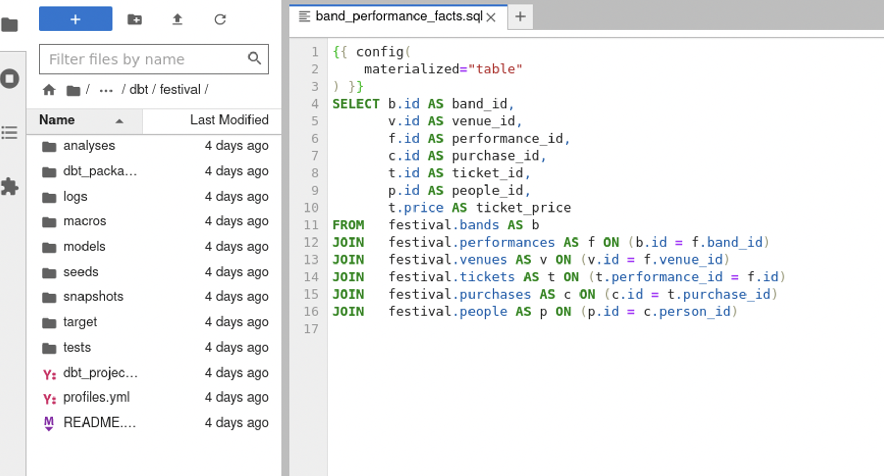

The dependencies (the lines in the DAG) can be represented by "references" in the DBT model, which 
use the names of the task files. This is the DBT model file that creates one of the data products.

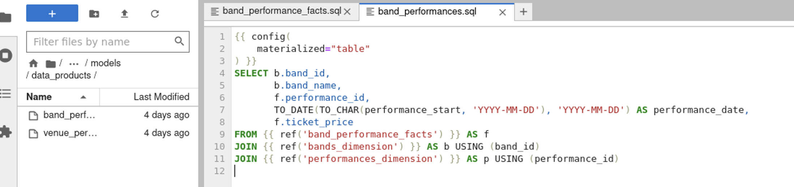

We create data products so that we have datasets that are easily consumable by others who want to
do useful things with the data. For example, most visualization tools need a single table or 
dataset to create a chart, as we'll see when we look at Superset. Data scientists may want curated 
datasets for machine learning and statistical analysis. Analysts may want to import these curated 
datasets into Excel spreadsheets. Software engineers may want to feed this data back into their
operational systems.

These are the data products we created to be able to answer the questions we posed in our scenario.

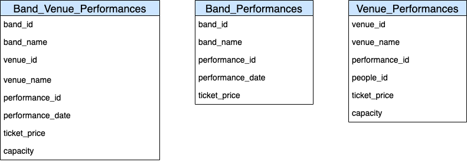

### Visualization

We will visualize using a tool called Superset. Superset is an open-source tool that allows you to
create interactive visualizations from datasets. It allows you to create a wide variety of 
different types of charts for your visualizations. We will only use a few different types of charts,
but it's nice to have a wide variety to choose from.

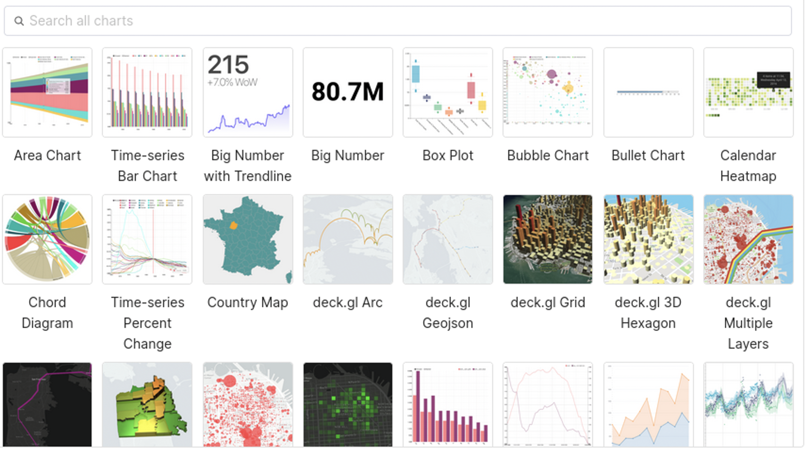

We create dashboards that consist of multiple charts that address different facets of the same 
subject area:

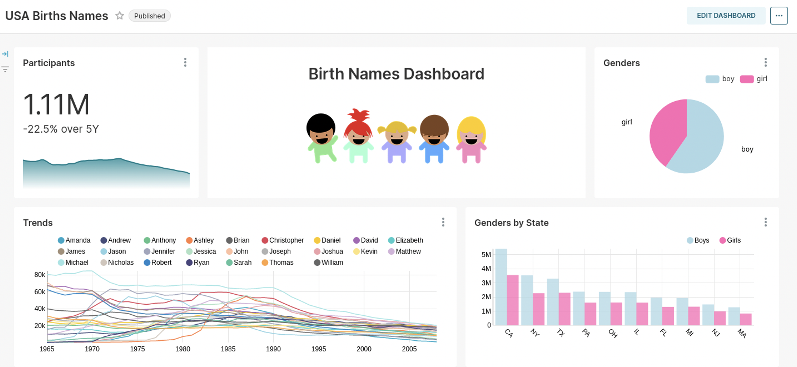

We start with the dataset to build a dashboard. For the music festival project, the datasets we
use are the data products we created as the last step in our pipeline.

We create charts from datasets, which are the data products that we've imported into Superset. Here 
we see our two data products available as datasets in Superset

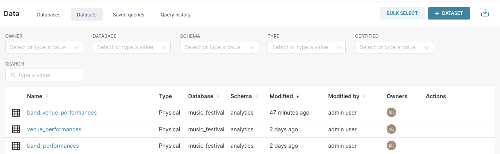

When we click on a dataset, it takes us to page where we can create a chart. Here is an example of
a bar chart showing top 3 venues by ticket sales:

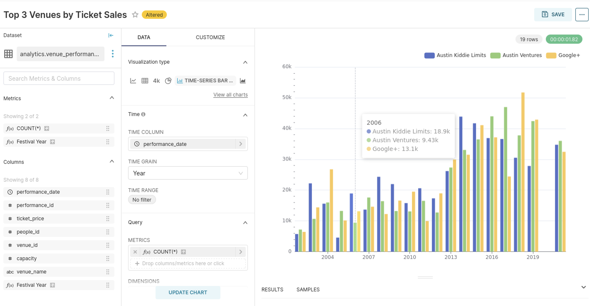

We'll take several charts built from this dataset that answer the questions we want to answer and 
put them into a dashboard:

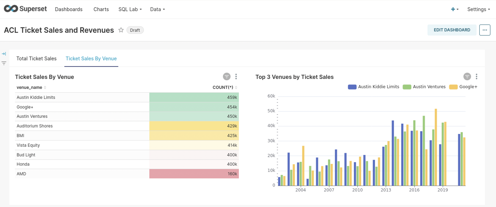

## Summary

We gave an overview of data pipelines using data from the ACL Music Festival.  We defined a 
scenario in which the ACL organizers want to create an all star festival of the most popular
bands and venues. To do this, we have to create a project that:

* Creates the tables to load data from our source system.
* Creates a pipeline that loads the data and transforms it into data products we can use to create the visualizations we need.
* Create the visualizations

We first visualize the tables we need to build as an Entity-Relationship Diagram and then write the
SQL to create those tables.

We can then define the pipeline as a directed acyclic graph (DAG()) of tasks that implement the set of tasks to
load and transform the data. 

We ingest the data from CSV files into the tables we created using the bulk loading facility of the 
Postgres database. Then we ran a validation task in order to ensure the quality of the data.

The next step is to transform the data into a star schema. First,  we define the star schema in an 
Entity-Relationship Diagram. We'll learn the design patterns for creating a star schema from our
source tables later in the course.

Then we create a DBT project. In that DBT project, we will define a series of models that do the data
transformations from source tables into the tables in the star schema. 

Once the tables in the star schema have been created, then we can create the data products we will 
use to visualize the data. We use the DBT references to star schema tables in these models that 
create the data products to ensure that they cannot be created until the star schema tables are 
created.

The final step is to create the visualizations. To do this, we use Superset. We define our data 
products as datasets in Superset and then create charts that answer the questions we asked in our 
scenario. We group related charts into dashboards to display our visualizations.

