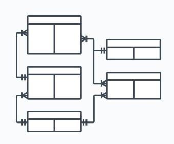

# Data Engineering Pipeline Overview

This week we will gain an overview of the data engineering pipelines that we are going to build.

In the presentation today we begin with our task, and first show the final outcome, the we circle back to the start, and discuss the data and the pipeline steps and tools we use.

This presentation is to give you a high-level overview and a map to the semester; we will go over each of these steps in detail in individual classes.  We don't expect you to understand the details, we just hope you are intruiged and excited to learn more.

## Scenario: ACL all stars analyst task

Our scenario is that that Austin City Limits music festival wants to create an ACL all stars event, inviting back bands that have been highly successful over the 20 year history of the ACL fest.

The festival wants to identify the most successful venues through the history of the festival, then identify the most successful bands for each of those venues.

What does success mean?  For the festival, the most successful venues and bands are those whose performances tend to sell most tickets. <!-- In addition, as potential all-stars, bands should have played at least three festivals over the years. -->

The festival would like to see a vizualization of these data, to help assess whether there are clear "must invite" standout bands, or whether there are groups of bands that have been about equally successful, such that any of them could be invited.

## Vizualizations

1. Ticket sales over all time

2. Tickets sales per venue over all time
    --> visually identify the top venues, a group of three.

3. Per venue, average ticket sales per performance by each band over all time.
    --> visually identify group of top performers
    --> maybe limit vizualization to top 8 bands per venue

## The Pipeline

(Figure showing steps, ingestion etc.)

### Ingestion

The festival has its data in a transactional database, organized in a structure that makes sense for the system that sells tickets.  This system is being used currently to sell tickets to the 2022 ACL fest, so it is crucial that we do not bog the ticket sales server down.

We first need to extract the data from the transactional system, then we need to understand the structure of that database.

TODO: The exported files:

TODO: The source system ER diagram.

The system holds data on Performances by Bands in Venues, together with People who have made Purchases of Tickets to Performances.

### Cleaning and Validation

TODO: perhaps show some validation queries using SQLLAB in Superset?

e.g., do we have any tickets for performances where we don't know the venue or band?  A result of zero is good validation.

do our ticket sales give us the same number of performances as a count on the performances table?

### Transformation

To build a usable data product for our analysis (and future analyses that might be needed) we will do two steps of transformation.  

1. Transform to Star Schema
2. Transform to data products

First, we transform this entity database schema into a star schema.

TODO: the star schema screenshot

Each of these steps will be run by the `dbt` tool, implementing a pipeline with dependencies known as a "DAG" (for _D_irected _A_cyclic _G_raph).

TODO: DAG picture.

`dbt` implements each of these steps (the circles in the DAG) using SQL `SELECT` queries stored in files. The dependencies (the lines in the DAG) are represented by "references" which use the names of the task files.

TODO: screenshots of the dbt files, show file system tree, but just show full text from one file for each step of transformation (so 2 in total?)

### Vizualization

We will vizualize using a tool called Superset.