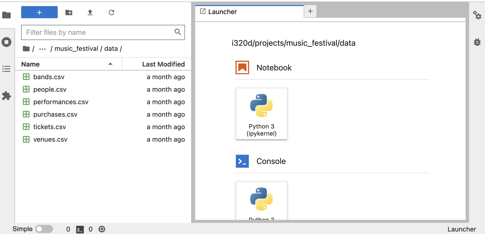
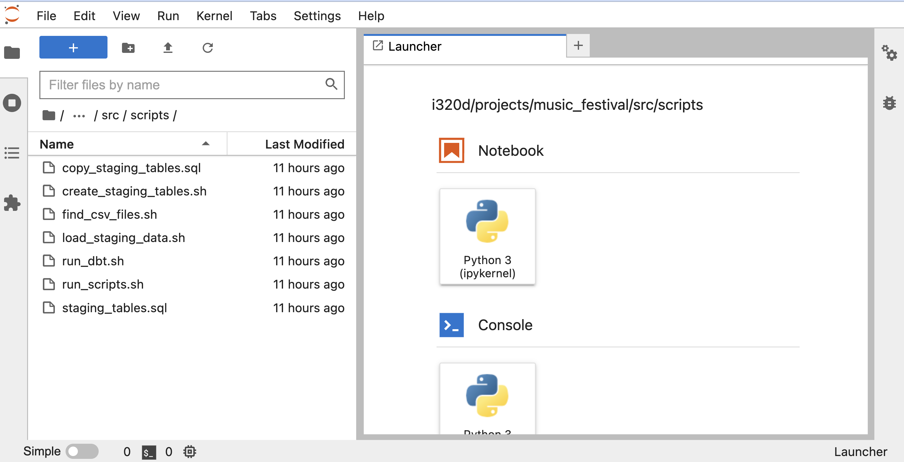

# Semester Project

## Projects
1. [Austin Animal Center Outcomes (aac)](../../projects/aac/REQUIREMENTS.md)
2. [Covid-19 Cases in US Counties (covid)](../../projects/covid/REQUIREMENTS.md)
3. [Dancing with the Stars (dwts)](../../projects/dwts/REQUIREMENTS.md)
4. [Internet Movie Database Ratings (imdb)](../../projects/imdb/REQUIREMENTS.md)
5. [Olympic Events (olympics)](../../projects/olympics/REQUIREMENTS.md)
6. [Saturday Night Live shows (snl)](../../projects/sat_night_live/REQUIREMENTS.md)

You will be divided into teams of 4 and be assigned a project. Each project has a requirements
document, which is linked above.

Each team will read their requirements document and make a copy of the 
[Project Report Template](../../320d_project_report_template.ipynb) that they will fill out for the
project. The requirements document and the project report template are also linked to in the 
syllabus.

Each person on a team will be linked to a project directory for their project that will be available 
on their Jupyter notebook. The project directory will have the following structure:


When you navigate to your project in your Jupyter notebook, it will look like this (using the Music
Festival project as an example):


If you click on `data`, you will see the CSV files for your project:



Go back up to `src` and click on that. You will see the source directories where your code will go.


Click on the `scripts` directory. This shows the files you will use to create your staging
tables and load the CSV files into those tables.



Go back up to the `src` and click on `dbt`. This shows the dbt project directory.


Click on the project name and then on `models` - you will see the `star_schema` and `data_products`
directories - this is where your dbt model files will go that create your dimensional model and
data products for your project.


> HELPFUL HINT:
> The Music Festival project is a complete example of a project. You can use this as a reference and
> an example of how to create your source files. All the code in this project has been run and
> tested.

## Project Instructions

### Copy the Project Report Template

Your first task will be to read the requirements, discuss with your team, and ask any questions you
have about the requirements. We will do the assignment of teams to projects while you do this.

### Creating Staging Tables

The next step is to create the staging tables. You first need to do the following:

1. Create a concrete data example.
2. Draw a conceptual E-R Diagram.
3. Draw a physical E-R Diagram.

> See the [Data Modeling](../modeling/01_has_many) presentation as a guide to help you with these 
steps.

Then your team will write CREATE TABLE statements to create your staging tables. These are the tables you will
load your CSV files into. These CREATE TABLE statements will go into the `staging_tables.sql` file.
You can edit this file in your Jupyter notebook. This file is located in the `<your project_name>/src/scripts` directory.

You will create the tables by running the `create_staging_tables.sh` script. To run it, open a 
Jupyter terminal and run the following commands:

```sh
cd projects/<your project name>/src/scripts/
bash create_staging_tables.sh
```

### Loading Data Into Staging Tables

You will write `\copy` commands into the `create_load_commands.sql` file. These commands will load
the data in your CSV files into your staging tables. You can also edit this file in your 
Jupyter notebook. This file is located in the `<your project_name>/src/scripts` directory.

> See the [Data Ingestion](../ingestion-pt2) presentation as a guide to help you with creating the 
> \copy commands

You will load the data into the staging tables by running the `load_staging_data.sh` script. To run
it, open a Jupyter terminal and run the following commands:

```sh
cd <your project name>/src/scripts
bash load_staging_data.sh
```

### Creating the Dimensional Model

Once the data is loaded into the staging tables, you will create your dimensional model. You
must do the following steps.

1. Identify the facts, grain, and dimensions for your dimensional model.
2. Create a transformation diagram.
3. Create a concrete data example.
4. Draw a conceptual E-R Diagram.
5. Draw a physical E-R Diagram.

> See the [Dimensional Modeling](../dimensional_modeling) presentation as a guide to help you with
these steps.

### Creating and Running the dbt Model Files

You will create the dbt model files for your dimensional model in the dbt `models/star_schema`
directory. You can find this directory at `<your project name>/src/dbt/<your project name>/models/star_schema`.
 
> See the [DBT Intro](../dbt_intro) presentation as a guide to help you create your dbt model files.

Later, you will create the dbt model files for your data products in the dbt `models/data_products`
directory. You can find this directory at `<your project name>/src/dbt/<your project name>/models/star_schema`.

You will execute the dbt model files by running the `run_dbt.sh` script. To run it, open a Jupyter
terminal and run the following commands:

```sh
cd <your project name>/src/scripts
bash run_dbt.sh
```
