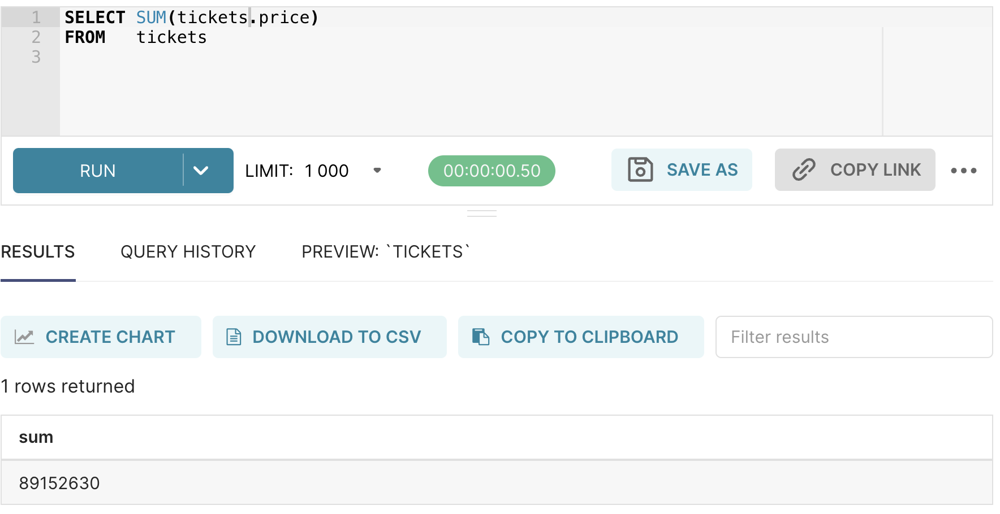
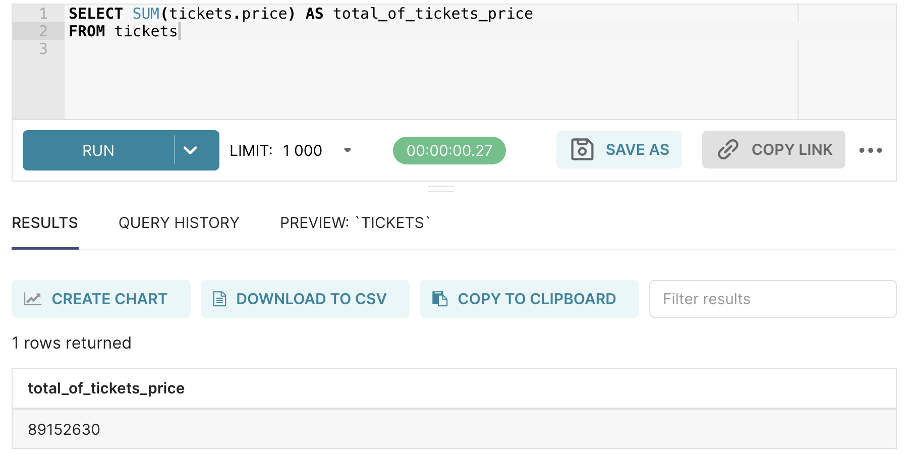
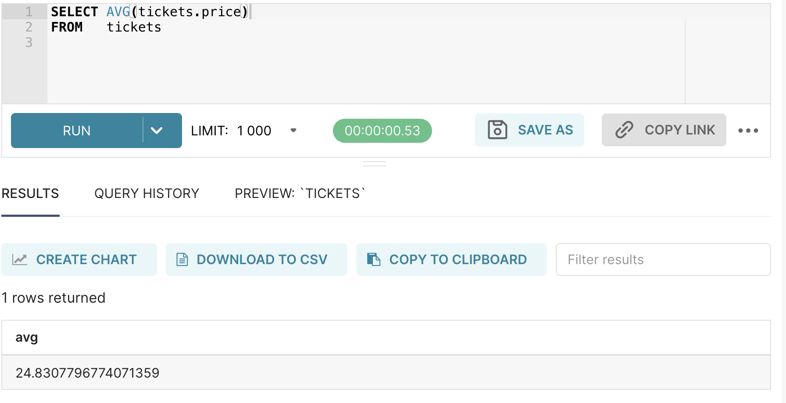
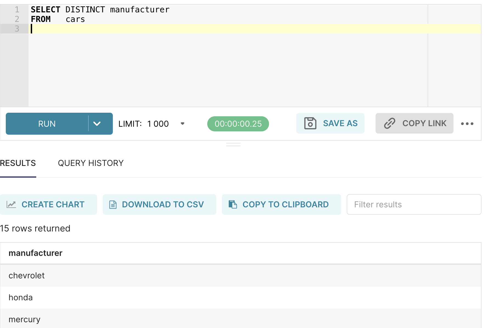

# Aggregate Functions and GROUP BY

## Aggregate Functions

Thus far we've learned how to narrow down rows and columns to obtain answers to queries. We've 
narrowed down rows using conditions (`WHERE`/`LIMIT`), and columns using `SELECT`.

In this module we're going to learn how to work with columns of data. Aggregate functions 'collapse' 
the values in a column, returning a result. The functions go into the SELECT clause.

Examples include, `SUM`, `AVG`, `COUNT`, `MIN`, and `MAX`. We will also learn how to use the
`DISTINCT` keyword.

Note that the aggregate functions only work on *numerical* columns.

### SUM
One of the simplest aggregate functions is to add together all the values in a column using `SUM`. 
This figure shows part of the tickets table from our `music_festival` database.  


If we wanted to know the total of the values in the `tickets.price` column we can get that with the 
three steps below.

```sql
-- identify the rows we want to work with
SELECT *
FROM tickets;

-- identify just the column we want to work with
SELECT tickets.price
FROM tickets;

-- Collapse the column vertically to a single value.
SELECT SUM(tickets.price)
FROM tickets;
```

Which would give us a result of:



When we use an aggregate function it is convenient to employ an alias to give a name to the result:

```sql
SELECT SUM(tickets.price) AS total_of_tickets_price
FROM tickets
```



## AVG
We can get the average of the numbers in a column with the AVG function. 



Note that there is no `MEDIAN` function nor a `MODE` function in sql. Both can be done but it is 
complicated and once one is doing real statistics it is better to move out of SQL and 
use `python` (or `R`).

## DISTINCT

`DISTINCT` is not an aggregate function, but is often used with aggregate functions. It reduces
the number of rows in query by removing duplicates

We can find the distinct set of manufacturers from the cars table by using `DISTINCT`
```sql
SELECT *
FROM cars;
```
Returns 234 rows which is the total number of rows in the database

```sql
SELECT DISTINCT cars.manufacturer 
FROM cars;
```
Returns 15 rows, which is the number of distinct car manufacturers



## COUNT (three forms of COUNT)

Counting values in a column (or rows in a table) is an important form of aggregation function. 
At first you might not think of that as aggregating, but it does take a column (or a table) and 
reduce it down to a single value, just as functions like `SUM` or `AVG` do.

There are three forms of COUNT, each subtly different from each other.

The three forms of COUNT are:
1. `COUNT(*)` counts the number of rows.
2. `COUNT(column)` counts the number of non-NULL values in a column.
3. `COUNT(DISTINCT column)` counts the unique values in a column, after removing NULLs.

`COUNT(*)` is immediately useful for simple tables:

```sql
SELECT *
FROM tickets;

SELECT COUNT(*) AS count_of_tickets
FROM tickets;
```

Or used with data conditions to count the number of things that meet some condition, such as how many bands had fees higher than $100?

```sql
SELECT *
FROM bands

SELECT *
FROM bands
WHERE bands.fee > 100;

SELECT COUNT(*) as number_of_expensive_bands
FROM bands
WHERE bands.fee > 100;
```

`COUNT(DISTINCT column)` is also very useful, when you want to know the number of distinct values 
in a column (rather than get a list of them).  For example we might want to know the distinct number 
of manufacturers represented in the cars dataset.

```sql
SELECT * 
FROM cars

SELECT DISTINCT cars.manufacturer
FROM cars
--> list of 15 unique manufacturers

SELECT COUNT(DISTINCT cars.manufacturer) AS count_manufacturer  
FROM cars
--> 15

```

Generally speaking counting rows or distinct ids is a better approach than counting distinct names 
because many things in the world can have the same name (as the Office Space movie, filmed in Austin, 
[showed us memorably about 'Michael Bolton'](https://www.youtube.com/watch?v=ADgS_vMGgzY#t=16.5s).)

For example, quite a few of the customers in the music_festival_database have the same name, as 
would be true in any set of people. The database knows that they are separate people (or at least 
separate user accounts) because they have different primary keys. So `SELECT DISTINCT people.name` 
will produce exact what it is asked for, the number of different strings in the people.name column, 
but that is quite different than the number of different peopel in the database.

```sql
SELECT COUNT(DISTINCT people.name)
FROM people
```

Gives 138,129 different names, but

```sql
SELECT COUNT(*)
FROM people
```

Gives 143,616 rows in the people table.  The difference is due to people having repeated names.

## COUNT(column) considered confusing (if not harmful)

My general advice is to avoid `COUNT(column)` entirely. It isn't needed and it is confusing.

To see why, consider the differences between the three forms of `COUNT` on this list:

```
id, name
--------
1, Domhog
2, NULL
3, Domhog
4, Shuyen
```

- `COUNT(*)` would give the answer `4` (there are 4 rows).
- `COUNT(name)` would give the answer `3` (there are 3 non-null values in the name column.)
- `COUNT(DISTINCT name)` would give the answer `2` (just 'Domhog' and 'Shuyen')

I advise people to avoid `COUNT(column)` because I find the semantics confusing in a query. I mean that what people are intending to accomplish is unclear. More, though, I haven't come across a time when it is necessary.

Whenever you are tempted to use `COUNT(column)`, ask yourself whether `COUNT(*)` is clearer and what you actually mean. Most counting queries are questions about the number of rows (after some conditions), not the number of non-NULL values.

If you really do want to count the number of non-NULL values, you can do this clearly and understandably using

```sql
SELECT COUNT(*) as count_rows_with_names
FROM people
WHERE people.name IS NOT NULL
```

## A note about MIN and MAX vs ORDER BY LIMIT 1

The aggregate functions `MIN()` and `MAX()` seem straight forward, the find the minimum or maximum 
value in a column.


```sql
SELECT MIN(tickets.price) AS lowest_ticket_price
FROM tickets
```

Which will, correctly, return `5`, the lowest value in the table.

However questions about the 'lowest', 'highest', 'earliest' usually also want another part of the 
row with that value. e.g., 'Who bought the earliest ticket?', 'which ticket number had the lowest price?'

These queries are better answered using `ORDER BY` and `LIMIT 1`. Using `MIN` and `MAX` the 
intuitive way will silently give a totally incorrect answer.


This bears repeating: If you use `MIN` or `MAX` in the `SELECT` clause _with any other column_ you 
will not get the value in the row that had the lowest value, you will get a random value from the 
other column.  I know that this is hard to believe. We'll talk about why when we get to groups.

Another way to think about this is to think of the question as two steps: 'What is the minimum 
price? (5) And what the ticketnumbers and prices for those tickets which had that price? (TA269304)'

```sql
-- First get the minimum value
SELECT MIN(tickets.price) FROM tickets

-- That returns a single value which you then can use.
-- You get the server to 'remember' it by surrounding the query with parens.
SELECT tickets.ticketnum, tickets.price
FROM tickets
WHERE tickets.price = (SELECT MIN(tickets.price) FROM tickets)
```

But hey if you use `ORDER BY` and `LIMIT` you can easily get the top five or bottom whatever 
(as long as ties don't matter), so just don't use `MIN` or `MAX` in the `SELECT` clause, 
unless it's a sub-query.

```sql
SELECT tickets.ticketnum, tickets.price
FROM tickets
ORDER BY tickets.price ASC
LIMIT 5
```

I would only use MIN or MAX when ties really matter, and only in a sub-query.  That said, even 
ranking is better done using specific `RANK` functions.

### Exercises:

You may find the first five exercises on [SUM and COUNT on SQLZoo](http://sqlzoo.net/wiki/SUM_and_COUNT) useful.

Onward to [GROUP BY](../grouping).