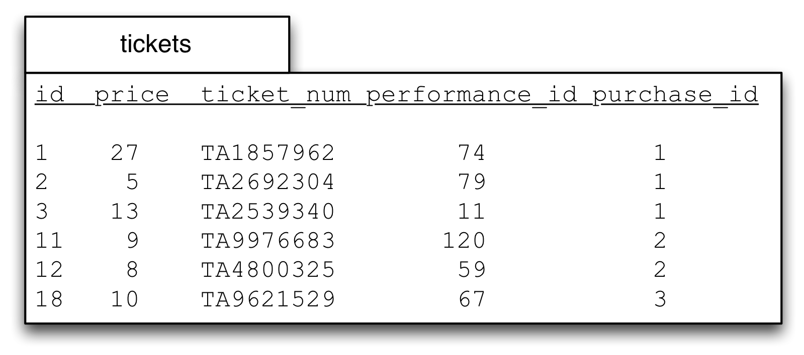
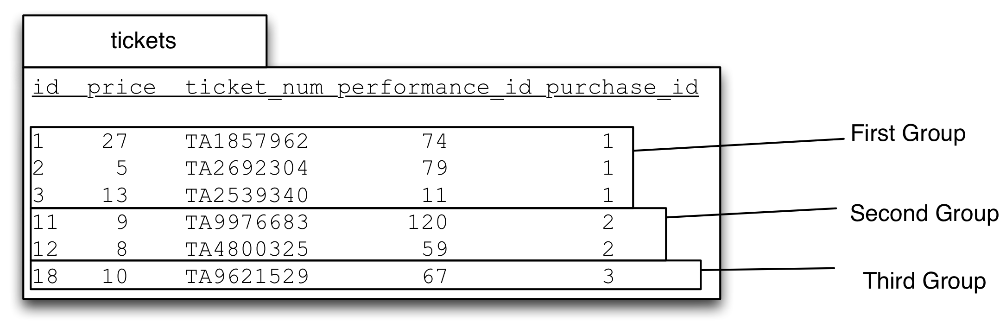
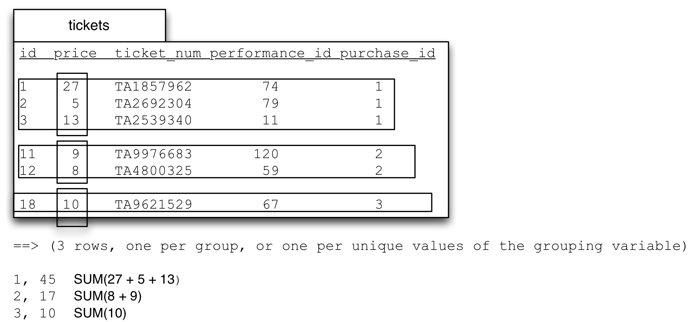
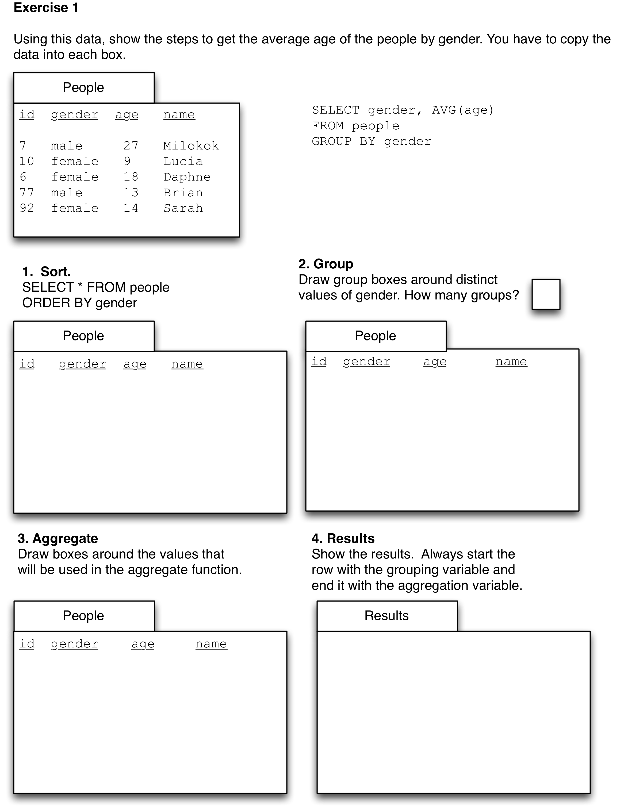
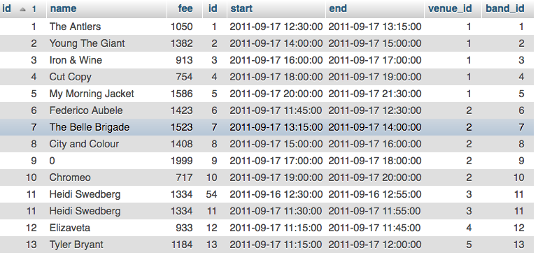
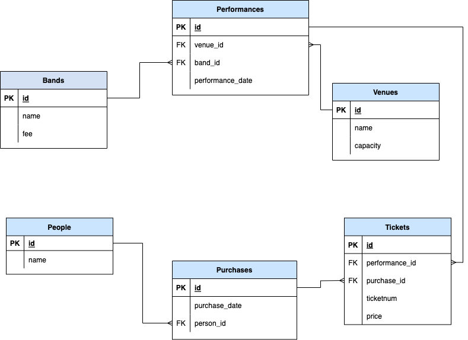
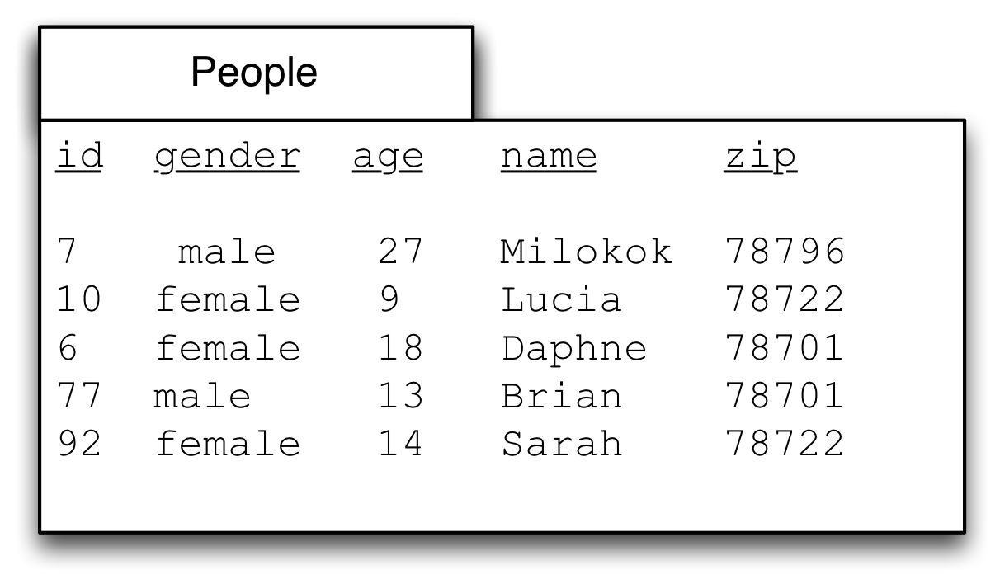
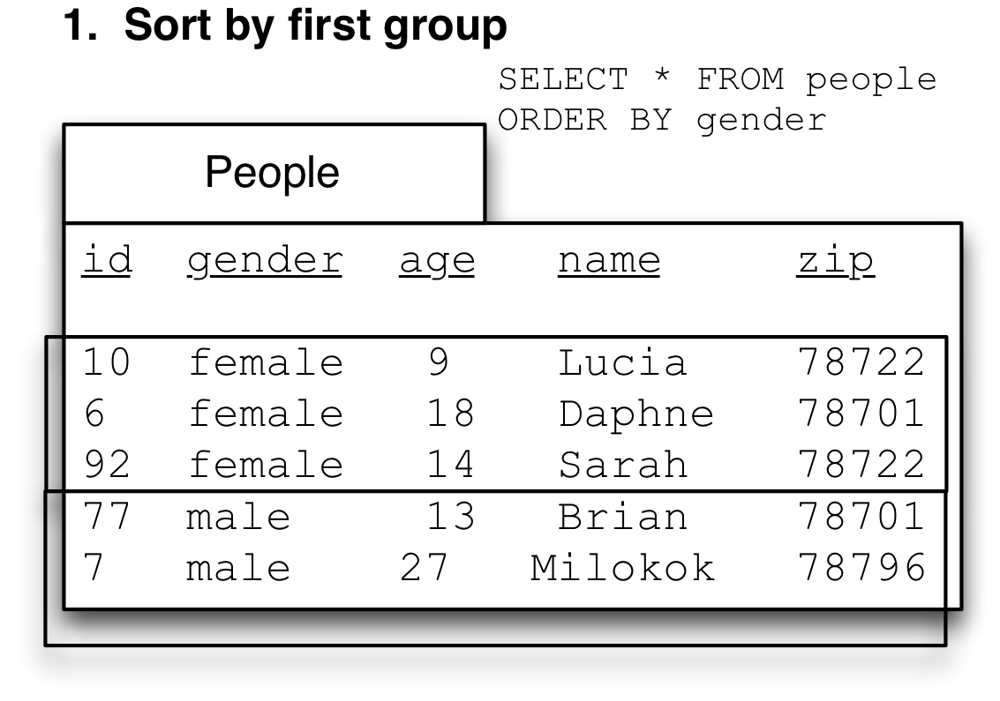
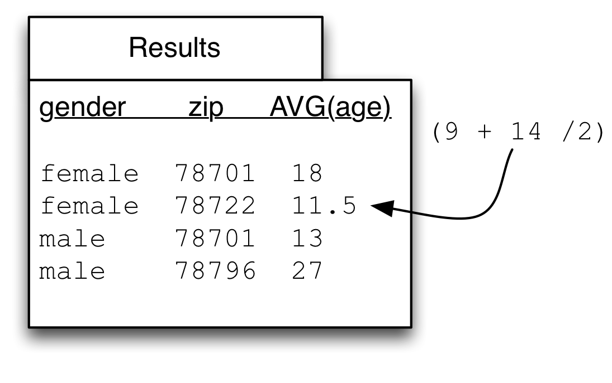
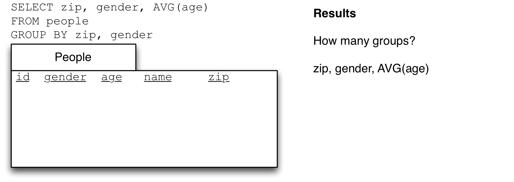

GROUP BY: using aggregate functions on sub-sets of tables
=========================================================

In the previous class we learned about aggregate functions, which let us 'collapse' a table (or a column in a table) down to a single value. We learned about `COUNT(*)` which shows us the number of rows in a table, and `SUM(column)` which collapses a column of numbers down by adding them together.

Often we want to do these things, but rather than doing them on a whole table, we want to split the table up into sections, then use `COUNT` or `SUM` on each of those sections.  In this way `GROUP BY` lets us divide the table into multiple parts, then use an aggregate function on each part.  The parts are defined by having the same value in one of the columns.

Again using our small slice of the `tickets` table, let's say that we want to know the total spent in each purchase. We first sort the table by `purchase_id` and then divide the table up into three groups, one for each of the values for `purchase_id`.

```sql
SELECT *
FROM tickets
ORDER BY tickets.purchase_id
LIMIT 30 -- to avoid dumping whole table
```



Sorting the table brings all the rows with value `1` together.  Grouping is drawing a line across the table where the values change:



So we get a group for all the rows with the value `1` in the `purchase_id` column, a group for all the rows with the value `2` and a group for the `3`s.

Now we make three moves:
1. Put grouping term at start of `SELECT`
2. Change `ORDER BY` to `GROUP BY`
3. Add aggregate function to `SELECT` and `AS` alias.

Here I show the steps separately, but you have to do all three at once (server will throw an error if you do try to execute the intermediate parts).

```sql
SELECT *
FROM tickets
ORDER BY tickets.purchase_id
LIMIT 30

-- 1. Put grouping term at start of SELECT
SELECT tickets.purchase_id,
FROM tickets
ORDER BY tickets.purchase_id
LIMIT 30

-- 2. Change ORDER BY to GROUP BY
SELECT tickets.purchase_id,
FROM tickets
GROUP BY tickets.purchase_id
LIMIT 30

-- 3. Add aggregate function to SELECT and alias.
SELECT tickets.purchase_id, SUM(price) AS total_of_purchase
FROM tickets
GROUP BY tickets.purchase_id
LIMIT 30
```

---------------
**You must always copy the column from the GROUP BY part to be the first part of SELECT.**

---------------


When we use an aggregate function in the `SELECT` part we get one answer for each group, rather than one answer for the whole table.  

Thus for this data `COUNT(*)` would give you three answers, one for each group, showing the number of rows in that group.

`SUM(tickets.price)` is also going to give you three answers, one for each group, by adding up the values in the `price` column using only the rows in each group.



So `GROUP BY` allows us to split up a table into groups that share a value in a particular column, and then apply aggregate functions to get a single value by 'collapsing' the group. The aggregate functions work exactly the same as they do on a whole table, but operate only on the rows in each group. You will always get back one row for each group.

The full build up for the query always involves the `ORDER BY` step. Once you use `GROUP BY` you can't see the rows in the group, `ORDER BY` gives you a chance to inspect inside the group. This is very useful.

```sql
-- What was the total spent in each purchase?
SELECT *
FROM tickets
LIMIT 30

-- tickets.purchase_id allows us to bring the rows for
-- each purchase together
SELECT *
FROM tickets
ORDER BY tickets.purchase_id
LIMIT 30
-- Execute query and check that grouping seems correct,
-- look for change over of grouping variable.

-- 1. Put grouping term at start of SELECT
-- 2. Change ORDER BY to GROUP BY
-- 3. Apply aggregate function.
SELECT tickets.purchase_id, SUM(tickets.price) AS total_of_purchase
FROM tickets
GROUP BY tickets.purchase_id
LIMIT 30
```

Note that you can't use `SELECT DISTINCT column` along with `GROUP BY` (because it could return more than one value for each group), but you can use `SELECT COUNT(DISTINCT column)` to count the number of distinct values in a column, within a group. `COUNT(DISTINCT column)` returns a single value for each group.

## Exercise

Print out this picture and use it as a worksheet:



<!--
## GROUP BY after a join

For example, we might want to ask:

```
How many performances did each band give?
```

I'm going to interpret this question as asking for the name of the band and a count of their performances. We know how to figure this out one band at a time:

```sql
SELECT *
FROM bands
WHERE bands.name = 'Beardyman'
-- 1 row

-- Join to performances, now a row per performance, all Beardyman
SELECT *
FROM bands
  JOIN performances
    ON bands.id = performances.band_id
WHERE bands.name = 'Beardyman'

-- Now count the rows.
SELECT 'Beardyman', COUNT(*) AS number_of_beardyman_shows
FROM bands
  JOIN performances
    ON bands.id = performances.band_id
WHERE bands.name = 'Beardyman'
```

(Note that I've used a constant `'Beardyman'` in the `SELECT` which is just copied to the results.)

Using `GROUP BY` enables us to answer this question for each band in the one query.

We'll be using `bands.id` as our grouping variable, so we'll get our table divided into as many groups as there are bands (note that I'm not using `bands.name` due to possibility of different bands with same name, the `id` column uniquely identifies bands).

We begin by joining the tables as normal:

```sql
SELECT *
FROM bands

SELECT *
FROM bands
  JOIN performances
    ON bands.id = performances.band_id
```

Now we examine those results and then sort the join table by the bands.id field, using `ORDER BY`:

```sql
SELECT *
FROM bands
  JOIN performances
    ON bands.id = performances.band_id
ORDER BY bands.id
```

That query gives these results:



You can see that most bands only have a single row, because they only have a single performance. But look at 'Heidi Swedberg' there are two rows for two performances (on different days).  When we group by bands.id (or performances.band_id) we will collapse those rows. Within each group to get the number of performances we use `COUNT(*)`. Most of the groups will only have a single row, but some will have more.

Now we do our three part change:
1. move grouping term to `SELECT`
2. change `ORDER BY` to `GROUP BY`
3. add aggregate function with `AS` alias.

```sql
SELECT bands.id, COUNT(*) AS num_performances
FROM bands
  JOIN performances
    ON bands.id = performances.band_id
GROUP BY bands.id
```

So using `GROUP BY` happens after the `JOIN` and `WHERE` parts. You can group a joined table just as you group a regular table.

To see just the bands with `2` performances, we can add a new `ORDER BY` using our calculated and aliased field. We can do this because (if you remember) `ORDER BY` works on the results table and executes after everything else (other than `LIMIT`).

```sql
SELECT bands.id, COUNT(*) AS num_performances
FROM bands
  JOIN performances
    ON bands.id = performances.band_id
GROUP BY bands.id
ORDER BY num_performances DESC
```

So now we have our bands sorted by the number of performances they gave. We're almost done but recall that we wanted the name of the band and their performances. Currently we only have the band `id`s and the count, but we also want the name of the band. To get this we can add the `bands.name` into the SELECT.

```sql
SELECT bands.id, bands.name, COUNT(*) AS num_performances
FROM bands
  JOIN performances
    ON bands.id = performances.band_id
GROUP BY bands.id
ORDER BY num_performances DESC
```

This works, but we have to *be very careful adding columns into the SELECT of a query with a GROUP BY* if the column we're adding isn't in the GROUP BY or isn't an aggregate function. We can **only** do it if every value in the group is identical.

The reason is that SQL has to choose a value for that field from the many rows in the group, and it is possible that the field you added could have more than one value within that group. This isn't a concern with the columns in the `GROUP BY` because the way the groups are created ensures that every row has the same value in the column that we're grouping by. It also isn't a concern with aggregate functions like `SUM` because they 'collapse' the column to a single value.

When we use other columns, however, what happens is that SQL simply selects the value from a random row and uses that as the value for the group. *Yes, that is actually what happens*. I know, I know, it seems insane. But it is not a problem if every row in the group has the same value (because choosing a random one still gets you the one you were looking for.)

You might be thinking: well, can't I just group on `bands.name` and not worry about this picking a random value stuff? You can write the query that way, but if two bands were to have the same name, all of their performances would be in the same group. Perhaps unlikely with bands at a festival, but very problematic for people, courses, etc. which often have the same name. If you use `id` to group (and include it in your `SELECT`, of course) then you might get two rows with the same name in your result, but you'll understand why.

Incidentally, this is why `MIN` and `MAX` shouldn't be used in the `SELECT` part when you want to find 'the smallest', 'the biggest', or 'the earliest'. When you do SQL is treating the table as one big group and when you add in the other column it picks a value from a random row and includes that.

Happily recent versions of postgres will give an error if a column is included that would result in this sort of error, but other SQL implementations will not.  Thus it is important to follow the advice above.

!-->

## HAVING

What if we only want to see purchases that included more than 10 tickets?

That is difficult because of the order that the clauses execute. `GROUP BY` (and therefore `COUNT(*)`) happens _after_ `WHERE`, so we don't have the count of tickets in a purchase at the time that `WHERE` executes. Since we don't have it yet, we can't use it in the `WHERE`.

We want to eliminate some rows from our _results_ table, just as `LIMIT` does. SQL accommodates this common use case with an additional keyword: `HAVING`. The syntax is exactly the same as `WHERE` clause had our results been a table in the database.

Thus to get only purchases that included more than 10 tickets we can do:

```sql
SELECT *
FROM tickets

SELECT *
FROM tickets
ORDER BY purchase_id

SELECT purchase_id, COUNT(*) as tickets_per_purchase
FROM tickets
GROUP BY purchase_id

-- Now add a HAVING clause to filter these results
SELECT purchase_id, COUNT(*) as tickets_per_purchase
FROM tickets
GROUP BY purchase_id
HAVING COUNT(*) > 10
```

Note that we cannot say `HAVING tickets_per_purchase > 10` we cannot use the alias from the SELECT clause in the HAVING clause. This has to do with the order that things execute, HAVING executes after `GROUP BY` but before `SELECT`. 



This is fairly annoying, especially if the expression we want to filter by is complicated (because it then has to be repeated in the SELECT and in the HAVING).

## GROUP BY on more than one column

Sometimes we want to group by one than one field.  In the data below there are two genders shown, but it's important for me to emphasize that there could be additional values for gender beyond 'man' and 'woman'. In fact Facebook, famously, eventually [was shamed into introducing a free-form text field for gender](https://www.huffpost.com/entry/facebook-gender-free-form-field-_n_6762458?guccounter=1).  

While I do only use 'man' and 'woman' below, using a freeform text field, rather than codes like 1 or 2, or a set of prespecified values from a drop-down is bad practice.  Free-form is much better than the category 'other,' because it is inaccurate and painful, as described by Bowker and Star (from the Information School world) in their book ['Sorting things out: classification and its consequences.'](https://mitpress.mit.edu/9780262522953/sorting-things-out/).

However, in this database we have two values, 'man' and 'woman'. And we might want to know the average age for those that chose each label, broken down by the zip code in which they live.

Just as we can use more than one column with `ORDER BY` (using a second column to 'split ties' from our first column), we can use more than one column with `GROUP BY`.

The same procedure as above works with two (or more columns). The key is to realize that the groups are based on _unique combinations of the grouping variables_. You might think of the first grouping variable as the 'outer' variable and the second as the 'inner' variable.  Remember that the grouping variables always come at the start of the SELECT, if you use two grouping variables, then you have to ask for both at the start, in the same order. If you follow the three steps from above you can't go wrong.



Now sort by the first variable (`gender`):



Then sort by the second variable (`zip`). This picture shows the second groups with a dotted line. Note that `zip` is in order only within each group from `gender`, but not if you simply read down the `zip` column (78701 shows up twice, once at the top of the female group, once at the top of the male group.)


Finally we can do our three group by steps, only difference being that we copy both terms from the `ORDER BY` to `SELECT`

1. move grouping terms to `SELECT`
2. change `ORDER BY` to `GROUP BY`
3. add aggregate function with `AS` alias.

```sql
SELECT *
FROM people
ORDER BY people.gender, people.zip

SELECT people.gender, people.zip, AVG(people.age) AS avg_age_by_gender_and_zip
FROM people
GROUP BY people.gender, people.zip
```



### Exercise

If we reverse the order of the terms in the `GROUP BY` will the answers change?



You may find the exercises 6-8 on [SUM and COUNT on SQLZoo](http://sqlzoo.net/wiki/SUM_and_COUNT) useful.
