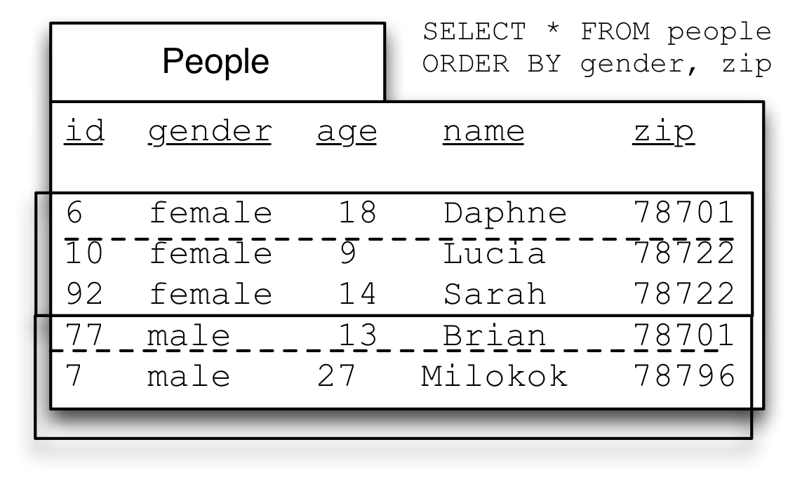

#GROUP BY: using aggregate functions on sub-sets of tables


In the previous presentation we learned about aggregate functions, which let us 'collapse' a table 
(or a column in a table) down to a single value. We learned about :

* `SUM(column)` which collapses a column of numbers down by adding them together;
* `AVG(column)`, which gives use the averaged value of the numbers in a column;
* `COUNT(*)` which shows us the number of rows in a table;
* `MAX(column)` which gives us the maximum value in a column
* `MIN(column)` which gives us the minimum value in a column

We also learned about `DISTINCT`, which gives us the distinct set of values in a column.

Often we want to do these things, but rather than doing them on a whole table, we want to split the 
table up into sections, then use `SUM`, `AVG`, or `COUNT` on each of those sections.  In this way 
the `GROUP BY` clause lets us divide the table into multiple parts, then use an aggregate function 
on each part.  The parts are defined by having the same value in one of the columns.

Again using our small slice of the `tickets` table, let's say that we want to know three things:
* How much did each performance make in ticket sales?
* What was the average ticket price for each performance?
* How many tickets where sold for each performance?

## GROUP BY with SUM
*How much did each performance make in ticket sales?* 

The `tickets` table contains the `price` column and the `performance_id` column. So we can SUM up 
ticket `price` for each performance if we GROUP BY `performance_id`.

You can do this in the following steps:

1. Choose the table to use in the FROM clause:
```sql
SELECT *
FROM   tickets;
```
2. Choose the column you want to SUM:
```sql
SELECT SUM(price)
FROM   tickets;
```
3. Now choose the column you want to group the SUMs on. In this case we want to total the ticket sales revenue for each performance:
```sql
SELECT performance_id, SUM(price)
FROM   tickets;
```

But now we need to tell the database to group on that column, so we add the GROUP BY clause:
```sql
SELECT performance_id, SUM(price)
FROM tickets
GROUP BY performance_id;
```


Notice that we get one row for each performance_id with the price added up for that performance.  


So `GROUP BY` allows us to split up a table into groups that share a value in a particular column, 
and then apply aggregate functions to get a single value by 'collapsing' the group. The aggregate 
functions work exactly the same as they do on a whole table, but operate only on the rows in each 
group. You will always get back one row for each group.

## GROUP BY with AVG
*What was the average ticket price for each performance?*


We get the average price in the same way we got the sum - we group by performance_id:


Notice again that we get one row for each performance_id with the price averaged for each 
performance.  

# GROUP BY with COUNT
* How many tickets where sold for each performance?*   


Notice here that we're counting rows:


Exercises:
1. What happens if you add ticket_id to any of the SQL statements above and run it?
2. How would you get the top 10 performances by ticket sales revenue?
3. How would you get the 5 lowest average ticket prices?
4. How would you get the top 5 performances by number of tickets sold?

## GROUP BY with JOINs

We can join tables together to get additional information using GROUP BY. For example, we can find
out how many performances each band has played at the festival by joining the `performances` and
`bands` tables together. Let's do this step-by-step:
1. Choose the tables:
```sql
SELECT *
FROM   bands AS b
JOIN   performances AS p ON (p.band_id = b.id);
```
2. Choose the columns :
```sql
SELECT b.name AS band_name, COUNT(*) AS performances
FROM   bands AS b
JOIN   performances AS p ON (p.band_id = b.id);
```
3. Add in the GROUP BY:
```sql
SELECT b.name AS band_name, COUNT(*) AS performances
FROM   bands AS b
JOIN   performances AS p ON (p.band_id = b.id)
GROUP BY band_name;
```

4. And let's order it by band name:
```sql
SELECT b.name AS band_name, COUNT(*) AS performances
FROM   bands AS b
JOIN   performances AS p ON (p.band_id = b.id)
GROUP BY band_name
ORDER BY band_name;
```

Note the order of the clauses in the SQL statement:  
SELECT  
FROM (+ JOIN)  
WHERE  
GROUP BY  
ORDER BY  
LIMIT  

Exercise: How would we get the number of performances at each venue?

# GROUP BY with JOINs filtered by WHERE

Let's say we want to find out how many times a particular band has played at the festival. To do
this, we need to add a WHERE clause to our GROUP BY:

```sql
SELECT b.name AS band_name, COUNT(*) AS performances
FROM   bands AS b
JOIN   performances AS p ON (p.band_id = b.id)
WHERE  b.name = 'Asleep at the Wheel'
GROUP BY band_name;
```

We would really like to know what bands played at a performance and what venue the performance was
at. To be able to do that, we're going to need to join multiple tables together to get that 
information.

What tables do we need to join to tickets to get band and venue names?


Exercises


<!--
So using `GROUP BY` happens after the `JOIN` and `WHERE` parts. You can group a joined table just as you group a regular table.

To see just the bands with `2` performances, we can add a new `ORDER BY` using our calculated and aliased field. We can do this because (if you remember) `ORDER BY` works on the results table and executes after everything else (other than `LIMIT`).

```sql
SELECT bands.id, COUNT(*) AS num_performances
FROM bands
  JOIN performances
    ON bands.id = performances.band_id
GROUP BY bands.id
ORDER BY num_performances DESC
```

So now we have our bands sorted by the number of performances they gave. We're almost done but recall that we wanted the name of the band and their performances. Currently we only have the band `id`s and the count, but we also want the name of the band. To get this we can add the `bands.name` into the SELECT.

```sql
SELECT bands.id, bands.name, COUNT(*) AS num_performances
FROM bands
  JOIN performances
    ON bands.id = performances.band_id
GROUP BY bands.id
ORDER BY num_performances DESC
```

This works, but we have to *be very careful adding columns into the SELECT of a query with a GROUP BY* if the column we're adding isn't in the GROUP BY or isn't an aggregate function. We can **only** do it if every value in the group is identical.

The reason is that SQL has to choose a value for that field from the many rows in the group, and it is possible that the field you added could have more than one value within that group. This isn't a concern with the columns in the `GROUP BY` because the way the groups are created ensures that every row has the same value in the column that we're grouping by. It also isn't a concern with aggregate functions like `SUM` because they 'collapse' the column to a single value.

When we use other columns, however, what happens is that SQL simply selects the value from a random row and uses that as the value for the group. *Yes, that is actually what happens*. I know, I know, it seems insane. But it is not a problem if every row in the group has the same value (because choosing a random one still gets you the one you were looking for.)

You might be thinking: well, can't I just group on `bands.name` and not worry about this picking a random value stuff? You can write the query that way, but if two bands were to have the same name, all of their performances would be in the same group. Perhaps unlikely with bands at a festival, but very problematic for people, courses, etc. which often have the same name. If you use `id` to group (and include it in your `SELECT`, of course) then you might get two rows with the same name in your result, but you'll understand why.

Incidentally, this is why `MIN` and `MAX` shouldn't be used in the `SELECT` part when you want to find 'the smallest', 'the biggest', or 'the earliest'. When you do SQL is treating the table as one big group and when you add in the other column it picks a value from a random row and includes that.

Happily recent versions of postgres will give an error if a column is included that would result in this sort of error, but other SQL implementations will not.  Thus it is important to follow the advice above.

!-->

## HAVING

What if we only want to see purchases that included more than 10 tickets?

That is difficult because of the order that the clauses execute. `GROUP BY` (and therefore `COUNT(*)`) happens _after_ `WHERE`, so we don't have the count of tickets in a purchase at the time that `WHERE` executes. Since we don't have it yet, we can't use it in the `WHERE`.

We want to eliminate some rows from our _results_ table, just as `LIMIT` does. SQL accommodates this common use case with an additional keyword: `HAVING`. The syntax is exactly the same as `WHERE` clause had our results been a table in the database.

Thus to get only purchases that included more than 10 tickets we can do:

```sql
SELECT *
FROM tickets

SELECT *
FROM tickets
ORDER BY purchase_id

SELECT purchase_id, COUNT(*) as tickets_per_purchase
FROM tickets
GROUP BY purchase_id

-- Now add a HAVING clause to filter these results
SELECT purchase_id, COUNT(*) as tickets_per_purchase
FROM tickets
GROUP BY purchase_id
HAVING COUNT(*) > 10
```

Note that we cannot say `HAVING tickets_per_purchase > 10` we cannot use the alias from the SELECT clause in the HAVING clause. This has to do with the order that things execute, HAVING executes after `GROUP BY` but before `SELECT`. 


This is fairly annoying, especially if the expression we want to filter by is complicated (because it then has to be repeated in the SELECT and in the HAVING).

## GROUP BY on more than one column

Sometimes we want to group by one than one field.  In the data below there are two genders shown, but it's important for me to emphasize that there could be additional values for gender beyond 'man' and 'woman'. In fact Facebook, famously, eventually [was shamed into introducing a free-form text field for gender](https://www.huffpost.com/entry/facebook-gender-free-form-field-_n_6762458?guccounter=1).  

While I do only use 'man' and 'woman' below, using a freeform text field, rather than codes like 1 or 2, or a set of prespecified values from a drop-down is bad practice.  Free-form is much better than the category 'other,' because it is inaccurate and painful, as described by Bowker and Star (from the Information School world) in their book ['Sorting things out: classification and its consequences.'](https://mitpress.mit.edu/9780262522953/sorting-things-out/).

However, in this database we have two values, 'man' and 'woman'. And we might want to know the average age for those that chose each label, broken down by the zip code in which they live.

Just as we can use more than one column with `ORDER BY` (using a second column to 'split ties' from our first column), we can use more than one column with `GROUP BY`.

The same procedure as above works with two (or more columns). The key is to realize that the groups are based on _unique combinations of the grouping variables_. You might think of the first grouping variable as the 'outer' variable and the second as the 'inner' variable.  Remember that the grouping variables always come at the start of the SELECT, if you use two grouping variables, then you have to ask for both at the start, in the same order. If you follow the three steps from above you can't go wrong.


Now sort by the first variable (`gender`):


Then sort by the second variable (`zip`). This picture shows the second groups with a dotted line. Note that `zip` is in order only within each group from `gender`, but not if you simply read down the `zip` column (78701 shows up twice, once at the top of the female group, once at the top of the male group.)



Finally we can do our three group by steps, only difference being that we copy both terms from the `ORDER BY` to `SELECT`

1. move grouping terms to `SELECT`
2. change `ORDER BY` to `GROUP BY`
3. add aggregate function with `AS` alias.

```sql
SELECT *
FROM people
ORDER BY people.gender, people.zip

SELECT people.gender, people.zip, AVG(people.age) AS avg_age_by_gender_and_zip
FROM people
GROUP BY people.gender, people.zip
```


### Exercise

If we reverse the order of the terms in the `GROUP BY` will the answers change?


You may find the exercises 6-8 on [SUM and COUNT on SQLZoo](http://sqlzoo.net/wiki/SUM_and_COUNT) useful.
