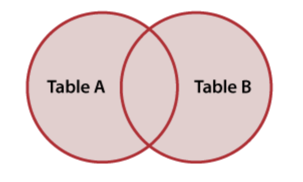
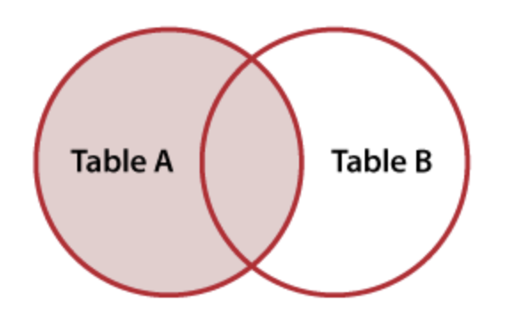

# Joining tables

Often we want to combine data from different tables.  Take this example:

> hobbies

| name | hobby |
| -- | -- |
| Shuyen | dancing |
| Brian | dancing |
|  Adnan (left only) | running |

> majors

| name | major |
| -- | -- |
| Shuyen | Art |
| Brian | Theater |
|  Yungsheng (right only) | English |

There are quite a few different ways to get this done.

Notice that the students in each table are overlapping.  Some are in both tables (Shuyen and Brian), but others are only in one of the tables.

One thing we can't do is that we can't just copy the `major` column and paste it next to the student_hobbies columns.  If we do that, we will end up with an incorrect row that claims that Adnan is in the English major.  So Yungsheng's data ends up on Adnan's row.


We also can't copy both columns and paste them underneath.  If we do that the values from `major` will end up in the `hobby` column.


So the database knows ways to combine the tables that preserve the meaning of the data.

We will look at four different ways to combine these tables: 1) `FULL JOIN`, 2) `LEFT JOIN`, 3) `RIGHT JOIN`, and 4) `INNER JOIN`

## FULL JOIN

The first keeps all of the data, matching up rows and adding `NULL` values where rows are only in one table or the other.  This is called the `FULL JOIN`.



```sql
SELECT *
FROM hobbies 
  FULL JOIN majors
```

> full_join_result

| student_name | hobby | major |
| --| --| -- | 
|  Shuyen (both tables)       | dancing | Art     |
| Brian        | dancing | Theater | 
|  Adnan (left only)       | running | NULL    |
|  Yungsheng (right only)   | NULL    | English |

### LEFT and RIGHT JOIN

We can also keep all of the data from one table, and add in only the matching data from the other table. This is called the `LEFT JOIN` or the `RIGHT JOIN`. The direction just points to which table we will keep all the rows from.

#### LEFT JOIN



```sql
SELECT *
FROM hobbies 
  LEFT JOIN majors
```
    
> left_join_result

| student_name | hobby |   major |
| --| --| -- | 
|  Shuyen (both tables) | dancing | Art |
|  Brian (both tables) | dancing |Theater |
|  Adnan (left only) | running | NULL

#### RIGHT JOIN


```sql
SELECT *
FROM hobbies 
  RIGHT JOIN majors
```

> right_join_result

| student_name | hobby |   major
| --| --| -- |
|  Shuyen (both tables) |       dancing | Art |
|  Brian (both tables) |        dancing | Theater |
|  Yungsheng (right only) |    NULL |    English |

These are really useful when we have data in a table about things and we want to "bring over" any data we have about those things. 


A `RIGHT JOIN` is identical to a `LEFT JOIN` with the tables reversed in order. This makes it almost never used as people would just rewrite it as a LEFT JOIN. So one generally doesn't come across `RIGHT JOIN`. ie:

```sql
majors RIGHT JOIN hobbies
```

is identical to  

```sql
hobbies LEFT JOIN majors
```

## INNER JOIN


Finally, our fourth option is to only keep rows that have data in both tables. This is called an `INNER JOIN`. 

> inner_join_result

| student_name | hobby |   major |
| -- | -- | -- | 
|  Shuyen (both tables) |       dancing | Art |
|  Brian (both tables) |        dancing | Theater |

## Inner vs Outer?

Joins are frequently talked about as being two kinds, inner and outer.  

`FULL`, `LEFT` and `RIGHT` are all `OUTER` joins.  

Because `LEFT JOIN` is by far the most used, if someone says just "outer join" then they almost always mean `LEFT JOIN` but `OUTER JOIN` on its own will throw an error.

`INNER JOIN` is the only inner join (there is only one way to include only the rows that match), it is used frequently enough that `JOIN` with no other word means `INNER JOIN`.

### JOIN synonyms 

[shows optional part]

```sql
FULL [OUTER] JOIN
LEFT [OUTER] JOIN -- Often say "outer join"
RIGHT [OUTER] JOIN
[INNER] JOIN -- Often say just "join"
```

## Join conditions (`ON` and `USING`)

When we join tables we have to say which columns we want to join on.  In the examples above it was implicit that we were joining using the `student_name` column (as that was the only one with any matches). We have to tell SQL this, so we use 

```sql
ON left_table.column = right_table.column
```

In that way our `LEFT JOIN` above would become:

```sql
SELECT *
FROM hobbies 
  LEFT JOIN majors ON hobbies.student_name = majors.student_name
```

There is a special shorthand when the column name is the same in both tables, `USING column_name`.  Making it:

```sql
SELECT *
FROM hobbies 
  LEFT JOIN majors USING student_name 
```

Exercises:

1. Data on countries: area, population, median income. Combine the tables so we can check what data we have available on each country.
    - Which countries have data on population missing? 
    - Which countries have data on median income missing?
    - Do any countries have data on both missing?

## Looking up values

One important use of JOIN is to lookup the value of some code, such as abbreviations. This is a little like "find and replace," using a second table to lookup values, doing many different "find and replace" all at once.

Consider these data:

> countries

| english_name | iso_code3 | iso_code2 |
| -- | -- | -- |
| China | CHN | CN |
| Australia | AUS | AU |
| United States of America | USA | US |

Now we can use these to convert a iso_code to an english name for a country. Consider:

> olympic_medals

| country | year | medal_count |
| -- | -- | -- |
| AU | 1984 | 20 |
| CN | 1984 | 30 |
| USA | 1984 | 29 |
| AU | 1980 | 20 |
| CN | 1980 | 30 |

We can use a `JOIN` to lookup values in `countries`, or "bring over" the matching values from `countries`, so that each row that has "CN" has "China" in a new column, each row that has "AU" has "Australia" etc.

```sql
SELECT *
FROM olympic_medals
  LEFT JOIN countries ON olympic_medals.country = countries.iso_code2
```

Now we get:

| country | year | medal_count | english_name | iso_code3 |  iso_code2 |
| ---- | ----- | ---- | ---- | ---- |  ----- |
| AU | 1984 | 20 | Australia | AU | AUS |
| CN | 1984 | 30 | China | CN | CHN |
| USA | 1984 | 29 | United States of America | US | USA |
| AU | 1980 | 20 | Australia | AU | AUS |
| CN | 1980 | 30 | China | CN | CHN |

You can see that using joins by default brings over _all_ of the columns, but we can use `SELECT` to get just those we want, renaming using `AS` if we wish.

```sql
SELECT english_name AS country_name, year, medal_count
FROM olympic_medals
  LEFT JOIN countries ON olympic_medals.country = countries.iso_code2
```

Note that I used a `LEFT JOIN` above. If I used just `JOIN` on its own I would get an inner join. In these particular data that would be the same, but if we had a two letter code in a row of the `olympic_medals` data that wasn't in the lookup table then we would lose the row. That isn't usually what we want, so `LEFT JOIN` protects against that. 

Discuss:

1. How would we find out if a row didn't get matched up? What value would country_name show?

## Using JOIN with foreign key columns

Recall our string database?  When we converted that to tabular relational form, we used `id` and `foreign_id` columns (e.g., `colors.id` and `objects.color_id`) to represent the relationships between things.  We had this structure:

> objects

| id | name | color_id |
| -- | -- | -- |
| 1 | Mug | 10 |
| 2 | Pen | 20 |

> colors

| id | name  |
| -- | --    | 
| 10 | red   |
| 20 | green |

We can use joins to lookup the color for each object. This is just like the case above, except instead of `AU` and `CN` we have the `10` and `20` labels in `color_id`. 

```sql
SELECT *
FROM objects
  JOIN colors ON objects.color_id = colors.id;
```

> results

| id | name | color_id | id | name |
| -- | -- | -- | -- | -- |
| 1 | Mug | 10 | 10 | red |
| 2 | Pen | 20 | 20 | green | 

Note that both objects and colors have a column `name` (and a column `id`). SQL allows this in results tables, but it is confusing so we use `AS` to rename things.

```sql
SELECT objects.name AS object_name, 
       colors.name AS color_name
FROM objects
  JOIN colors ON objects.color_id = colors.id;
```

| object_name | color_name |
| -- | -- |
| Mug | red |
| Pen | green | 

This pattern of joining with an `ON` condition that matches up primary key and foreign key is very common. The `id` is used in other tables to represent a relationship with a row in a different table. This allows us to stitch back together data that is spread across databases.

You may notice that I've used `JOIN` (inner join) rather than `LEFT JOIN` (outer join) in this example. This is because when we have primary and foreign key columns we usually have "well-formed" data with "referential integrity" meaing that we don't have "orphaned records" such that an id in a foreign key column will not be missing in the table it refers to.  For example, we could add a new object, a purple pencil.

> objects

| id | name | color_id |
| -- | -- | -- |
| 1 | Mug | 10 |
| 2 | Pen | 20 |
| 3 | Pencil | 30 |

But if the `colors` table does not have a row for purple (`30, purple`) then beware that using just `JOIN` will silently drop our pencil.

You can watch out for this as you build up your sequence of queries, using `--` sql comments to keep track of the number of rows.

```sql
SELECT *
FROM objects;
--> 3 rows

-- Now join to colors table to convert color_id to a color name.
SELECT *
FROM objects 
  JOIN colors ON objects.color_id = colors.id;
--> 2 rows?????????????????????????
-- Why did this drop to 2 rows?

SELECT *
FROM objects 
  LEFT JOIN colors ON objects.color_id = colors.id;
-- 3 rows.  hmmm, the pencil doesn't have a color. Are we missing a color definition?
```

Historically databases enforced "referential integrity" by marking foreign key columns with `REFERENCING` in the `CREATE TABLE` statement. This ensured that you could not insert a row with a "hanging" foreign key. If you tried the database would throw an error.

Today the fashion seems to be to avoid specifying these checks in the database itself. The argument for this approach is that these sort of checks are part of a wider set of validation requirements. For example, checking that a phone number matches a valid particular pattern, or a mailing address is valid, or an age is not negative. The tendancy is to push validation outside the database, such as to javascript libraries (for data coming from web forms) or to test steps in data engineering toolchains.

In the data engineering and data warehouse world, this practice (of not specifying `REFERENCES` relationships in the table definitions) is reinforced in data engineering pipelines, because data is imported table by table, so there frequently are situations where foreign keys do not resolve, at least temporarily. The approach in data engineering is to import all data, then sort it out in the pipeline.

The takeaway here is that using `LEFT JOIN` when joining tables with primary and foreign keys is certainly a legitimate and important part of data validation and should probably be the default during data exploration. 

The downside of using an outer join, though, is that _all_ the records in the left table are retained. When working interactively doing data exploration, this can be problematic when the amount of data is large. We will return to this in material on data validation.

## Joining more than 2 tables

Each join is between two tables (the left and the right). Yet we often want to join many tables together, to create data products and reports. Even in our very small database we have three tables, `objects`, `colors`, and `functions`. 

When we join two tables we get an intermediate result table.  That intermediate result table becomes our new starting point. We can then join a third table onto that newly created table.  In that way we can combine many tables, joining each in turn into an ever growing intermediate results table.


> objects

| id | name | color_id | function_id |
| -- | -- | -- | -- |
| 1 | Mug | 10 | 200 |
| 2 | Pen | 20 | 100 |

> colors

| id | name  |
| -- | --    | 
| 10 | red   |
| 20 | green |

> functions

| id | name |
| -- | --   |
| 100 | writes | 
| 200 | holds |

We can begin as before by joining `objects` to `colors`:

```sql
SELECT *
FROM objects;

SELECT *
FROM objects 
  JOIN colors ON objects.color_id = colors.id;
```

This gives us a result, which is the start of our ever growing intermediate table:

> intermediate results

| id | name | color_id | function_id | id | name |
| -- | -- | -- | -- | -- |
| 1 | Mug | 10 | 200 | 10 | red |
| 2 | Pen | 20 | 100 | 20 | green | 

Now we can add a further `JOIN` to add the `functions` table onto this:

```sql
-- starting from intermediate results table
SELECT *
FROM objects 
  JOIN colors ON objects.color_id = colors.id;

SELECT *
FROM objects 
  JOIN colors ON objects.color_id = colors.id
  JOIN functions ON objects.function_id = functions.id
```

> results

| id | name | color_id | function_id | id | name | id | name |
| -- | -- | -- | -- | -- | -- | -- | -- |
| 1 | Mug | 10 | 200 | 10 | red | 200 | holds
| 2 | Pen | 20 | 100 | 20 | green | 100 | writes

So the intermediate results table grows and grows.  You can also see that column names are ambiguous, making using `AS` crucial.

```sql
SELECT objects.name AS object_name,
       colors.name AS color_name,
       functions.name AS function_name
FROM objects 
  JOIN colors ON objects.color_id = colors.id
  JOIN functions ON objects.function_id = functions.id
```

You can mix different types of joins, inner, outer, full in the sequence of JOINs.

## Using AS in joins (table abbreviations)

As you can see above, joins can get long and the `ON` conditions in particular are often hard to fit on one line. They get even longer if one adds conditions in the WHERE clause.

We can provide abbreviations to tables to shorten queries. We do this with `FROM table AS t` 

For example, `FROM functions AS f` and `FROM objects AS o` would shorten the query above somewhat:

```sql
SELECT o.name AS object_name,
       c.name AS color_name,
       f.name AS function_name
FROM objects AS o 
  JOIN colors AS c ON o.color_id = c.id
  JOIN functions AS f ON o.function_id = f.id
```

This is useful, although the definition of the abbreviation comes in the middle of the query, after it has already been used.

In Postgres (and other moden SQL databases) you can use the `WITH` keyword to define aliases at the top of the query:

```sql
WITH functions AS f
WITH objects AS o
WITH colors AS c
SELECT o.name AS object_name,
       c.name AS color_name,
       f.name AS function_name
FROM o
  JOIN c ON o.color_id = c.id
  JOIN f ON o.function_id = f.id
```

Aliasing tables is common and you will find it very frequently when searching online. However, reasonable people can disagree about its usefulness.

Pros:
- Queries are faster to type
- Queries can be more compact, and compactness helps legibility especially when line wraps are avoided

Cons:

- Abbreviations can be ambiguous. They are not always obvious, especially when tables start with the same letters. Does `p` refer to `people` or `purchases`? Different analysts might resolve this in different ways, or even the same analyst may use different abbreviations in different queries with different combinations of tables.
- It can harder to share queries with others, as abbreviations might not be standardized across groups.

    > _"So `p` is always people. Well, unless `purchases` is also in the query, then I use `pp` for `people` and `pr` for purchases. But Katherine, I think, uses `ppl` or she used to. Oh, and if you join to `peters_report` try not to use `pr`?  Got it?_

- Column names can't be abbreviated, so advantages are partial.
- It can be hard to remember abbreviations when reading queries with many tables, especially if you haven't worked with the data frequently.

Given that SQL is usually written with tab completion for table names, and colored syntax highlighting, table alisasing may not be as important. Although, given that we write little snippets of SQL everywhere (Slack channels, web Q&A, email) and compactness can help spot errors it will probably persist.  
    
> **Notice the conventions used by those around you, ask what your team prefers**.

