# Joins, Part 2

Today we're going to review what we learned about joins in the last class and then look at a 
larger and more complicated database to do multi-table joins.

## Review Joins
First, let's look at the Hobbies and Majors tables again:

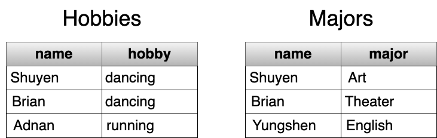

The `name` column is the common column between these two tables - we need to have one or more 
columns in common to be able to join tables. Shuyen and Brian appear in both the Hobbies and Majors 
tables. Adnan appears only in the Hobbies table. Yungshen only appears in the Majors table.

As you remember, there are 4 kinds of joins we did in the previous class:
* INNER JOIN
* LEFT (OUTER) JOIN
* RIGHT (OUTER) JOIN
* FULL (OUTER) JOIN

### Inner Joins
The INNER JOIN only keeps the rows that match the join condition in both tables. Here we match on
the name column in both tables.

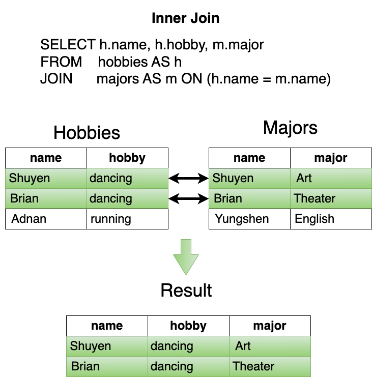

### Left (Outer) Joins
The LEFT JOIN keeps all the rows from the `left-hand` table and all the rows that match the join 
condition in the `right-hand` table. Any columns that are in the left-hand table but not in the
right-hand table will have a NULL value.

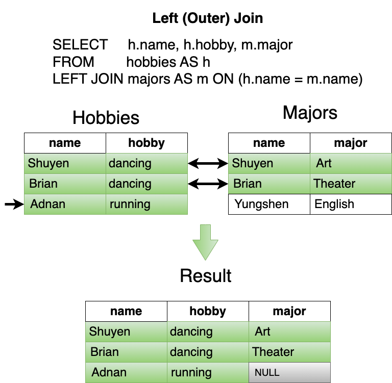

### Right (Outer) Joins
The RIGHT JOIN keeps all the rows from the `right-hand` table and all the rows that match the join 
condition in the `left-hand` table. Any columns that have rows are in the right-hand table but not 
in the left-hand table will have a NULL value.

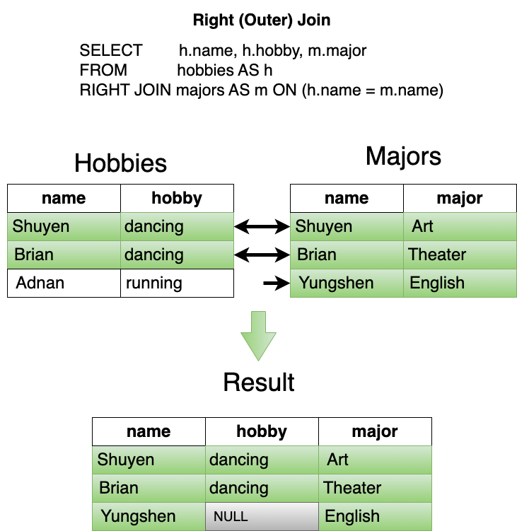

### Full (Outer) Joins
The FULL JOIN keeps all the rows from both the left-hand and right-hand tables. Columns that have
rows in one table that do not have matching columns in the other will have NULL values.

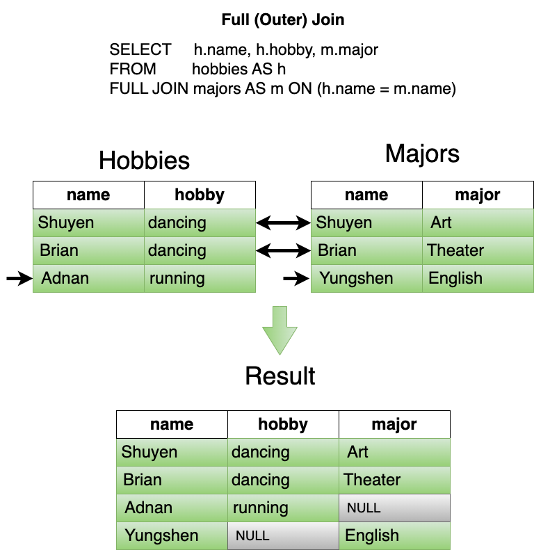

### Filtering with joins

We generally don't just join tables together - we usually want to filter the results of the join
to answer a specific question we have about the data. For example, we might want to know all the
students who are English majors or enjoy running:

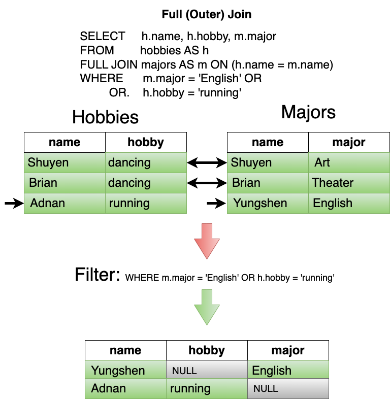

Remember the sequence of steps when the database executes an SQL statement:
- **FROM** (includes JOINS)
- **WHERE**
- SELECT
- ORDER BY
- LIMIT

## More Advanced Joins
We will use the Music Festival database to further explore joins. 

Open SQL Lab, change the database to `Music Festival` and the schema to `Festival`.

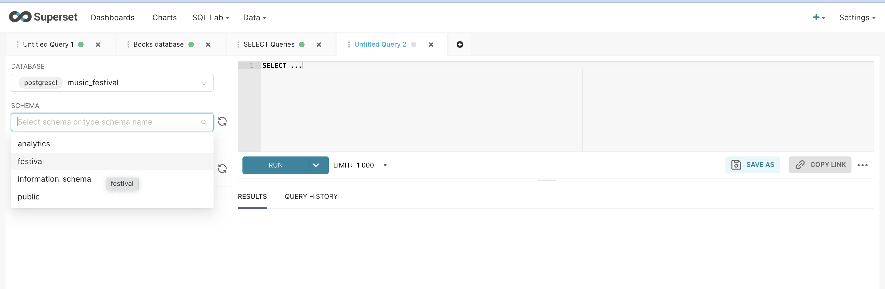

Then click on "SEE TABLE SCHEMA" to see the tables in this schema.

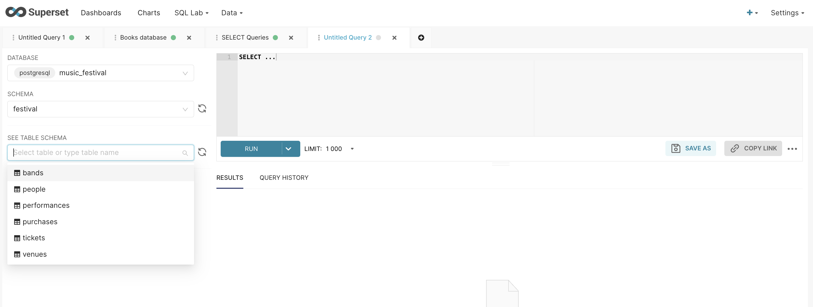

This is a diagram of the tables in this database:

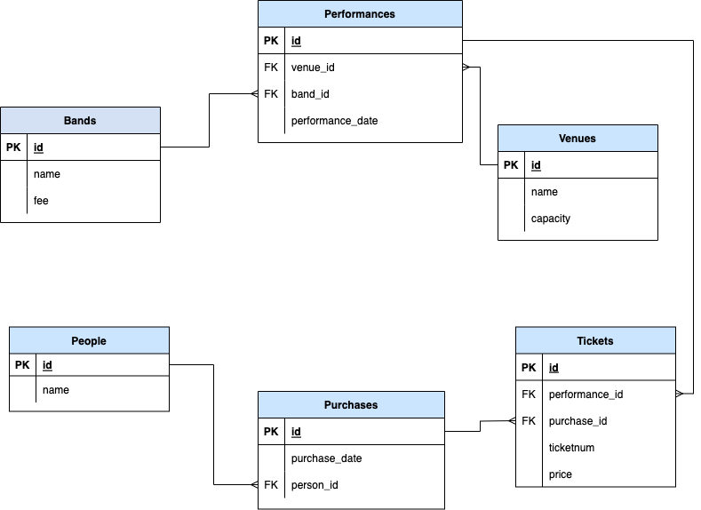

This database captures some of the information about the Austin City Limits Music Festival. 
Specifically, it captures information about:
* **Bands** - The group or individuals who have played at the festival.
* **Venues** - The places where the bands play.
* **Performances** - The date and time a band played at a venue.
* **Tickets** - The tickets to a performance.
* **Purchases** - The tickets people bought to attend a performance.
* **People** - The people who attended a performance.

Notice the primary key and foreign key relationships in each table:
* Performances has `band_id` and `venue_id` as foreign keys.
* Tickets has `performance_id` and `purchase_id` as foreign keys.
* Purchases has `person_id` as a foreign key

### Inner joins
Let's join the `bands`, `venues`, and `performances` tables together first.

We start with SELECT * FROM performances - we could pick any table, but we'll use performances 
because it joins with the other two tables:
```sql
SELECT *
FROM   performances
```
Now let's join it to bands - notice I use aliases as soon as there is more than one table:
```sql
SELECT *
FROM   performances AS p
JOIN   bands AS b ON (p.band_id = b.id)
```
Then join it to venues:
```sql
SELECT *
FROM   performances AS p
JOIN   bands AS b ON (p.band_id = b.id)
JOIN   venues AS v ON (p.venue_id = v.id)
```
The query will now return every matching row in bands, performances, and venues:

id  | performance_start | band_id | venue_id | id_1  | name | fee  | id_2  | name_1 | capacity
----|----------------- |  -------  | --------  | -----  | ---- |  ---- |  ----- |  ------ |  --------
1 | 2002-09-28T20:00:00+00:00 | 17 | 1 | 17 | Abra Moore | 200 | 1 | AMD |700
2 | 2002-09-28T23:00:00+00:00 | 72 | 9 | 72 | Asleep at the Wheel | 200 | 9 | Auditorium Shores | 2000
3 | 2002-09-28T17:00:00+00:00 | 156 | 5 | 156 | Bob Schneider | 200 | 5 | BMI | 2000
4 | 2002-09-28T16:00:00+00:00 | 191 | 4 | 191 | Caitlin Cary | 200 | 4 | Austin Ventures |2000
5 | 2002-09-28T15:00:00+00:00 | 204 | 5 | 204 | Caroline Herring | 200 | 5 | BMI | 2000

The final step is to change the select list to only include the columns we want, renamed so we can
understand what they are:
```sql
SELECT b.name AS band_name,
       v.name AS venue_name,
       p.performance_start,
       v.capacity AS venue_capacity
FROM   performances AS p
JOIN   bands AS b ON (p.band_id = b.id)
JOIN   venues AS v ON (p.venue_id = v.id)
```
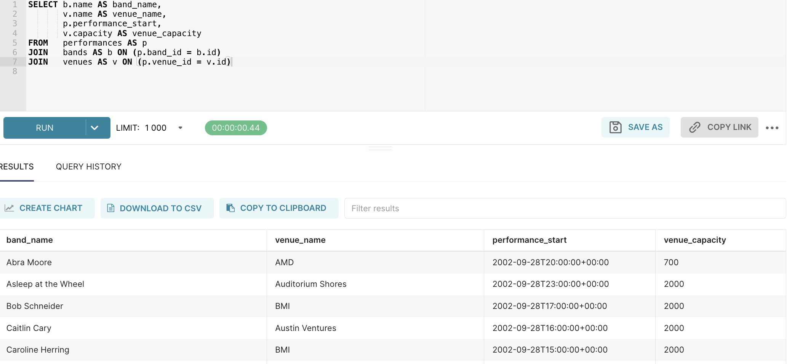

I might want to filter this list of performances by year. So we will introduce a function called
`EXTRACT` to get the year of the performance:
```sql
SELECT b.name AS band_name,
       v.name AS venue_name,
       p.performance_start,
       v.capacity AS venue_capacity
FROM   performances AS p
JOIN   bands AS b ON (p.band_id = b.id)
JOIN   venues AS v ON (p.venue_id = v.id)
WHERE  EXTRACT(YEAR FROM performance_start) = 2018
```

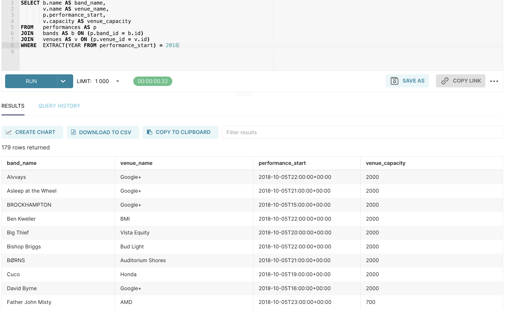

Finally, I might want to see the performances in the order they occurred - so we order them by
performance_start:
```sql
SELECT b.name AS band_name,
       v.name AS venue_name,
       p.performance_start,
       v.capacity AS venue_capacity
FROM   performances AS p
JOIN   bands AS b ON (p.band_id = b.id)
JOIN   venues AS v ON (p.venue_id = v.id)
WHERE  EXTRACT(YEAR FROM performance_start) = 2018
ORDER BY performance_start, band_name
```
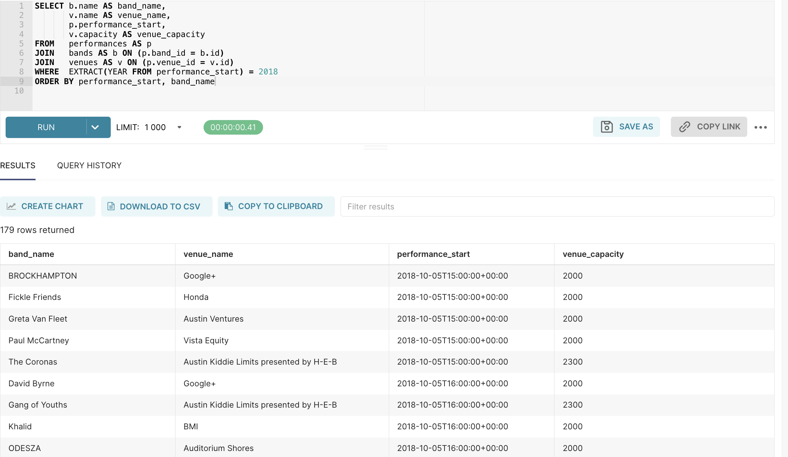

### Left Joins
Do we have any bands in our database that haven't played any performances? How would we find this
out using a Left Join?

<!--
Hints:
* We want to eliminate all of the rows that match to find out the ones that don't
* What is the value of columns that don't match in Left, Right, or Full outer joins?
-->


### Right Joins
Do we have any venues in our database that haven't hosted any performances? How could we find this
out using a Right Join?

### Full Joins
How could get both the bands that haven't played any performances and the venues tha haven't hosted
any performances in a single query using a Full join?