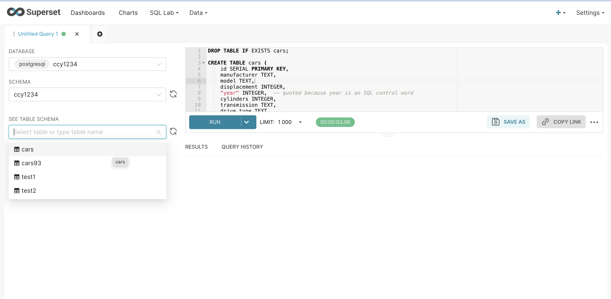
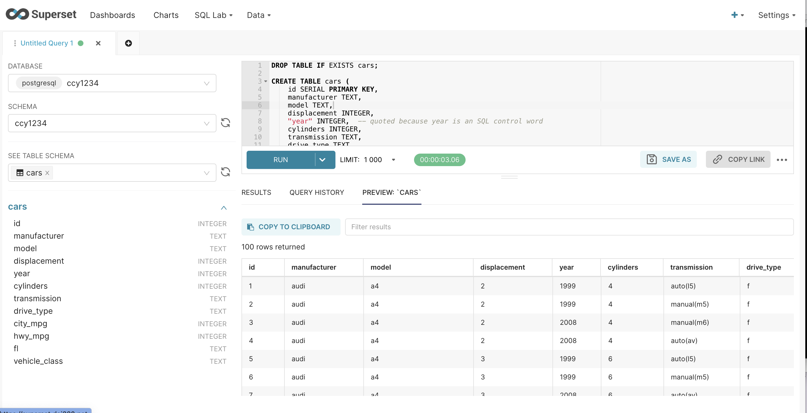

# Topics
{:.no_toc}
* toc
{:toc}

# Introduction to SELECT queries

In this class we're going to cover the basics of SQL's `SELECT` query. `SELECT` works by applying 
filters to the table, filtering out data you don't want to see, and returning data that you do 
want to see. The returned data ends up in a new table which has just the columns and rows that you 
asked for.  

In the first class we used cards to build up our table representation. When we use a query it is as 
though we have a box that hides everything but a single row, then we ask the query about the single 
row and it is always one of `true` or `false`. If the answer was `true` then we copy the data from 
that row into a table called `results`.  This is precisely how a `SELECT` query works.

The steps in a `SELECT` query are:

1. Identify the table you are asking for data from
2. Specify the conditions you want to ask about for each row
3. Specify the columns you want to copy from those rows

These correspond to different parts of the query. Somewhat oddly, though, the parts aren't in the 
order above.

```
SELECT [columns]
FROM   [tables]
WHERE  [conditions about rows]
```

# The FROM clause: specifying the table you want
A relational database like Postgres stores data in _tables_. A table is a logical collection of data
represented in a tabular form of _rows_ and _columns_. A row of data represents a single instance of
some _entity_ - like a person, a car, a book, a bank transaction, a social media post, a sporting
event, a TV show, or anything else you can think of. A row will have one or more columns that 
describe the characteristics of the entity - a car could have a make, a model, a model year, an 
mpg rating, etc. A table will have 0 or more rows.

We can begin to write our query by specifying the table we want to query the data from. Later, we
will learn how to query data from multiple tables when we learn how to do joins but for now we
will use a single table in the FROM clause.


# The WHERE clause: picking rows using conditions

To run these queries we need to create a schema and a table called `cars`. 
[The commands you can copy to do this are here.](create_class_cars.html).

Once you execute those queries, you can select your EID schema.


and then select the `cars` table.



and finally choose "Preview"



Each row in the database represents a single car model and there are 234 car models in the database 
(I reduced the full set by only including cars produced in 1999 and 2008). On each row we have data 
about one car, such as the year it was produced (`cars.year`), the manufacturer 
(`cars.manufacturer`) (e.g., audi, ford), the model (e.g., a4, focus). Using a select query we can 
narrow the database to find cars that match our query.

We will build our queries up step by step. This is a little laborious but as our queries become more 
complex (especially as we work with more than one table) you'll find that this habit serves you 
very well.

We wait until the end to specify the columns we want to see, so we'll start our queries with `SELECT *` 
where the star means "all columns".

Let's say we are interested in cars that have four cylinders. The `cars.cylinders` column has that 
information. We start by confirming that we are addressing the right table by executing this query:

```sql
SELECT *
FROM   cars
```

This asks for all the data in the table and will return 234 rows and all the columns. There is no 
`WHERE` clause, which means that there are no conditions on the rows and that is why all of them 
are returned. When you run it in SQLLab it will look like this:


If we want to add some conditions we can add a `WHERE` clause:

```sql
SELECT *
FROM   cars
WHERE  cars.cylinders = 4
```

Now we will only see rows where the condition in the `WHERE` clause is true. It's just the same as 
using the paper template: the computer looks at one row at a time and checks the number in the 
`cylinders` column. If that number is a `4` then the whole row is copied into the results.  If you 
run that query in SQL Lab, by copying the query above and pasting it into the SQL tab (go ahead 
and try it now) you'll see that the results have 81 rows. Every one of the rows has a `4` in the 
`cylinders` column.


We can add more conditions to our `WHERE` clause to reduce the number of rows shown even more.  For 
example, let's say that from those 4 cylinder cars we want to find older cars, produced earlier than 
the year 2000. We can do that by adding a condition to the `WHERE` clause:

```sql
SELECT *
FROM   cars
WHERE  cars.cylinders = 4
  AND  cars.year < 2000
```

Two things to notice here. The `AND` and the `<` (less than) sign. First we use the word `AND` 
between our two conditions. I place it under the `WHERE`, indenting it by two spaces to show that 
it is still part of the `WHERE` clause and causing the conditions to line up down the page.  You 
could equally see this with the `WHERE` clause written on one line:

```sql
SELECT *
FROM   cars
WHERE  cars.cylinders = 4 AND cars.year < 2000
```

But I prefer to have one condition per line, to keep things visually neat.

The `<` (less than) sign will allow more than one value in the row, as long as it is below 2000. 
(It would exclude rows with year = 2000, since we used `<` (less than) and not `<=` which is less 
than or equal to.). If we run this query we see our results reduced from 81 to 45 cars.

## Conditions with different data types

Our columns in SQL have datatypes associated with them (text, numbers, datetimes). The datatype has 
some impact on how we write our conditions. When we are querying number columns (`INTEGER`, `NUMERIC`) 
we don't use quotes around the data we supply. See how there are no quotes around `4` and `2000` in 
this query:

```sql
SELECT *
FROM   cars
WHERE  cars.cylinders = 4
  AND  cars.year < 2000
```

But if we're writing a condition on a non-number field we need to use quotes around the bit we 
supply. For posgresql we must use plain single quotes `'` rather than `"` or any other quote 
character. e.g.,

```sql
SELECT *
FROM   cars
WHERE  cars.manufacturer = 'audi'
```

We also need quotes around date fields `cars.production_date = '2008-06-06'`.

## Boolean Algebra (resolving AND and OR)

The `WHERE` clause in the query above is asking three questions of each row, each of which resolves 
to `TRUE` or `FALSE`.  Three? I only see two! (you say).  Well here are the three:

1. Is the value for `cylinders` on this row equal to 4? --> TRUE or FALSE
2. Is the value for `year` on this row less than 2000 --> TRUE or FALSE
3. Was the answer to questions 1 and 2 both TRUE? --> TRUE or FALSE.

For 4 cylinder and year of 2008

```sql
cars.cylinders = 4 AND cars.year < 2000
     TRUE          AND      FALSE
                  FALSE
```

For 4 cylinder and year of 1999

```sql
cars.cylinders = 4 AND cars.year < 2000
     TRUE          AND      TRUE
                  TRUE
```

This is called Boolean Algebra. It's a way of reducing a combination of conditions down to a single 
`TRUE` or `FALSE` value. That's what happens here, in the first round we reduce each condition to a 
`TRUE` or `FALSE` (e.g., `TRUE AND FALSE` on the second lines above) and in the second round we 
reduce again (`TRUE AND FALSE` --> `FALSE` (because both were not `TRUE`)).  These end up looking 
like an upside down pyramid.

This ends up more intuitive than you might be feeling at the moment. The key thing is that when you 
join conditions with `AND` _all_ of the conditions must be true for the row to be in the results. 

In addition to `AND` we can also join conditions with `OR`. When we do that we are saying that we 
want the row if _any_ of the conditions are `TRUE`. `OR` ends up used much less than `AND` in sql. 

Let's say that we wanted all the cars but only if they were made by Audi or Ford. We would write:

```sql
SELECT *
FROM   cars
WHERE  cars.manufacturer = 'audi'
   OR  cars.manufacturer = 'ford'
```

That works fine and we get 43 results. Things can get tricky with `OR` if you go beyond two 
conditions, mixing `AND` and `OR`. Consider these three queries:

```sql
SELECT *
FROM   cars
WHERE  cars.year = 2008
  AND  cars.manufacturer = 'audi'
```

which returns 9 rows. And this:

```sql
SELECT *
FROM   cars
WHERE  cars.year = 2008
  AND  cars.manufacturer = 'ford'
```

which returns 10 rows. So we know that if we combine the 2008 Ford cars and 2008' Audi cars we 
should get 19 rows.  Yet:

```sql
SELECT *
FROM   cars
WHERE  cars.year = 2008
  AND  cars.manufacturer = 'ford'
   OR  cars.manufacturer = 'audi'
```

gives us 28 results. So we have 9 extra results. Where are they coming from? See this screenshot:


Look closely at the first row; it shows a value of `1999` for `year`. Why is it in the results 
(since 1999 most definitely is not equal to 2008).

The reason is to do with how the boolean algebra resolves. Remember that each condition is resolved 
first.  In the figures below each clause resolves to the value written below it. So for that row 
("Audi" and 1999) we would get:

```sql
cars.year = 2008 AND cars.manufacturer = 'ford' OR cars.manufacturer = 'audi'
       FALSE     AND              FALSE         OR          TRUE
```
The `cars.year = 2008` resolves to the `FALSE` written under it and so on. But when we come to 
resolve the `AND` and `OR`s in boolean algebra the `AND` is resolved _before_ the `OR` and thus we 
get:

```sql
FALSE AND FALSE OR TRUE
     FALSE      OR TRUE
               TRUE
```
The `FALSE AND FALSE` on the first line is resolved first and become a `FALSE`, leaving us with 
`FALSE OR TRUE` which resolves to `TRUE` and thus the 1999 Audi is included in the results.

What our query actually asked for was "Find me all the Fords built in 2008, and all the Audis 
(regardless of the year)" so as soon as a row was `TRUE` for the right-hand side of the `OR` it was 
included.

You can get around this by changing the order of things using parenthesis `()`. So we could change 
the order that things are resolved with:

```sql
SELECT *
FROM cars
WHERE cars.year = 2008
  AND (cars.manufacturer = 'ford' OR 
       cars.manufacturer = 'audi')
```

Which would require every row to have 2008 for its year and either Ford or Audi for its manufacturer. 
This is very useful. I encourage you to always use parens whenever you use any `OR`s in your queries. 
It just makes things much easier.

## Use IN rather than OR (most of the time)

Even easier still is using the `IN` keyword, which you should do whenever you have a list of 
alternatives for a value:

```sql
SELECT *
FROM   cars
WHERE  cars.year = 2008
  AND  cars.manufacturer IN ('ford', 'audi')
```

which returns the 19 rows that we expected.

## Other operators

Above we've used two operators inside the parts of our `WHERE`: the equals sing `=`, the `<` sign, 
and the `IN` keyword.  There are many other operators, such as `>`, `>=` and so on.

There are also operators that do the reverse of these. Thus I can also say "not equal": `!=` or `<>` 
or the reverse of `IN` which is `NOT IN` (values from the list that follows will be excluded from 
the results.).

Finally there are a set of useful operators, such as `BETWEEN` operator that simplifies range 
queries. eg. `cars.cylinders BETWEEN 4 AND 6` or, if we were using dates: 
`cars.production_date BETWEEN '2008-03-01' AND '2009-06-05'`

# The SELECT clause: specifying columns

The first clause in the query specifies the columns that you want to see in the results. You supply 
a comma-separated list of column headings after the SELECT (instead of the `*`). So if we only 
wanted the manufacturer and model we could write:

```sql
SELECT cars.manufacturer, cars.model
FROM   cars
WHERE  cars.year = 2008
```

You can think of querying like this as a process of hiding, knocking out, or covering up parts of 
the original table that you don't want. So if `WHERE` knocks rows out from your results, `SELECT` 
knocks out columns from your results.

# Doing math in the SELECT clause (new columns in results)

The `SELECT` part of the query let's us specify the columns that we want, but we can also do some 
basic math to derive new values.  When we do this we create new columns in the results.

For example, imagine a table with data about a retail store, a row for each month and a column for 
`expenses` and a column for `sales`.

```
stores(id, month, expenses, sales)
```

If `sales` is our incoming money and `expenses` is our outgoing money, it would be useful to find 
the difference between them. We can do that in SQL using the minus sign `-`:

```sql
SELECT stores.sales, stores.expenses, stores.sales - stores.expenses 
FROM   stores
```

This math works on each row, subtracting the value for expenses in that row from the value in sales 
from that row. We use the values in the two columns to create a third column in the results.

Similarly you can add values using `+`, multiply values together using the `*` sign, and divide 
using the `/` slash character.

It is convenient to rename the newly created column. We can do this using `AS` which is known as 
aliasing.

```sql
SELECT stores.sales, stores.expenses, stores.sales - stores.expenses AS revenue
FROM   stores
```

We can 

### Exercise

1. Calculate a new column showing expected distance traveled on the highway given a tank with 14 gallons of gas.

# ORDER BY and LIMIT: Sorting results and getting top x rows

The three clauses above leave you with a results table, showing only the rows and columns that match 
your query.  Now we'll learn two things we can do with these results: sorting and limiting.

Let's say that we wanted to find the more fuel efficient 4 cylinder cars for city driving.  First 
we'd get all the 4 cylinder cars:

```sql
SELECT *
FROM   cars
WHERE  cars.cylinders = 4
```

Now we want to re-order the results table according to city_mpg (miles per gallon). Note that we're 
reordering the results table, and not changing the original data in the database at all.

```sql
SELECT *
FROM   cars
WHERE  cars.cylinders = 4
ORDER  BY city_mpg DESC
```

We add an `ORDER BY` clause saying that the rows should be ordered by the values in the `city_mpg` 
column for that row.  Finally we say that we want those with the highest values first, thus our 
sorting order is descending which is abbreviated to `DESC`. The opposite is ascending, showing the 
smallest values at the top, shown with `ASC`. If you don't put either then the results are sorted in 
Ascending order, but it's most clear if you always include either `DESC` or `ASC`.

Here are the results:


We can see that the top three are made by Volkswagen, then a Toyota Corolla and a Honda Civic and so 
on right through the 81 rows that return.

After we've sorted we often want to see just the very top result. So rather than finding the more 
fuel efficient cars, we find the most fuel efficient car. This is done with `LIMIT 1` which means only return the first row (after sorting).


```sql
SELECT *
FROM   cars
WHERE  cars.cylinders = 4
ORDER  BY city_mpg DESC
LIMIT  1
```

I always put LIMIT on its own line, but you will frequently see it on the end of the ORDER BY line 
as well.  I use its own line because its clearer.  You could also get the top 5 using `LIMIT 5`:

```sql
SELECT *
FROM   cars
WHERE  cars.cylinders = 4
ORDER  BY city_mpg DESC
LIMIT  5
```

# Summary

The `SELECT` query allows you to select data out of the table in your database. It copies rows that 
match the conditions in the `WHERE` clause (using boolean algebra) and generates a results table. 
You can then sort and limit the results table.  The figure below shows the parts of the basic 
select query:


Finally as usual w3cSchool has a useful SQL tutorial. It doesn't go in exactly the same order as 
we did, but it's pretty close. Here are their materials on [SQL SELECT](http://www.w3schools.com/sql/sql_select.asp)
